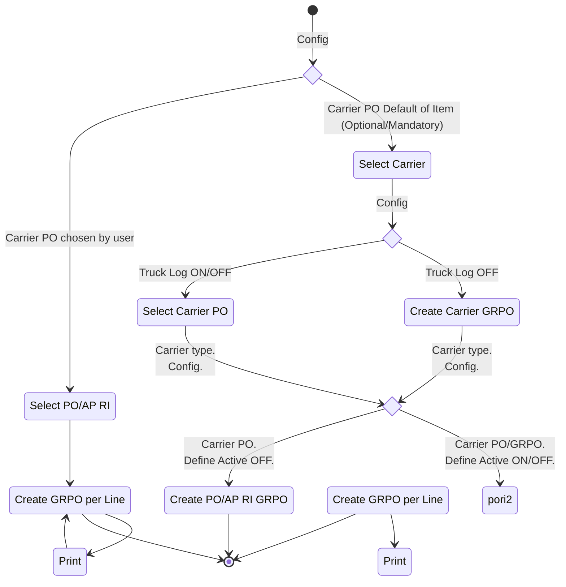

```mermaid
stateDiagram-v2
    state "Select Carrier" as carrier1
    state "Select PO/AP RI" as pori1
    state "Create Carrier GRPO" as carriergrpo1
    state "Select Carrier PO" as carrierpo1
    state "Create PO/AP RI GRPO" as porigrpo
    state "Create GRPO per Line" as linegrpo1
    state "Create GRPO per Line" as linegrpo2
    state "Print" as print1
    state "Print" as print2

    state initialconfigchoices <<choice>>
    state carrierchoices1 <<choice>>
    state carrierpoandgrpochoices1 <<choice>>

    [*] --> initialconfigchoices: Config
    initialconfigchoices --> carrier1: Carrier PO Default of Item (Optional/Mandatory)
    initialconfigchoices --> pori1: Carrier PO chosen by user
    carrier1 --> carrierchoices1: Config
    carrierchoices1 --> carriergrpo1: Truck Log OFF
    carrierchoices1 --> carrierpo1: Truck Log ON/OFF
    pori1 --> linegrpo1
    carriergrpo1 --> carrierpoandgrpochoices1: Carrier type. <br> Config.
    carrierpo1 --> carrierpoandgrpochoices1: Carrier type. <br> Config.
    carrierpoandgrpochoices1 --> pori2: Carrier PO/GRPO. <br> Define Active ON/OFF.
    carrierpoandgrpochoices1 --> porigrpo: Carrier PO. <br> Define Active OFF.
    porigrpo --> [*]
    linegrpo1 --> print1
    linegrpo1 --> [*]
    linegrpo2 --> print2
    linegrpo2 --> [*]
    print1 --> linegrpo1
```