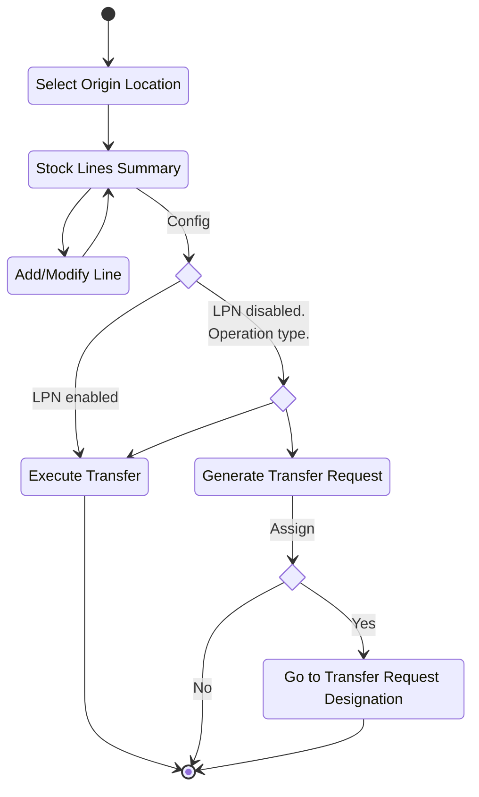
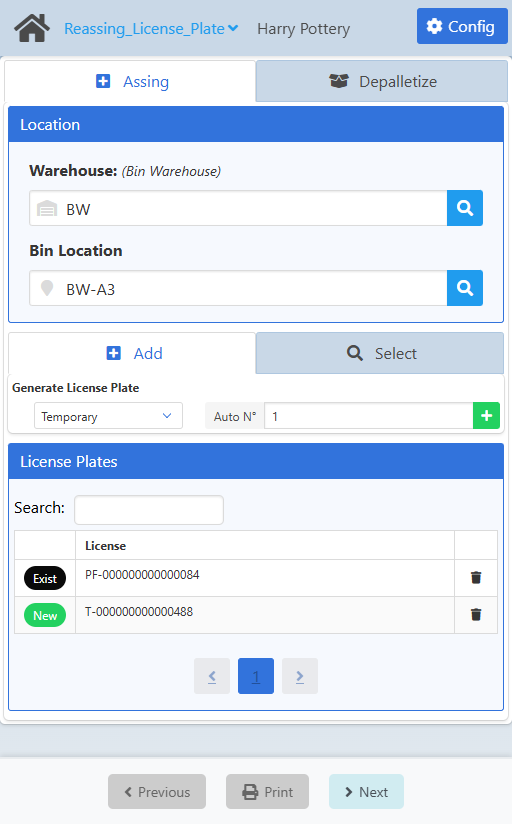
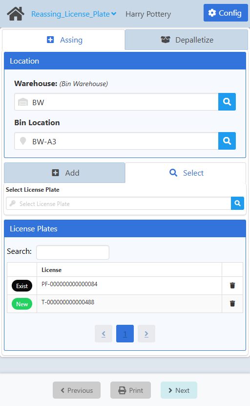
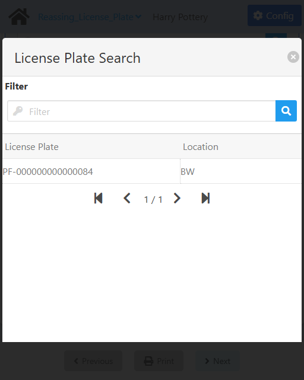
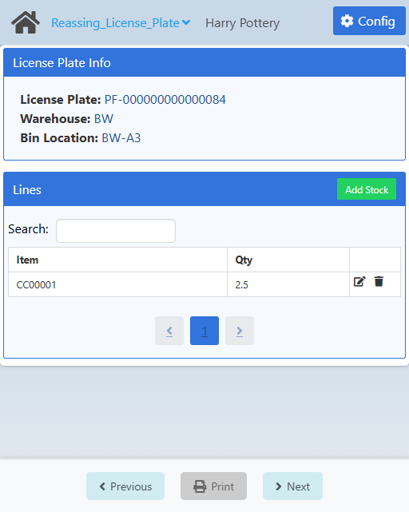
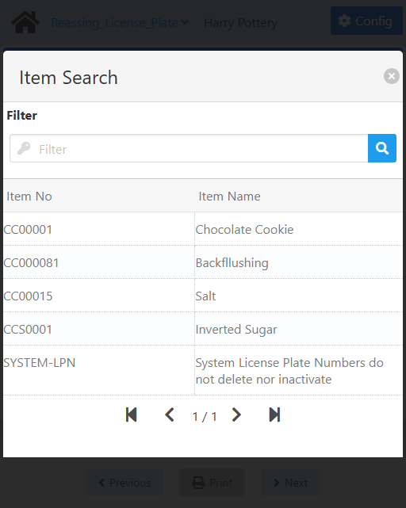
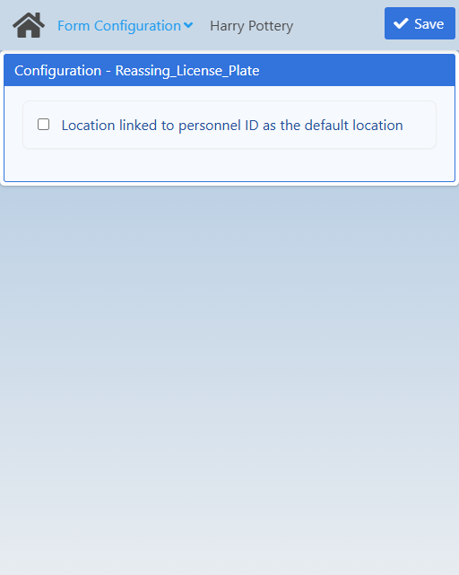

import CustomDetails from "@site/src/components/CustomDetails";
import Tabs from '@theme/Tabs';
import TabItem from '@theme/TabItem';

# Reassign License Plate

The Reassign License Plate WebApp allows you to link and unlink stock to and from LPNs.

## Flow Diagram

## Screens

### Assign: Create/Select LPN

On this screen you can create or select the LPNs that you want to assign stock to.

<Tabs>
  <TabItem value="create" label="Create LPN" default>
    
  </TabItem>
  <TabItem value="select" label="Select LPN">
    
  </TabItem>
</Tabs>

First, you have to select a **warehouse** and **bin** (if available) to create the LPNS into or to select the LPNs from.

:::note[INFO]
The behavior of the **Location** will vary depending on the **Location linked to personnel ID as the default location** setting in the [Configuration](./reassign_lpn.md#configuration).
:::

Once you do that, the next part of the screen will load below to continue with the LPN creation/selection.

Let's go over the process for **creating** new LPNs. Make sure you are in the **Create** tab.

You need to select the type of LPN you are going to create: **Permanent Transfer** (PF-XXXX), **Permanent Transport** (PP-XXXX), **Temporary** (T-XXXX) and **External** (E-XXXX).

Next, you need to set the **Auto N°** field to the number of LPNs you want to create. LPNs are **auto-incremental**.

Once you are done, click the <IIcon icon="ph:plus-fill" width="17" height="17" /> button to create the number of LPNs you specified. You can find them in the **License Plates** section. Up until this point no actual LPN has been created in the system, it's all locally.

The leftmost column in the table of LPNs will tell you if the LPN is already in the system (**Exist**) or if the LPN is a new one that will be created at the end of the process (**New**).

You can **filter** the list of LPNs using the search box.

You can **remove** any of the LPNs by clicking the <IIcon icon="ic:baseline-delete" width="17" height="17" /> button on the rightmost column.

Now, let's go over the process for **selecting** already existing LPNs. Make sure you are in the **Select** tab.

Click the <IIcon icon='iconamoon:search-bold' width='17' height='17' /> button in the **Select License Plate** field to open the **License Plate Search** modal.

<CustomDetails summary="License Plate Search Modal">

On this screen you need to select one of the **License Plates** listed.

You can select any item by clicking on it, which will close the modal and take you back with that **License Plate** already set.

You can filter the list of **License Plates** using the search box.

If you want to close the modal without making any changes, click the <IIcon icon="zondicons:close-solid" width="17" height="17"/> button.

</CustomDetails>

You can find all selected LPNs in the **License Plates** section.

Next up is **adding stock** to the LPNs. For that, click on any of the LPNs to go to the [Assign: Add/Modify Stock](./reassign_lpn.md#assign-addmodify-stock) screen, if it's the first time you are editing the LPN, or to the [Assign: Stock Summary](./reassign_lpn.md#assign-addmodify-stock) screen, if it is not the first time.

Once you are done, click **Next** at the bottom to save (in the system), which assigns the selected stock to the corresponding LPNs in the specified amount and with the specified batches/serial numbers.

:::note[INFO]
Keep in mind that assigning stock to LPNs creates a **reservation** for the stock and a **GRPO** for the new LPNs under the hood.
:::

At the end, you will get a modal asking you if you want to print the labels. Click **Yes** to print the labels and to start anew, or **No** to just start anew.

### Assign: Stock Summary

On this screen you can **see**, **add**, **edit** and **remove** the stock that will be assigned to the LPN.

At the top you can see the **License Plate Info** section that shows you what you are working on.

If you want to **add** stock, click the **Add Stock** button to go to the [Assign: Add/Modify Stock](./reassign_lpn.md#assign-addmodify-stock) screen.

If you want to **edit** stock, click the <IIcon icon="bx:edit" width="17" height="17" /> button for the respective stock line to go to the [Assign: Stock Summary](./reassign_lpn.md#assign-stock-summary) screen.

If you want to **remove** stock, click the <IIcon icon="ic:baseline-delete" width="17" height="17" /> button for the respective stock line.

Once you are done, click **Next** at the bottom to save (locally) and to go back to the [Assign: Create/Select LPN](./reassign_lpn.md#assign-createselect-lpn) screen.

### Assign: Add/Modify Stock

On this screen you can **add** or **modify** the stock you want assign to the LPN.

At the top you can see the **License Plate Info** section that shows you what you are working on.

First, select an item using the **Item No** field. Click the <IIcon icon='iconamoon:search-bold' width='17' height='17' /> button to open the **Item Search** modal.

<CustomDetails summary='Item Search Modal'>

On this modal you need to select one of the **items** listed.

You can select any item by clicking on it, which will close the modal and take you back with that **item** already set.

You can filter the list of **items** using the search box.

If you want to close the modal without making any changes, click the <IIcon icon='zondicons:close-solid' width='17' height='17'/> button.

</CustomDetails>

Next, you need to select a version for the item using the **I-Version** field. This field is only going to be enabled if the item has them available.

After that, you have to select one or more batches/serial numbers. Click the <IIcon icon='iconamoon:search-bold' width='17' height='17' /> button to open the **Batch/Serial Number Search** modal. If you see this field disabled, that means the item is not managed by batch or serial number.

<CustomDetails summary="Batch/Serial Number Search Modal">

On this screen you need to select one of the **Batches/Serial Numbers** listed.

You can select any item by clicking on it, which will close the modal and take you back with that **Batch/Serial Number** already set.

You can filter the list of **Batches/Serial Numbers** using the search box.

If you want to close the modal without making any changes, click the <IIcon icon="zondicons:close-solid" width="17" height="17"/> button.
</CustomDetails>

And last we have the **Quantity** field. Set it to what you want to assign from that batch/serial number to the LPN.

Once you are done, click **Next** at the bottom to save (locally) and to go to the [Assign: Stock Summary](./reassign_lpn.md#assign-stock-summary) screen.

### Depalletize: Select LPN
### Depalletize: Pick Stock
### Configuration

:::note[INFO]
Only administrators can access the configuration for a web app.
:::

On this screen you can set the settings that will apply to this web app.

| Name | Description |
| --- | --- |
| Location linked to personnel ID as the default location | This applies to **Assigning** only.    If checked, it will prefill the **location** with the default location for the personnel. Otherwise, it will leave the **location** empty for the user to choose one manually. |