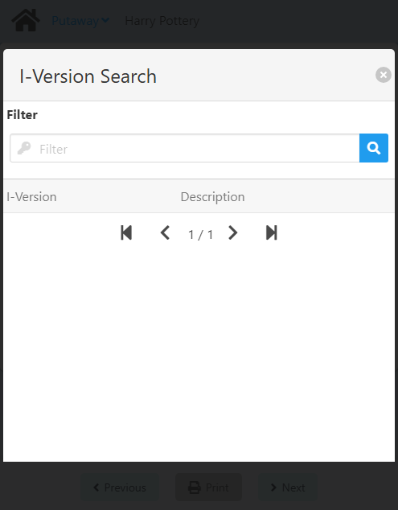

import CustomDetails from "@site/src/components/CustomDetails";
import Tabs from '@theme/Tabs';
import TabItem from '@theme/TabItem';

# Receive

The Receive web app allows you to log the necessary information and execute the necessary actions when receiving inventory into a warehouse.

## Flow Diagram

## Screens

### Receive Type Selection

On this screen you can choose the **type of receiving** you are doing.

You have three options: **PO**(Purchase Order), **RMA**(Return Material Authorization) and **TR**(Transfer Request).

Once you select an option, you will be taken to the respective screen, depending on the [Configuration](./receive.md#configuration):

- **Carrier PO Default of Item (Optional/Mandatory):** You will be taken to the [Carrier Selection](./receive.md#carrier-selection) screen.
- **Carrier PO Not Provided:** You will be taken to the [_Open_ Receive Document Selection](./receive.md#open-receive-document-selection) screen.

### Carrier Selection

:::note[INFO]
This screen is only shown if **Carrier PO required PO** is set to **The Carrier PO is the default of Item  (Optional/Mandatory)** in the [**Configuration**](./shipping_multi_site_transfer.md#configuration).
:::

On this screen you need to select a **carrier**.

The exact screen you will see will depend on the **receive type** you selected.

<Tabs>
  <TabItem value="po" label="PO" default>
    
  </TabItem>
  <TabItem value="rma" label="RMA">
    
  </TabItem>
  <TabItem value="tr" label="TR">
    
  </TabItem>
</Tabs>

---

Click the <IIcon icon='iconamoon:search-bold' width='17' height='17' /> button to open the **Carrier Search** modal.

<CustomDetails summary='Carrier Search Modal'>

On this modal you need to select one of the **carriers** listed.

You can select any item by clicking on it, which will close the modal with that **carrier** already set.

You can filter the list of **carriers** using the search box.

If you want to close the modal without making any changes, click the <IIcon icon='zondicons:close-solid' width='17' height='17'/> button.

</CustomDetails>

Once you select a **carrier**, you will be taken to the [Carrier PO/GRPO Selection](./receive.md#carrier-pogrpo-selection) screen.

### Carrier PO/GRPO Selection

:::note[INFO]
This screen is only shown if **Carrier PO required PO** is set to **The Carrier PO is the default of Item  (Optional/Mandatory)** in the [**Configuration**](./shipping_multi_site_transfer.md#configuration).
:::

On this screen you need to select a **carrier po** associated with the carrier you previously chose, or create a **carrier grpo**.

The exact screen you will see will depend on the **receive type**.

<Tabs>
  <TabItem value="po" label="PO" default>
    
  </TabItem>
  <TabItem value="rma" label="RMA">
    
  </TabItem>
  <TabItem value="tr" label="TR">
    
  </TabItem>
</Tabs>

---

If you want to use a **Carrier PO**, click the <IIcon icon='iconamoon:search-bold' width='17' height='17' /> button to open the **Carrier Purchase Order Search** modal.

:::note[INFO]
If **Truck Log Enabled or Disabled** <u>is</u> checked in the [Configuration](./receive.md#configuration), the search results will only include carrier purchase orders that are open <u>and</u> have already checked in.
:::

<CustomDetails summary='Carrier Purchase Order Search Modal'>

On this modal you need to select one of the **carrier purchase orders** listed.

You can select any item by clicking on it, which will close the modal with that **carrier purchase order** already set.

You can filter the list of **carrier purchase orders** using the search box.

If you want to close the modal without making any changes, click the <IIcon icon='zondicons:close-solid' width='17' height='17'/> button.

</CustomDetails>

Once you select a **carrier po**, you will be taken to the [_Assigned_ Receive Document Selection](./receive.md#assigned-receive-document-selection) screen.

If instead you want to create and use a **carrier grpo**, click the **Generate Carrier GRPO** button to go to the [Carrier GRPO Creation](./receive.md#carrier-grpo-creation) screen.

:::note[INFO]
If **Truck Log Enabled or Disabled** <u>is</u> checked in the [Configuration](./receive.md#configuration), the **Generate Carrier GRPO** button will not be available.
:::

### Carrier GRPO Creation

On this screen you need to create a **Carrier GRPO**. This is an <u>alternative</u> to a **Carrier Purchase Order**.

The **Carrier Company** comes from the previous screen and the **Item No** comes from the **Item to generate the Carrier GRPO** option in the [Configuration](./receive.md#configuration). These fields <u>are not</u> editable.

By default, the **Warehouse** and **Bin Location** will be the location of the personnel in the system, <u>only if</u> the **Location linked to personnel ID as the default location** option <u>is</u> checked in the [Configuration](./receive.md#configuration). These fields <u>are</u> editable.

If you want set a **Warehouse**, click the <IIcon icon="iconamoon:search-bold" width="17" height="17" /> button to open the **Warehouse Search** modal.

<CustomDetails summary="Warehouse Search Modal">

On this screen you need to select one of the **warehouses** listed.

You can select any item by clicking on it, which will close the modal and take you back with that **warehouse** already set.

You can filter the list of **warehouses** using the search box.

If you want to close the modal without making any changes, click the <IIcon icon="zondicons:close-solid" width="17" height="17"/> button.

</CustomDetails>

The **Bin Location** will only be enabled if the **Warehouse** is managed by one. Click the <IIcon icon="iconamoon:search-bold" width="17" height="17" /> button on the field to open the **Bin Location Search** modal.

<CustomDetails summary="Bin Location Search Modal">

On this screen you need to select one of the **bin locations** listed.

You can select any item by clicking on it, which will close the modal and take you back with that **bin location** already set.

You can filter the list of **bin locations** using the search box.

If you want to close the modal without making any changes, click the <IIcon icon="zondicons:close-solid" width="17" height="17"/> button.

</CustomDetails>

And last but no least we have the **Quantity**. Set it to the value you see fit for your case.

Once you are done, click **GRPO** at the bottom to create the **Carrier GRPO** and to go to the [_Open_ Receive Document Selection](./receive.md#open-receive-document-selection) screen.

### _Open_ Receive Document Selection

On this screen you need to select either a **Purchase Order**, **A/P Reserve Invoice**, **Return Request**, or **Transfer Request**, depending on the **receive type**. 

You can select from **all open** documents.

The exact screen you will see will depend on the **receive type** you selected.

<Tabs>
  <TabItem value="po" label="PO" default>
    
  </TabItem>
  <TabItem value="rma" label="RMA">
    
  </TabItem>
  <TabItem value="tr" label="TR">
    
  </TabItem>
</Tabs>

---

Click the <IIcon icon='iconamoon:search-bold' width='17' height='17' /> button to open the search modal for the respective field.

<CustomDetails summary='Purchase Order/AP Reserve Invoice Search Modal'>

On this modal you need to select one of the **purchase orders/ap reserve invoices** listed.

You can select any item by clicking on it, which will close the modal with that **purchase order/ap reserve invoice** already set.

You can filter the list of **purchase orders/ap reserve invoices** using the search box.

If you want to close the modal without making any changes, click the <IIcon icon='zondicons:close-solid' width='17' height='17'/> button.

</CustomDetails>

<CustomDetails summary="Return Request Search Modal">

On this screen you need to select one of the **return requests** listed.

You can select any item by clicking on it, which will close the modal with that **return request** already set.

You can filter the list of **return requests** using the search box.

If you want to close the modal without making any changes, click the <IIcon icon="zondicons:close-solid" width="17" height="17"/> button.

</CustomDetails>

<CustomDetails summary="Transfer Request Search Modal">

On this screen you need to select one of the **transfer requests** listed.

You can select any item by clicking on it, which will close the modal with that **transfer request** already set.

You can filter the list of **transfer requests** using the search box.

If you want to close the modal without making any changes, click the <IIcon icon="zondicons:close-solid" width="17" height="17"/> button.

</CustomDetails>

Once you select a document, you will be taken to the [Line Selection](./receive.md#line-selection) screen.

### _Assigned_ Receive Document Selection

On this screen you need to select either a **Purchase Order**, **A/P Reserve Invoice**, **Return Request**, or **Transfer Request**, depending on the **receive type**. 

You can select from **all open** documents, the **already assigned** to the Carrier PO selected, or **create a PO/AP RI GRPO** if necessary, depending on the [Configuration](./receive.md#configuration).

The exact screen you will see will depend on the **receive type** you selected.

<Tabs>
  <TabItem value="po" label="PO" default>
    
    <CustomDetails summary="Table Reference">
      | Column | Description |
      | --- | --- |
      | Doc # | Document Type and Document Number. |
      | Supplier Details | Supplier information. |
      | Due Date | Date for when the document is to be fulfilled. |
      | Categ. | The category of the document. It can be an Item or a Service. |
    </CustomDetails>
    If you want to use one the **PO/AP RIs** currently **assigned** to the **Carrier PO** selected, click any of the rows in the table to go to the [Line Selection](./receive.md#line-selection) screen.   
    If you want to use a **PO/AP RI** from the list of **open**, click the <IIcon icon='iconamoon:search-bold' width='17' height='17' /> button to open the **Purchase Order/AP Reserve Invoice Search** modal.
    :::note[INFO]
    The **Purchase Order/AP Reserve Invoice** field will only show if the **Carrier PO required PO** option is set to **The Carrier PO is the default of Item (Optional/Mandatory)** in the [Configuration](./receive.md#configuration).
    :::
    <CustomDetails summary='Purchase Order/AP Reserve Invoice Search Modal'>
    On this modal you need to select one of the **purchase orders/ap reserve invoices** listed.  
      
    You can select any item by clicking on it, which will close the modal with that **purchase order/ap reserve invoice** already set.  
    You can filter the list of **purchase orders/ap reserve invoices** using the search box.  
    If you want to close the modal without making any changes, click the <IIcon icon='zondicons:close-solid' width='17' height='17'/> button.
    </CustomDetails>
    Once you select a **PO/AP RI** from the modal, you will be taken to the [Line Selection](./receive.md#line-selection) screen.   
    If you want to create a **PO/AP RI GRPO**, click the **Generate GRPO** button to go to the [PO/AP RI GRPO Creation](./receive.md#pori-grpo-creation) screen.
    :::note[INFO]
    The **Generate GRPO** button will only show if the **Define Active No PO** option is checked in the [Configuration](./receive.md#configuration).
    :::
  </TabItem>
  <TabItem value="rma" label="RMA">
    
    <CustomDetails summary="Table Reference">
      | Column | Description |
      | --- | --- |
      | Doc # | Document Number. |
      | Supplier Info | Supplier information. |
      | Due Date | Date for when the document is to be fulfilled. |
    </CustomDetails>
    If you want to use one the **Return Requests** currently **assigned** to the **Carrier PO** selected, click any of the rows in the table to go to the [Line Selection](./receive.md#line-selection) screen.  
    If you want to use a **Return Request** from the list of **open**, click the <IIcon icon='iconamoon:search-bold' width='17' height='17' /> button to open the **Return Request Search** modal.
    :::note[INFO]
    The **Return Request** field will only show if the **Carrier PO required RMA** option is set to **The Carrier PO is the default of Item (Optional/Mandatory)** in the [Configuration](./receive.md#configuration).
    :::
    <CustomDetails summary="Return Request Search Modal">
    On this screen you need to select one of the **return requests** listed.  
      
    You can select any item by clicking on it, which will close the modal with that **return request** already set.  
    You can filter the list of **return requests** using the search box.  
    If you want to close the modal without making any changes, click the <IIcon icon="zondicons:close-solid" width="17" height="17"/> button.
    </CustomDetails>
    Once you select a **Return Request** from the modal, you will be taken to the [Line Selection](./receive.md#line-selection) screen.
  </TabItem>
  <TabItem value="tr" label="TR">
    
    <CustomDetails summary="Table Reference">
      | Column | Description |
      | --- | --- |
      | DocNum | Document Number. |
      | Supplier | Supplier information. |
      | Due Date | Date for when the document is to be fulfilled. |
      | From Warehouse | The warehouse from where the items are going to be taken. |
      | From Warehouse | The warehouse to where the items are going to be transferred. |
    </CustomDetails>
    If you want to use one the **Transfer Requests** currently **assigned** to the **Carrier PO** selected, click any of the rows in the table to go to the [Line Selection](./receive.md#line-selection) screen.  
    If you want to use a **Transfer Request** from the list of **open**, click the <IIcon icon='iconamoon:search-bold' width='17' height='17' /> button to open the **Transfer Request Search** modal.
    :::note[INFO]
    The **Transfer Request** field will only show if the **Carrier PO required TR** option is set to **The Carrier PO is the default of Item (Optional/Mandatory)** in the [Configuration](./receive.md#configuration).
    :::
    <CustomDetails summary="Transfer Request Search Modal">
    On this screen you need to select one of the **transfer requests** listed.  
      
    You can select any item by clicking on it, which will close the modal with that **transfer request** already set.  
    You can filter the list of **transfer requests** using the search box.  
    If you want to close the modal without making any changes, click the <IIcon icon="zondicons:close-solid" width="17" height="17"/> button.
    </CustomDetails>
    Once you select a **Transfer Request** from the modal, you will be taken to the [Line Selection](./receive.md#line-selection) screen.
  </TabItem>
</Tabs>

### PO/AP RI GRPO Creation

On this screen you need to create a **PO/AP RI GRPO**. This is an <u>alternative</u> to a **PO/AP RI**.

Click the <IIcon icon="iconamoon:search-bold" width="17" height="17" /> button on the fields to open the search modals. You have the **Supplier**, **Item**, **Warehouse** and **Bin Location** search modals.

<CustomDetails summary='Supplier Search Modal'>

On this modal you need to select one of the **suppliers** listed.

You can select any item by clicking on it, which will close the modal and take you back with that **supplier** already set.

You can filter the list of **suppliers** using the search box.

If you want to close the modal without making any changes, click the <IIcon icon='zondicons:close-solid' width='17' height='17'/> button.

</CustomDetails>

<CustomDetails summary='Item Search Modal'>

On this modal you need to select one of the **items** listed.

You can select any item by clicking on it, which will close the modal and take you back with that **item** already set.

You can filter the list of **items** using the search box.

If you want to close the modal without making any changes, click the <IIcon icon='zondicons:close-solid' width='17' height='17'/> button.

</CustomDetails>

<CustomDetails summary="Warehouse Search Modal">

On this screen you need to select one of the **warehouses** listed.

You can select any item by clicking on it, which will close the modal and take you back with that **warehouse** already set.

You can filter the list of **warehouses** using the search box.

If you want to close the modal without making any changes, click the <IIcon icon="zondicons:close-solid" width="17" height="17"/> button.

</CustomDetails>

<CustomDetails summary="Bin Location Search Modal">

On this screen you need to select one of the **bin locations** listed.

You can select any item by clicking on it, which will close the modal and take you back with that **bin location** already set.

You can filter the list of **bin locations** using the search box.

If you want to close the modal without making any changes, click the <IIcon icon="zondicons:close-solid" width="17" height="17"/> button.

</CustomDetails>

If you want to add batches/serial numbers, click the <IIcon icon="pepicons-pop:dots-x" width="17" height="17" /> button on the **Batch/Serial Number** field to open the **Batches/Serial Numbers: Extended Information** modal.

<CustomDetails summary="Batches/Serial Numbers: Extended Information">

On this screen you will be able to **add/modify** batches/serial numbers.

The first thing you will see is the **Batch** tab, giving you information for the batch selected, if any. You can modify the fields on this tab, and that will be reflected once you are done.

If you want to add a new batch, click the <IIcon icon="subway:add" width="17" height="17" />  button to use the **Batch** tab as a form.

Click the <IIcon icon="iconamoon:search-bold" width="17" height="17" /> button on the fields to open the search modals. You have the **Batch/Serial Number** and **I-Version** search modals.

Once you are done adding the batches, you can click on the **Batches** tab to see the list of batches selected and their information.

If you want to delete a batch, click the <IIcon icon="ic:baseline-delete" width="17" height="17" /> button for the respective batch.

If you want to edit a batch, click on that specific batch in the lis to switch to the **Batch** tab and edit it from there.

Once you have everything that you need, click the <IIcon icon="zondicons:close-solid" width="17" height="17"/> button to close the modal and take you back with the new batch information already set.

</CustomDetails>

Next up is the **Quantity**. Set it to the value you see fit.

And last but not least you have the **Remarks**. Use it to leave additional comments.

Once you are done, click **GRPO** at the bottom to create the **PO/AP RI GRPO** and to go to the [Home](./receive.md#receive-type-selection) screen to log another receiving.

### Line Selection

On this screen you need to select one of the lines listed to either create a **GRPO**, execute a **Return**, or execute an **Inventory Tranfer**.

The exact screen you will see will depend on the **receive type** selected.

<Tabs>
  <TabItem value="po" label="PO" default>
    
    <CustomDetails summary="Table Reference">
      | Column | Description |
      | --- | --- |
      | PO Line | Purchase order line. |
      | Item Details | Type, ID and description of the item. |
      | WO Details | Work order, work order position and operation.    **Note:** This column is optional and will show only when a PO has a work order associated. |
      | Qty | Initial quantity and quantity left to complete the line. |
      | Due Date | Date for when the document is to be fulfilled. |
      | WH | Warehouse where the items will be received. |
    </CustomDetails>
    Click on any of the rows of the table to go to the [Line GRPO Creation](./receive.md#line-grpo-creation) screen.
  </TabItem>
  <TabItem value="rma" label="RMA">
    
    <CustomDetails summary="Table Reference">
      | Column | Description |
      | --- | --- |
      | Line | Return line. |
      | Item Details | ID and description of the item. |
      | Qty | Initial quantity and quantity left to complete the line. |
      | Due Date | Date for when the document is to be fulfilled. |
      | WH | Warehouse where the items will be received. |
    </CustomDetails>
    Click on any of the rows of the table to select it and then click **Return** at the bottom to open the **Return Quantity Modal**.
    <CustomDetails summary="Return Quantity Modal">
    On this modal you need to set the **return quantity**.   
       
    Enter the return quantity in the field and click **Confirm** to go to the [Return: Line Summary](./receive.md#return-line-summary) screen.
    </CustomDetails>
  </TabItem>
  <TabItem value="tr" label="TR">
    
    <CustomDetails summary="Table Reference">
      | Column | Description |
      | --- | --- |
      | <IIcon icon="tabler:square" width="17" height="17" /> | Checkbox for selecting the line. |
      | # | ID of the line. |
      | Item | ID and description of the item. |
      | Qty | Quantity requested initially. |
      | Origin | Warehouse and Bin Location from where the items will be be taken. |
      | Destination | Warehouse and Bin Location to where the items will be transferred. |
    </CustomDetails>
    In order to continue to the next screen, you need to check at least one line from the transfer request. If it does not let you select them, that means you need to modify some information in them for them to be applicable for a transfer.  
    If you want to **select** a line, click the <IIcon icon="gg:check-r" width="17" height="17" /> button in the first column of the table for that line.  
    If you want to **modify** a line, click any of the other columns for that line to go to the [Transfer: Modify Line](./receive.md#transfer-modify-line) screen.  
    Once you are done, click **Next** at the bottom to go to the [Transfer: Confirm and Execute](./receive.md#transfer-confirm-and-execute) screen.
  </TabItem>
</Tabs>

### Line GRPO Creation

On this screen you need to **create a grpo** for the line you selected.

The **Item No** comes from the line you selected. It cannot be changed.

If you want set a **Warehouse**, click the <IIcon icon="iconamoon:search-bold" width="17" height="17" /> button to open the **Warehouse Search** modal.

<CustomDetails summary="Warehouse Search Modal">

On this screen you need to select one of the **warehouses** listed.

You can select any item by clicking on it, which will close the modal and take you back with that **warehouse** already set.

You can filter the list of **warehouses** using the search box.

If you want to close the modal without making any changes, click the <IIcon icon="zondicons:close-solid" width="17" height="17"/> button.

</CustomDetails>

The **Bin Location** will only be enabled if the **Warehouse** is managed by one. Click the <IIcon icon="iconamoon:search-bold" width="17" height="17" /> button on the field to open the **Bin Location Search** modal.

<CustomDetails summary="Bin Location Search Modal">

On this screen you need to select one of the **bin locations** listed.

You can select any item by clicking on it, which will close the modal and take you back with that **bin location** already set.

You can filter the list of **bin locations** using the search box.

If you want to close the modal without making any changes, click the <IIcon icon="zondicons:close-solid" width="17" height="17"/> button.

</CustomDetails>

If you want to add batches/serial numbers, click the <IIcon icon="pepicons-pop:dots-x" width="17" height="17" /> button on the **Batch/Serial Number** field to open the **Batches/Serial Numbers: Extended Information** modal.

<CustomDetails summary="Batches/Serial Numbers: Extended Information">

On this screen you will be able to **add/modify** batches/serial numbers.

The first thing you will see is the **Batch** tab, giving you information for the batch selected, if any. You can modify the fields on this tab, and that will be reflected once you are done.

If you want to add a new batch, click the <IIcon icon="subway:add" width="17" height="17" />  button to use the **Batch** tab as a form.

Click the <IIcon icon="iconamoon:search-bold" width="17" height="17" /> button on the fields to open the search modals. You have the **Batch/Serial Number** and **I-Version** search modals.

Once you are done adding the batches, you can click on the **Batches** tab to see the list of batches selected and their information.

If you want to delete a batch, click the <IIcon icon="ic:baseline-delete" width="17" height="17" /> button for the respective batch.

If you want to edit a batch, click on that specific batch in the lis to switch to the **Batch** tab and edit it from there.

Once you have everything that you need, click the <IIcon icon="zondicons:close-solid" width="17" height="17"/> button to close the modal and take you back with the new batch information already set.

</CustomDetails>

Next up is the **Quantity**. Set it to the value you see fit.

Once you are done, click **Save** at the bottom to create the grpo and to open the **Label Printing Modal**.

<CustomDetails summary="Label Printing Modal">

The first thing you will be given is a choice: **Do you want to prin the labels?**

If you click **No**, you will be taken back to the [Line Selection](./receive.md#line-selection) screen.

If you click **Yes, print**, you will be given another choice: **What type of label do you want to print?**

If you click **Cancel**, you will be taken back to the [Line Selection](./receive.md#line-selection) screen.

Otherwise, you have four options: **Per Line**, **Per Unit/Pack**, **Per Batch** and **Per Serial**. The last two options are <u>mutually exclusive</u> and will depend on if the item is managed by batches or serial number.

If you select **Per Line** and click **Print**, a single-page pdf will be created with the line information. After that, you will be taken back to the [Line Selection](./receive.md#line-selection) screen.

If you select **Per Batch** and click **Print**, a pdf will be created with the item and batch information. One page for each batch. After that, you will be taken back to the [Line Selection](./receive.md#line-selection) screen.

If you select **Per Serial** and click **Print**, a single-page pdf will be created with the item and serial number information. After that, you will be taken back to the [Line Selection](./receive.md#line-selection) screen.

If you select **Per Unit/Pack** and click **Print**, you will be taken to the [Print: Box Distribution Setup](./receive.md#print-box-distribution-setup) screen.

:::note[INFO]
For now, you can find all PDFs in the project folder inside the /PDF/PO/ directory.
:::

</CustomDetails>

### Print: Box Distribution Setup

On this screen you need to set the **number of boxes** that will be used for transporting the items, so that a label is created for each one.

<CustomDetails summary="Table Reference">
  | Column | Description |
  | --- | --- |
  | Pack Number | The ID of the box. |
  | Qty | Quantity of the item that will go in that box. This field is editable. |
  | Details | Action button for opening the screen for assigning the batches/serial numbers. |
</CustomDetails>

After you set the number of boxes, a table an other information will be shown below.

You can distribute the total quantity as you see fit. Just make sure it matches the **Total Qty** down below.

Click the <IIcon icon="pepicons-pop:dots-x" width="17" height="17" /> button on any of the boxes to go to the [Print: Select Serials](./receive.md#print-select-serials) screen.

Once you assign all the serial numbers, click **Print** at the bottom to print a number of pdfs equal to the number of boxes with all the boxes information, and to go back to the [Line Selection](./receive.md#line-selection) screen.

### Print: Select Serials

On this screen you need to **assign serial numbers** to the box you selected.

<CustomDetails summary="Table Reference">
  | Column | Description |
  | --- | --- |
  | Select | Action button for selecting a serial number. |
  | Serial Number | Serial Number. |
  | Item Code | Item ID. |
  | Warehouse | Warehouse. |
</CustomDetails>

You can **filter** the list of serial numbers using the search box.

Click the <IIcon icon="gg:check-r" width="17" height="17" /> button on any of the serial numbers to select them.

Once youn are done, click **Save** at the bottom to save the changes and to go back to the [Print: Box Distribution Setup](./receive.md#print-box-distribution-setup) screen.

### Return: Line Summary

On this screen you can see the summary for the return line you selected.

Click **Select Batch/Serial** to go to the [Return: Batch/Serial Number Selection](./receive.md#return-batchserial-number-selection) screen.

After you select a batch/serial number, that information will be reflected underneath the **Select Batch/Serial Number** button.

You can edit/delete the batch/serial number using the action buttons on the right.

One you are done, click **Return** at the bottom to **Execute the Return** and to go back to the [Line Selection](./receive.md#line-selection) screen.

### Return: Batch/Serial Number Selection

On this screen you need to select a **batch/serial number** with a quantity that matches the one you set for return line.

Click the <IIcon icon='iconamoon:search-bold' width='17' height='17' /> button to open the **Batch/Serial Number Search** modal.

<CustomDetails summary='Batch/Serial Number Search Modal'>

On this modal you need to select one of the **batch/serial numbers** listed.

You can select any item by clicking on it, which will close the modal and take you back with that **batch/serial number** already set.

You can filter the list of **batch/serial numbers** using the search box.

If you want to close the modal without making any changes, click the <IIcon icon='zondicons:close-solid' width='17' height='17'/> button.

</CustomDetails>

Next is the **Quantity**. Set it to the quantity you set the return line.

Once you are done, click **Save** to save the selection and to go back to the [Return: Line Summary](./receive.md#return-line-summary) screen.

### Transfer: Modify Line

On this screen you need to **modify** the necessary information on the line you selected.

The **Item No** comes from the previously chosen line.

Click the <IIcon icon="iconamoon:search-bold" width="17" height="17" /> button on the fields to open the search modals. You have the **I-Version**, **Origin Warehouse**, **Origin Bin Location**, **Destination Warehouse**, and **Destination Bin Location**.

<CustomDetails summary="I-Version Search Modal">

On this screen you need to select one of the **I-Versions** listed.

You can select any item by clicking on it, which will close the modal and take you back with that **I-Version** already set.

You can filter the list of **I-Versions** using the search box.

If you want to close the modal without making any changes, click the <IIcon icon="zondicons:close-solid" width="17" height="17"/> button.
</CustomDetails>

<CustomDetails summary="Origin and Destination Warehouse Search Modal">

On this screen you need to select one of the **warehouses** listed.

You can select any item by clicking on it, which will close the modal and take you back with that **warehouse** already set.

You can filter the list of **warehouses** using the search box.

If you want to close the modal without making any changes, click the <IIcon icon="zondicons:close-solid" width="17" height="17"/> button.

</CustomDetails>

<CustomDetails summary="Origin and Destination Bin Location Search Modal">

On this screen you need to select one of the **bin locations** listed.

You can select any item by clicking on it, which will close the modal and take you back with that **bin location** already set.

You can filter the list of **bin locations** using the search box.

If you want to close the modal without making any changes, click the <IIcon icon="zondicons:close-solid" width="17" height="17"/> button.

</CustomDetails>

Click the <IIcon icon="pepicons-pop:dots-x" width="17" height="17" /> button on the **Batch/Serial Number** field to open the **Batches/Serial Numbers: Extended Information** modal.

<CustomDetails summary="Batches/Serial Numbers: Extended Information">

On this screen you will be able to **add/modify** batches/serial numbers.

The first thing you will see is the **Batch** tab, giving you information for the batch selected, if any. You can modify the fields on this tab, and that will be reflected once you are done.

If you want to add a new batch, click the <IIcon icon="subway:add" width="17" height="17" />  button to use the **Batch** tab as a form.

Click the <IIcon icon="iconamoon:search-bold" width="17" height="17" /> button on the fields to open the search modals. You have the **Batch/Serial Number** and **I-Version** search modals.

Once you are done adding the batches, you can click on the **Batches** tab to see the list of batches selected and their information.

If you want to delete a batch, click the <IIcon icon="ic:baseline-delete" width="17" height="17" /> button for the respective batch.

If you want to edit a batch, click on that specific batch in the lis to switch to the **Batch** tab and edit it from there.

Once you have everything that you need, click the <IIcon icon="zondicons:close-solid" width="17" height="17"/> button to close the modal and take you back with the new batch information already set.

</CustomDetails>

Next up is the **Quantity**. Set it to the value you see fit.

Once you are done, click **Next** at the bottom to save the changes and to go back to the [Line Selection](./receive.md#line-selection) screen.

### Transfer: Confirm and Execute

On this screen you need to **confirm** the transfer lines and then **execute** the transfer.

<CustomDetails summary="Table Reference">
  | Column | Description |
  | --- | --- |
  | # | ID of the line. |
  | Item | ID and description of the item. |
  | Qty | Quantity to be transferred. |
  | Origin | Warehouse and Bin Location from where the items will be be taken. |
  | Destination | Warehouse and Bin Location to where the items will be transferred. |
</CustomDetails>

If everything looks correct, click **Next** to **execute** the transfer and to go back to the [Line Selection](./receive.md#line-selection) screen.

## Configuration

:::danger[development]
Currently, all users can access the configuration.
:::

:::note[INFO]
Only administrators can access the configuration for a web app.
:::

On this screen you can set the settings that will apply to this web app.

:::danger[development]
<u>**Visual:**</u> Field name. 

**~Item to generate the Carrier PO~** <IIcon icon="mdi:arrow-right-thin" width="17" height="17" /> **Item to generate the Carrier GRPO**.
:::

| Name | Description |
| :--- | :--- |
| Truck Log Enabled or Disabled | If checked, the web app will only show Carrier POs that are open <u>and</u> have already checked in. Otherwise, it will show all that are open. |
| Define Active No PO | If checked, the user can select documents currently assigned to the Carrier PO selected or create a PO/RI/RR/TR GRPO. Otherwise, the user can only work with the documents currently assigned. |
| Location linked to personnel ID as the default location | For a Transfer Request, if checked, it will prefill the **origin** location of the item with the default location for the personnel. Otherwise, it will prefill the **origin** location of the item with the location with which the line was created for the transfer request.     For other receive types, if checked, it will prefill the location of the item with the default location for the personnel. Otherwise, it will prefill the location of the item with the location with which the line was created for the receive type. |
| Carrier PO required PO/RMA/TR | **The Carrier PO is the default of item (Mandatory):**: The user can <u>only</u> select documents that <u>are</u> currently assigned to the Carrier PO selected.    **The Carrier PO is the default of item (Optional):**: The user can <u>also</u> select documents that <u>are not</u> currently assigned to the Carrier PO selected.    **The Carrier PO is not provided:**: This will skip the screens for selecting a Carrier and a Carrier PO/GRPO. |
| Setting to define the putaway location for the item | This only applies for Transfer Requests.   <ol><li>**The destination location is the default of Item (Mandatory):** This will prefill the **destination** location of the item with the default location for the item. The user <u>cannot</u> edit it.</li><li>**The destination location is the default of Item (Optional):** This will prefill the **destination** location of the item with the default location for the item. The user <u>can</u> edit it.</li><li>**The destination location is chosen by the user:** This will prefill the **destination** location of the item with the location with which the line was created for the transfer request.</li></ol> |
| Item to generate the Carrier GRPO | Here you can set the item that will be used when creating a Carrier GRPO. It can only be changed here.|
