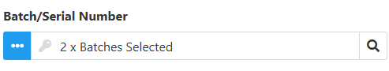
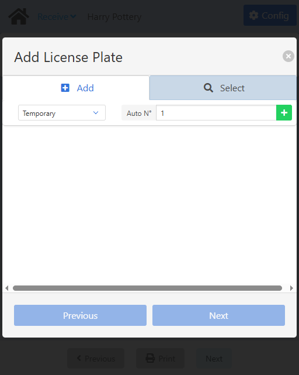
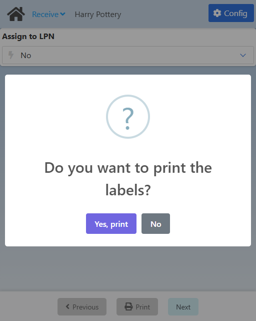

import CustomDetails from "@site/src/components/CustomDetails";
import Tabs from '@theme/Tabs';
import TabItem from '@theme/TabItem';

# Receive

The Receive web app allows you to log the necessary information and execute the necessary actions when receiving inventory into a warehouse.

## Flow Diagram

## Screens

### Carrier Selection

:::note[INFO]
This screen is only shown if **Carrier PO required PO** is set to **The Carrier PO is the default of Item  (Optional/Mandatory)** in the [**Configuration**](./shipping_multi_site_transfer.md#configuration).
:::

On this screen you need to select a **carrier**.

Click the <IIcon icon='iconamoon:search-bold' width='17' height='17' /> button to open the **Carrier Search** modal.

<CustomDetails summary='Carrier Search Modal'>

On this modal you need to select one of the **carriers** listed.

You can select any item by clicking on it, which will close the modal with that **carrier** already set.

You can filter the list of **carriers** using the search box.

If you want to close the modal without making any changes, click the <IIcon icon='zondicons:close-solid' width='17' height='17'/> button.

</CustomDetails>

Once you select a **carrier**, you will be taken to the [Carrier PO/GRPO Selection](./receive.md#carrier-pogrpo-selection) screen.

### Carrier PO/GRPO Selection

:::note[INFO]
This screen is only shown if **Carrier PO required PO** is set to **The Carrier PO is the default of Item  (Optional/Mandatory)** in the [**Configuration**](./shipping_multi_site_transfer.md#configuration).
:::

On this screen you need to select a **carrier po** associated with the carrier you previously chose, or create a **carrier grpo**.

If you want to use a **Carrier PO**, click the <IIcon icon='iconamoon:search-bold' width='17' height='17' /> button to open the **Carrier Purchase Order Search** modal.

:::note[INFO]
If **Truck Log Enabled or Disabled** <u>is</u> checked in the [Configuration](./receive.md#configuration), the search results will only include carrier purchase orders that are open <u>and</u> have already checked in.
:::

<CustomDetails summary='Carrier Purchase Order Search Modal'>

On this modal you need to select one of the **carrier purchase orders** listed.

You can select any item by clicking on it, which will close the modal with that **carrier purchase order** already set.

You can filter the list of **carrier purchase orders** using the search box.

If you want to close the modal without making any changes, click the <IIcon icon='zondicons:close-solid' width='17' height='17'/> button.

</CustomDetails>

Once you select a **carrier po**, you will be taken to the [_Assigned_ Receive Document Selection](./receive.md#assigned-receive-document-selection) screen.

If instead you want to create and use a **carrier grpo**, click the **Generate Carrier GRPO** button to go to the [Carrier GRPO Creation](./receive.md#carrier-grpo-creation) screen.

:::note[INFO]
If **Truck Log Enabled or Disabled** <u>is</u> checked in the [Configuration](./receive.md#configuration), the **Generate Carrier GRPO** button will not be available.
:::

### Carrier GRPO Creation

On this screen you need to create a **Carrier GRPO**. This is an <u>alternative</u> to a **Carrier Purchase Order**.

The **Carrier Company** comes from the previous screen and the **Item No** comes from the **Item to generate the Carrier GRPO** option in the [Configuration](./receive.md#configuration). These fields <u>are not</u> editable.

By default, the **Warehouse** and **Bin Location** will be the location of the personnel in the system, <u>only if</u> the **Location linked to personnel ID as the default location** option <u>is</u> checked in the [Configuration](./receive.md#configuration). These fields <u>are</u> editable.

If you want set a **Warehouse**, click the <IIcon icon="iconamoon:search-bold" width="17" height="17" /> button to open the **Warehouse Search** modal.

<CustomDetails summary="Warehouse Search Modal">

On this screen you need to select one of the **warehouses** listed.

You can select any item by clicking on it, which will close the modal and take you back with that **warehouse** already set.

You can filter the list of **warehouses** using the search box.

If you want to close the modal without making any changes, click the <IIcon icon="zondicons:close-solid" width="17" height="17"/> button.

</CustomDetails>

The **Bin Location** will only be enabled if the **Warehouse** is managed by one. Click the <IIcon icon="iconamoon:search-bold" width="17" height="17" /> button on the field to open the **Bin Location Search** modal.

<CustomDetails summary="Bin Location Search Modal">

On this screen you need to select one of the **bin locations** listed.

You can select any item by clicking on it, which will close the modal and take you back with that **bin location** already set.

You can filter the list of **bin locations** using the search box.

If you want to close the modal without making any changes, click the <IIcon icon="zondicons:close-solid" width="17" height="17"/> button.

</CustomDetails>

And last but no least we have the **Quantity**. Set it to the value you see fit for your case.

Once you are done, click **GRPO** at the bottom to create the **Carrier GRPO** and to go to the [_Open_ Receive Document Selection](./receive.md#open-receive-document-selection) screen.

### _Open_ Receive Document Selection

On this screen you need to select a **Purchase Order/AP Reserve Invoice**.

You can select from **all open** documents.

For selecting a one of the open PO/RIs, click the <IIcon icon='iconamoon:search-bold' width='17' height='17' /> button to open the **PO/RI Search** modal.

<CustomDetails summary='Purchase Order/AP Reserve Invoice Search Modal'>

On this modal you need to select one of the **purchase orders/ap reserve invoices** listed.

You can select any item by clicking on it, which will close the modal with that **purchase order/ap reserve invoice** already set.

You can filter the list of **purchase orders/ap reserve invoices** using the search box.

If you want to close the modal without making any changes, click the <IIcon icon='zondicons:close-solid' width='17' height='17'/> button.

</CustomDetails>

Once you select a document, you will be taken to the [Line Selection](./receive.md#line-selection) screen.

If instead you want to create and use a **po/ri grpo**, click the **Generate GRPO** button to go to the [PO/AP RI GRPO Creation](./receive.md#poap-ri-grpo-creation) screen.

### _Assigned_ Receive Document Selection

On this screen you need to select a **Purchase Order/AP Reserve Invoice**.

You can select from **all open** documents, the **already assigned** to the Carrier PO selected, or **create a PO/AP RI GRPO** if necessary, depending on the [Configuration](./receive.md#configuration).

<CustomDetails summary="Table Reference">
  | Column | Description |
  | --- | --- |
  | Doc # | Document Type and Document Number. |
  | Supplier Details | Supplier information. |
  | Due Date | Date for when the document is to be fulfilled. |
  | Categ. | The category of the document. It can be an Item or a Service. |
</CustomDetails>

If you want to use one the **PO/AP RIs** currently **assigned** to the **Carrier PO** selected, click any of the rows in the table to go to the [Line Selection](./receive.md#line-selection) screen.

If you want to use a **PO/AP RI** from the list of **open**, click the <IIcon icon='iconamoon:search-bold' width='17' height='17' /> button to open the **Purchase Order/AP Reserve Invoice Search** modal.

:::note[INFO]
The **Purchase Order/AP Reserve Invoice** field will only show if the **Carrier PO required PO** option is set to **The Carrier PO is the default of Item (Optional/Mandatory)** in the [Configuration](./receive.md#configuration).
:::

<CustomDetails summary='Purchase Order/AP Reserve Invoice Search Modal'>

On this modal you need to select one of the **purchase orders/ap reserve invoices** listed.

You can select any item by clicking on it, which will close the modal with that **purchase order/ap reserve invoice** already set.

You can filter the list of **purchase orders/ap reserve invoices** using the search box.

If you want to close the modal without making any changes, click the <IIcon icon='zondicons:close-solid' width='17' height='17'/> button.
</CustomDetails>
Once you select a **PO/AP RI** from the modal, you will be taken to the [Line Selection](./receive.md#line-selection) screen. 

If you want to create a **PO/AP RI GRPO**, click the **Generate GRPO** button to go to the [PO/AP RI GRPO Creation](./receive.md#pori-grpo-creation) screen.

:::note[INFO]
The **Generate GRPO** button will only show if the **Define Active No PO** option is checked in the [Configuration](./receive.md#configuration).
:::

### PO/AP RI GRPO Creation

On this screen you need to create a **PO/AP RI GRPO**. This is an <u>alternative</u> to an actual **PO/AP RI**.

Click the <IIcon icon="iconamoon:search-bold" width="17" height="17" /> button on the fields to open the search modals. You have the **Supplier**, **Item**, **Warehouse** and **Bin Location** search modals.

<CustomDetails summary='Supplier Search Modal'>

On this modal you need to select one of the **suppliers** listed.

You can select any item by clicking on it, which will close the modal and take you back with that **supplier** already set.

You can filter the list of **suppliers** using the search box.

If you want to close the modal without making any changes, click the <IIcon icon='zondicons:close-solid' width='17' height='17'/> button.

</CustomDetails>

<CustomDetails summary='Item Search Modal'>

On this modal you need to select one of the **items** listed.

You can select any item by clicking on it, which will close the modal and take you back with that **item** already set.

You can filter the list of **items** using the search box.

If you want to close the modal without making any changes, click the <IIcon icon='zondicons:close-solid' width='17' height='17'/> button.

</CustomDetails>

<CustomDetails summary="Warehouse Search Modal">

On this screen you need to select one of the **warehouses** listed.

You can select any item by clicking on it, which will close the modal and take you back with that **warehouse** already set.

You can filter the list of **warehouses** using the search box.

If you want to close the modal without making any changes, click the <IIcon icon="zondicons:close-solid" width="17" height="17"/> button.

</CustomDetails>

<CustomDetails summary="Bin Location Search Modal">

On this screen you need to select one of the **bin locations** listed.

You can select any item by clicking on it, which will close the modal and take you back with that **bin location** already set.

You can filter the list of **bin locations** using the search box.

If you want to close the modal without making any changes, click the <IIcon icon="zondicons:close-solid" width="17" height="17"/> button.

</CustomDetails>

If you want to add batches/serial numbers, click the <IIcon icon="pepicons-pop:dots-x" width="17" height="17" /> button on the **Batch/Serial Number** field to open the **Batches/Serial Numbers: Extended Information** modal.

<CustomDetails summary="Batches/Serial Numbers: Extended Information">

On this screen you will be able to **add/modify** batches/serial numbers.

The first thing you will see is the **Batch** tab, giving you information for the batch selected, if any. You can modify the fields on this tab, and that will be reflected once you are done.

If you want to add a new batch, click the <IIcon icon="subway:add" width="17" height="17" />  button to use the **Batch** tab as a form.

Click the <IIcon icon="iconamoon:search-bold" width="17" height="17" /> button on the fields to open the search modals. You have the **Batch/Serial Number** and **I-Version** search modals.

Once you are done adding the batches, you can click on the **Batches** tab to see the list of batches selected and their information.

If you want to delete a batch, click the <IIcon icon="ic:baseline-delete" width="17" height="17" /> button for the respective batch.

If you want to edit a batch, click on that specific batch in the lis to switch to the **Batch** tab and edit it from there.

Once you have everything that you need, click the <IIcon icon="zondicons:close-solid" width="17" height="17"/> button to close the modal and take you back with the new batch information already set.

</CustomDetails>

Next up is the **Quantity**. Set it to the value you see fit.

And last but not least you have the **Remarks**. Use it to leave additional comments.

Once you are done, click **GRPO** at the bottom to create the **PO/AP RI GRPO** and to go to the [Home](./receive.md#receive-type-selection) screen to log another receiving.

### Line Selection

On this screen you need to select one of the lines listed to create a **GRPO**.

<CustomDetails summary="Table Reference">
  | Column | Description |
  | --- | --- |
  | PO Line | Purchase order line. |
  | Item Details | Type, ID and description of the item. |
  | WO Details | Work order, work order position and operation.    **Note:** This column is optional and will show only when a PO has a work order associated. |
  | Qty | Initial quantity and quantity left to complete the line. |
  | Due Date | Date for when the document is to be fulfilled. |
  | WH | Warehouse where the items will be received. |
</CustomDetails>

Click on any of the rows of the table to go to the [Line GRPO Creation](./receive.md#line-grpo-creation) screen.

### Line GRPO Creation

On this screen you need to **create a grpo** for the line you selected.

The **Item No** comes from the line you selected. It cannot be changed.

If you want set a **Warehouse**, click the <IIcon icon="iconamoon:search-bold" width="17" height="17" /> button to open the **Warehouse Search** modal.

<CustomDetails summary="Warehouse Search Modal">

On this screen you need to select one of the **warehouses** listed.

You can select any item by clicking on it, which will close the modal and take you back with that **warehouse** already set.

You can filter the list of **warehouses** using the search box.

If you want to close the modal without making any changes, click the <IIcon icon="zondicons:close-solid" width="17" height="17"/> button.

</CustomDetails>

The **Bin Location** will only be enabled if the **Warehouse** is managed by one. Click the <IIcon icon="iconamoon:search-bold" width="17" height="17" /> button on the field to open the **Bin Location Search** modal.

<CustomDetails summary="Bin Location Search Modal">

On this screen you need to select one of the **bin locations** listed.

You can select any item by clicking on it, which will close the modal and take you back with that **bin location** already set.

You can filter the list of **bin locations** using the search box.

If you want to close the modal without making any changes, click the <IIcon icon="zondicons:close-solid" width="17" height="17"/> button.

</CustomDetails>

If you want to add batches/serial numbers, click the <IIcon icon="pepicons-pop:dots-x" width="17" height="17" /> button on the **Batch/Serial Number** field to open the **Batches/Serial Numbers: Extended Information** modal.

<CustomDetails summary="Batches/Serial Numbers: Extended Information">

On this screen you will be able to **add/modify** batches/serial numbers.

The first thing you will see is the **Batch** tab, giving you information for the batch selected, if any. 

You can modify the fields on this tab, and that will be reflected once you are done.

Set the **Batch Number**, the **LPN UOM** (number of containers that will be used for handling the items), the **Quantity** and you are good to go.

If you want to add a new batch, click the <IIcon icon="subway:add" width="17" height="17" />  button to use the **Batch** tab as a form.

Once you are done adding the batches, you can click on the **Batches** tab to see the list of batches selected and their information.

If you want to delete a batch, click the <IIcon icon="ic:baseline-delete" width="17" height="17" /> button for the respective batch.

If you want to edit a batch, click on that specific batch in the lis to switch to the **Batch** tab and edit it from there.

Once you have everything that you need, click the <IIcon icon="zondicons:close-solid" width="17" height="17"/> button to close the modal and take you back with the new batch information already set.

</CustomDetails>

Next up is the **Quantity**. Set it to the value you see fit, as long as you didn't use the extended modal, otherwise, the quantity will already be set.

Once you are done, click **Save** at the bottom to open the **UOM Quantity** modal.

<CustomDetails summary="UOM Quantity Modal">

On this modal you need to set the number of containers that will be used for transporting the item with the quantity you selected.

Once you are done, click **Ok** to generate the grpo and to go to the [Choice: Assign to LPN](./receive.md#choice-assign-to-lpn) screen.

</CustomDetails>

### Choice: Assign to LPN

On this screen you need to choose if you want to assign the stock to an LPN or not.

If you select **Yes** and click **Next**, the **Assign License Plate** modal will open.

<CustomDetails summary="Assign License Plate Modal">

On this modal you need to choose between creating new LPNs for the process and using existing LPNs.

If you click **Create New**, the **Add License Plate: Add** modal will open.

<CustomDetails summary="Add License Plate: Add Modal">

On this modal you can create LPNs.

First you need to select the type of LPN you are going to create: **Permanent Transfer** (PF-XXXX), **Permanent Transport** (PP-XXXX), **Temporary** (T-XXXX) and **External** (E-XXXX).

Next, you need to set the **Auto N°** field to the number of LPNs you want to create. All LPNs are **auto-incremental**.

Once you are done, click the <IIcon icon="ph:plus-fill" width="17" height="17" /> button to go to the **License Plates Summary** section.

You can **add** more LPNs by clicking the **Add License Plate** button.

You can **filter** the list of LPNs using the search box.

You can **remove** any of the LPNs by clicking the <IIcon icon="ic:baseline-delete" width="17" height="17" /> button on the rightmost column. Keep in mind that at this point no LPN has actually been created in the system.

If you have everything that you need, click **Next** to actually create the LPNs in the system and to go to the [LPN Overview](./receive.md#lpn-overview) screen.

</CustomDetails>

If you click **Select Existing**. the **Add License Plate: Select** modal will open.

<CustomDetails summary="Add License Plate: Select Modal">

On this modal you can select already existing LPNs.

Click the <IIcon icon='iconamoon:search-bold' width='17' height='17' /> button to open the **License Plate Search** modal.

<CustomDetails summary="License Plate Search Modal">

On this screen you need to select one of the **License Plates** listed.

You can select any item by clicking on it, which will close the modal and take you back with that **License Plate** already set.

You can filter the list of **License Plates** using the search box.

If you want to close the modal without making any changes, click the <IIcon icon="zondicons:close-solid" width="17" height="17"/> button.
</CustomDetails>

After you select one of the license plates, you will see all the information related to it.

If everything seems correct, click **Next** to go to the **License Plates Summary** section.

You can **add** more LPNs by clicking the **Add License Plate** button.

You can **filter** the list of LPNs using the search box.

You can **unselect** any of the LPNs by clicking the  button on the rightmost column.

If you have everything that you need, click **Next** to go to the [LPN: Overview](./receive.md#lpn-overview) screen.

</CustomDetails>

</CustomDetails>

On the other hand, if you select **No**, the **Label Printing** modal will open.

<CustomDetails summary="Label Printing Modal">

The first thing you will be given is a choice: **Do you want to print the labels?**

If you click **No**, you will be taken back to the [Line Selection](./receive.md#line-selection) screen.

If you click **Yes, print**, you will be given another choice: **What type of label do you want to print?**

If you click **Cancel**, you will be taken back to the [Line Selection](./receive.md#line-selection) screen.

Otherwise, you have four options: **Per Line**, **Per Unit/Pack**, **Per Batch** and **Per Serial**. The last two options are <u>mutually exclusive</u> and will depend on if the item is managed by batches or serial number.

If you select **Per Line** and click **Print**, a single-page pdf will be created with the line information. After that, you will be taken back to the [Line Selection](./receive.md#line-selection) screen.

If you select **Per Batch** and click **Print**, a pdf will be created with the item and batch information. One page for each batch. After that, you will be taken back to the [Line Selection](./receive.md#line-selection) screen.

If you select **Per Serial** and click **Print**, a single-page pdf will be created with the item and serial number information. After that, you will be taken back to the [Line Selection](./receive.md#line-selection) screen.

If you select **Per Unit/Pack** and click **Print**, you will be taken to the [Print: Box Distribution Setup](./receive.md#print-box-distribution-setup) screen (for serial numbers) or to the [Print: Batch List](./receive.md#print-batch-list) screen (for batches).

:::note[INFO]
You can find all PDFs in the project folder inside the /PDF/PO/ directory.
:::

</CustomDetails>

### LPN: Overview

On this screen you can see the list of LPNs you created.

<CustomDetails summary="Table Reference">
  | Column | Description |
  | --- | --- |
  | License | License Plate. |
  | Details | Action button to go to the batch selection screen. |
</CustomDetails>

If you are working with a **batch-managed** item, click the <IIcon icon="pepicons-pop:dots-x" width="17" height="17" /> button on any of the LPNs to go to the [LPN: Batch Selection](./receive.md#lpn-batch-selection) screen.

If you are working with a **serial-managed** item, click the <IIcon icon="pepicons-pop:dots-x" width="17" height="17" /> button on any of the LPNs to go to the [LPN: Assign Serials](./receive.md#lpn-assign-serials) screen.

Once you are done, click **Next** at the bottom to save the changes and open the **Label Printing** modal.

<CustomDetails summary="Label Printing Modal">

The first thing you will be given is a choice: **Do you want to print the labels?**

If you click **No**, you will be taken back to the [Line Selection](./receive.md#line-selection) screen.

If you click **Yes, print**, you will be given another choice: **What type of label do you want to print?**

If you click **Cancel**, you will be taken back to the [Line Selection](./receive.md#line-selection) screen.

Otherwise, you have four options: **Per Line**, **Per Unit/Pack**, **Per Batch** and **Per Serial**. The last two options are <u>mutually exclusive</u> and will depend on if the item is managed by batches or serial number.

If you select **Per Line** and click **Print**, a single-page pdf will be created with the line information. After that, you will be taken back to the [Line Selection](./receive.md#line-selection) screen.

If you select **Per Batch** and click **Print**, a pdf will be created with the item and batch information. One page for each batch. After that, you will be taken back to the [Line Selection](./receive.md#line-selection) screen.

If you select **Per Serial** and click **Print**, a single-page pdf will be created with the item and serial number information. After that, you will be taken back to the [Line Selection](./receive.md#line-selection) screen.

If you select **Per Unit/Pack** and click **Print**, a number of pdfs equal to the number of boxes with all the boxes information will be created. After that, you will be taken back to the [Line Selection](./receive.md#line-selection) screen.

:::note[INFO]
You can find all PDFs in the project folder inside the /PDF/PO/ directory.
:::

</CustomDetails>

### LPN: Batch Selection

On this screen you can see the list of batches that you can work with.

At the top you will see the LPN you are working with.

<CustomDetails summary="Table Reference">
  | Column | Description |
  | --- | --- |
  | Batch | ID of the batch. |
  | Item | ID of the item. |
  | Quantity | Quantity. |
  | Warehouse | Warehouse. |
  | Details | Action button to go to the screen for Selecting containers. |
</CustomDetails>

Click the <IIcon icon="pepicons-pop:dots-x" width="17" height="17" /> button on any of the batches to go to the [LPN: Box Distribution](./receive.md#lpn-box-distribution) screen.

### LPN: Box Distribution

On this screen you can see the list of containers that you specified before with the total quantity evenly divided into all the containers. The total quantity is distributed automatically and cannot be changed.

At the top you will see the batch you are working with.

<CustomDetails summary="Table Reference">
  | Column | Description |
  | --- | --- |
  | Select | Action button for selecting a container. |
  | Box # | ID of the box. |
  | Quantity | Quantity currently assigned to the container. |
  | Status | Shows if the container is available or if it has alredy been assigned to an LPN. |
</CustomDetails>

Select containers by clicking the <IIcon icon="line-md:square" width="17" height="17"/> button on the leftmost column.

Once you are done, click **Next** at the bottom to save the changes, assign the containers to the current LPN and to go back to the [LPN: Overview](./receive.md#lpn-overview) screen.

### LPN: Assign Serials

On this screen you can see the list of serial numbers that you can work with.

At the top you will see the LPN you are working with.

You need to assign serial numbers to the LPN. Click the <IIcon icon="line-md:square" width="17" height="17"/> button on the leftmost column to select a serial number. It's only one container with quantity of one for each serial number.

Once you are done, click **Next** to save the changes, assign the serial numbers to the LPN and to go back to the [LPN: Overview](./receive.md#lpn-overview) screen.

### Print: Box Distribution Setup

On this screen you need to set the **number of boxes** that will be used for transporting the items, so that a label is created for each one.

<CustomDetails summary="Table Reference">
  | Column | Description |
  | --- | --- |
  | Pack Number | The ID of the box. |
  | Qty | Quantity of the item that will go in that box. This field is editable. |
  | Details | Action button for opening the screen for assigning the batches/serial numbers. |
</CustomDetails>

After you set the number of boxes, a table an other information will be shown below.

You can distribute the total quantity as you see fit. Just make sure it matches the **Total Qty** down below.

Click the <IIcon icon="pepicons-pop:dots-x" width="17" height="17" /> button on any of the boxes to go to the [Print: Select Serials](./receive.md#print-select-serials) screen.

Once you assign all the serial numbers, click **Print** at the bottom to print a number of pdfs equal to the number of boxes with all the boxes information, and to go back to the [Line Selection](./receive.md#line-selection) screen.

### Print: Select Serials

On this screen you need to **assign serial numbers** to the box you selected.

<CustomDetails summary="Table Reference">
  | Column | Description |
  | --- | --- |
  | Select | Action button for selecting a serial number. |
  | Serial Number | Serial Number. |
  | Item Code | Item ID. |
  | Warehouse | Warehouse. |
</CustomDetails>

You can **filter** the list of serial numbers using the search box.

Click the <IIcon icon="gg:check-r" width="17" height="17" /> button on any of the serial numbers to select them.

Once youn are done, click **Save** at the bottom to save the changes and to go back to the [Print: Box Distribution Setup](./receive.md#print-box-distribution-setup) screen.

### Print: Batch List

On this screen you can see a summary of the batches you can work with.

<CustomDetails summary="Table Reference">
  | Column | Description |
  | --- | --- |
  | Batch | ID of the batch. |
  | Item | ID of the item. |
  | Quantity | Quantity. |
  | Warehouse | Warehouse. |
  | Details | Action button to go to the screen for handling quantities by containers. |
</CustomDetails>

For changing the quantity per container and printing, click the <IIcon icon="pepicons-pop:dots-x" width="17" height="17"/> button on the rightmost column to go to the [Print: Batch Distribution](./receive.md#print-batch-distribution) screen.

### Print: Batch Distribution

On this screen you can modify the quantity that each container is going to hold. You can also print the labels by unit/pack.

On top of the containers table you can see the batch you are working with.

<CustomDetails summary="Table Reference">
  | Column | Description |
  | --- | --- |
  | Box # | ID of the box. |
  | Quantity | Quantity being handled by that specific container. |
</CustomDetails>

Set the quantities as you see fit, making sure to use the total quantity.

Once you are done, click **Print** at the bottom to print the labels and to go to the [Line Selection](./receive.md#line-selection) screen.

## Configuration

:::note[INFO]
Only administrators can access the configuration for a web app.
:::

On this screen you can set the settings that will apply to this web app.

| Name | Description |
| :--- | :--- |
| Truck Log Enabled or Disabled | If checked, the web app will only show Carrier POs that are open <u>and</u> have already checked in. Otherwise, it will show all that are open. |
| Define Active No PO | If checked, the user can select documents currently assigned to the Carrier PO selected or create a PO/RI/RR/TR GRPO. Otherwise, the user can only work with the documents currently assigned. |
| Location linked to personnel ID as the default location | For a Transfer Request, if checked, it will prefill the **origin** location of the item with the default location for the personnel. Otherwise, it will prefill the **origin** location of the item with the location with which the line was created for the transfer request.     For other receive types, if checked, it will prefill the location of the item with the default location for the personnel. Otherwise, it will prefill the location of the item with the location with which the line was created for the receive type. |
| Carrier PO required PO/RMA/TR | **The Carrier PO is the default of item (Mandatory):**: The user can <u>only</u> select documents that <u>are</u> currently assigned to the Carrier PO selected.    **The Carrier PO is the default of item (Optional):**: The user can <u>also</u> select documents that <u>are not</u> currently assigned to the Carrier PO selected.    **The Carrier PO is not provided:**: This will skip the screens for selecting a Carrier and a Carrier PO/GRPO. |
| Setting to define the putaway location for the item | This only applies for Transfer Requests.   <ol><li>**The destination location is the default of Item (Mandatory):** This will prefill the **destination** location of the item with the default location for the item. The user <u>cannot</u> edit it.</li><li>**The destination location is the default of Item (Optional):** This will prefill the **destination** location of the item with the default location for the item. The user <u>can</u> edit it.</li><li>**The destination location is chosen by the user:** This will prefill the **destination** location of the item with the location with which the line was created for the transfer request.</li></ol> |
| Item to generate the Carrier GRPO | Here you can set the item that will be used when creating a Carrier GRPO. It can only be changed here.|
