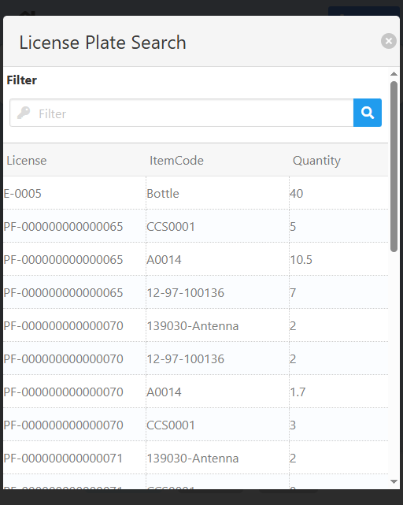

import CustomDetails from "@site/src/components/CustomDetails";
import Tabs from '@theme/Tabs';
import TabItem from '@theme/TabItem';

# Reprinting

The Reprinting WebApp allows you to print labels for any GRPO and LPN, in a variety of ways.

## Flow Diagram

## General Notes

:::note[INFO]
You can find all PDFs in the project folder inside the /PDF/PO/ directory.
:::

:::note[INFO]
This is how the label-type printing works:

**Line:** A single PDF with all the lines, consecutively.

**Unit/Pack:** One PDF per box.

**Batch:** A single PDF with one page per batch.

**Serial:** A single PDF with one page per serial.

**LPN:** A single PDF with one page per item/line.
:::

## Screens

### Label Type Selection

On this screen you can select the way by which you want to print the label: **Line**, **Unit/Pack**, **Batch**, **Serial** and **LPN**.

Use the **Select a Label** dropdown to select a label type and to go to the [GRPO/LPN Selection](./reprinting.md#grpolpn-selection) screen.

### GRPO/LPN Selection

On this screen you need to select either the Goods Receipt Purchase Order (**GRPO**) or the **LPN** that you want to print labels for.

<Tabs>
  <TabItem value="grpo" label="GRPO" default>
    
  </TabItem>
  <TabItem value="lpn" label="LPN">
    
  </TabItem>
</Tabs>

:::note[INFO]
For LPN labels you need to select an LPN, and for the rest, you need a GRPO.
:::

Click the <IIcon icon='iconamoon:search-bold' width='17' height='17' /> button to open the search modals.

<CustomDetails summary='GRPO Search Modal'>

On this modal you need to select one of the **GRPOs** listed.

You can select any item by clicking on it, which will close the modal with that **GRPO** already set.

You can filter the list of **GRPOs** using the search box.

If you want to close the modal without making any changes, click the <IIcon icon='zondicons:close-solid' width='17' height='17'/> button.

</CustomDetails>

<CustomDetails summary='LPN Search Modal'>

On this modal you need to select one of the **LPNs** listed.

You can select any item by clicking on it, which will close the modal with that **LPN** already set.

You can filter the list of **LPNs** using the search box.

If you want to close the modal without making any changes, click the <IIcon icon='zondicons:close-solid' width='17' height='17'/> button.

</CustomDetails>

After selecting a GRPO/LPN, you will be taken to the:

- [Unit/Pack: GRPO Line Selection](./reprinting.md#unitpack-grpo-line-selection) screen, if you want to print a **Unit/Pack** label.
- [Summary and Printing](./reprinting.md#summary-and-printing) screen, if you want to print any other type of label.

### Unit/Pack: GRPO Line Selection

First, you need to select one of the lines from the GRPO. Click the <IIcon icon='iconamoon:search-bold' width='17' height='17' /> button on the **Good Receipt PO Line** field to open the **GRPO Line Search** modal.

<CustomDetails summary='GRPO Line Search Modal'>

On this modal you need to select one of the **GRPO Lines** listed.

You can select any item by clicking on it, which will close the modal with that **GRPO Line** already set.

You can filter the list of **GRPO Lines** using the search box.

If you want to close the modal without making any changes, click the <IIcon icon='zondicons:close-solid' width='17' height='17'/> button.

</CustomDetails>

After selecting the GRPO line, you will be taken to the:

- [Unit/Pack: Batch: Batch List](./reprinting.md#unitpack-batch-batch-list) screen, if it is a **batch-managed** item.
- [Unit/Pack: Serial: Box Distribution](./reprinting.md#unitpack-serial-box-distribution) screen, if it is a **serial-managed** item.
- [Unit/Pack: None: Number of Boxes](./reprinting.md#unitpack-none-number-of-boxes) screen, if it is a **none-managed** item.
- [Summary and Printing](./reprinting.md#unitpack-none-number-of-boxes) screen, if the GRPO already has a unit/pack label generated.

### Unit/Pack: Serial: Box Distribution

On this screen you need to set the numbers of boxes that will be used and their quantities.

<CustomDetails summary="Table Reference">
  | Column | Description |
  | --- | --- |
  | Pack Number | SID of the box. |
  | Qty | Quantity of the item that will go in that box. This field is editable. |
  | Details | Action button for opening the screen for assigning the serial numbers. |
</CustomDetails>

After you set the number of boxes, a table and other information will be shown below.

You can distribute the total quantity as you see fit. Just make sure it matches the **Total Qty** down below.

Click the <IIcon icon="pepicons-pop:dots-x" width="17" height="17" /> button on any of the boxes to go to the [Print: Select Serials](./reprinting.md#unitpack-serial-select-serials) screen.

Once you assign all the serial numbers, click **Print** at the bottom to print a number of pdfs equal to the number of boxes with all the boxes information, and to go to the [Home](./reprinting.md#label-type-selection) screen.

### Unit/Pack: Serial: Select Serials

On this screen you need to **assign serial numbers** to the box you selected.

<CustomDetails summary="Table Reference">
  | Column | Description |
  | --- | --- |
  | Select | Action button for selecting a serial number. |
  | Serial Number | Serial Number. |
  | Item Code | Item ID. |
  | Warehouse | Warehouse. |
</CustomDetails>

You can **filter** the list of serial numbers using the search box.

Click the <IIcon icon="gg:check-r" width="17" height="17" /> button on any of the serial numbers to select them.

Once you are done, click **Save** at the bottom to save the changes and to go back to the [Unit/Pack: Serial: Box Distribution](./reprinting.md#unitpack-serial-box-distribution) screen.

### Unit/Pack: Batch: Batch List

On this screen you can see a summary of the batches you can work with for the selected line.

<CustomDetails summary="Table Reference">
  | Column | Description |
  | --- | --- |
  | Batch | ID of the batch. |
  | Item | ID of the item. |
  | Quantity | Quantity. |
  | Warehouse | Warehouse. |
  | Details | Action button to go to the screen for handling quantities per containers. |
</CustomDetails>

On top of the batches table you can see the GRPO you are working with.

For changing the quantity per container and printing, click the <IIcon icon="pepicons-pop:dots-x" width="17" height="17"/> button on the rightmost column to go to the [Unit/Pack: Batch: Batch Distribution](./reprinting.md#unitpack-batch-batch-distribution) screen.

### Unit/Pack: Batch: Batch Distribution

On this screen you can modify the quantity that each container is going to hold. You can also print the labels by unit/pack.

<CustomDetails summary="Table Reference">
  | Column | Description |
  | --- | --- |
  | Box # | ID of the box. |
  | Quantity | Quantity that will be handled by that specific container. |
</CustomDetails>

On top of the containers table you can see the batch you are working with.

Set the quantities as you see fit, making sure to use the total quantity.

Once you are done, click **Print** at the bottom to print the labels and to go to the [Home](./reprinting.md#label-type-selection) screen.

### Unit/Pack: None: Number of Boxes

On this screen you need to set the number of boxes for the distribution.

Put the number in the field and press **enter** or **click outside** to apply it and to go to the [Unit/Pack: None: Box Distribution](./reprinting.md#unitpack-none-box-distribution) screen.

### Unit/Pack: None: Box Distribution

On this screen you can modify the quantity that each container is going to hold. You can also print the labels by unit/pack.

<CustomDetails summary="Table Reference">
  | Column | Description |
  | --- | --- |
  | Pack # | ID of the box. |
  | Quantity | Quantity that will be handled by that specific container. |
</CustomDetails>

Set the quantities as you see fit, making sure to use the total quantity.

Once you are done, click **Print** at the bottom to print the labels and to go to the [Home](./reprinting.md#label-type-selection) screen.

### Summary and Printing

On this screen you can see a summary of what you are working with and print the labels.

<Tabs>
  <TabItem value="line" label="Line" default>
    
  </TabItem>
  <TabItem value="unitpack" label="Unit/Pack" default>
    
    <CustomDetails summary="Table Reference">
      | Column | Description |
      | --- | --- |
      | PackNum | ID of the box. |
      | PackQty | Quantity assigned to that box. |
    </CustomDetails>
    :::note[INFO]
    For Unit/Pack, if the GRPO already has a unit/pack label generated, you will see it reflected in the table below.
    :::
  </TabItem>
  <TabItem value="batch" label="Batch">
    
  </TabItem>
  <TabItem value="serial" label="Serial">
    
  </TabItem>
  <TabItem value="lpn" label="LPN">
    
  </TabItem>
</Tabs>

---

If everything seems right, click **Print** at the bottom to print the labels as you specified and to go the [Home](./reprinting.md#label-type-selection) screen.