import CustomDetails from "@site/src/components/CustomDetails";
import Tabs from '@theme/Tabs';
import TabItem from '@theme/TabItem';

# Shipping Delivery

The Shipping Delivery web app allows you to log the necessary information and execute the necessary actions when delivering sales orders, or part of them.

## Flow Diagram

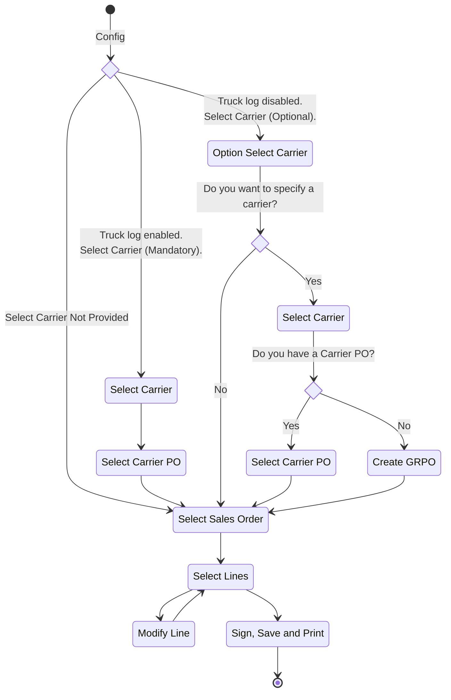

## Screens

### Option: Select Carrier

:::note[INFO]
This screen is only shown if **Truck Log Enabled or disabled** <u>is not</u> checked in the [**Configuration**](./shipping_delivery.md#configuration).
:::

On this screen you have the option of deciding if you want to specify a **carrier** or not.

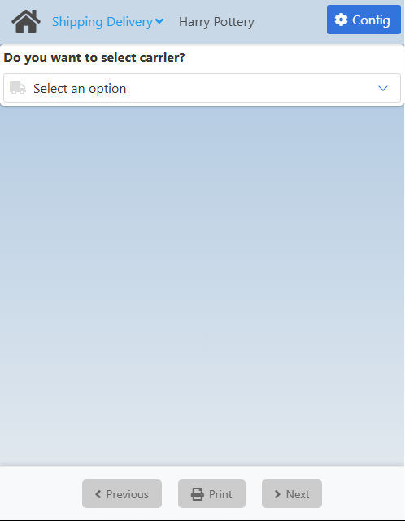

If you choose **Yes**, you will be taken to the [Carrier Selection](./shipping_delivery.md#carrier-selection) screen.

If you choose **No**, you will be taken to the [Sales Order Selection](./shipping_delivery.md#sales-order-selection) screen.

### Carrier Selection

On this screen you need to select a **carrier**.

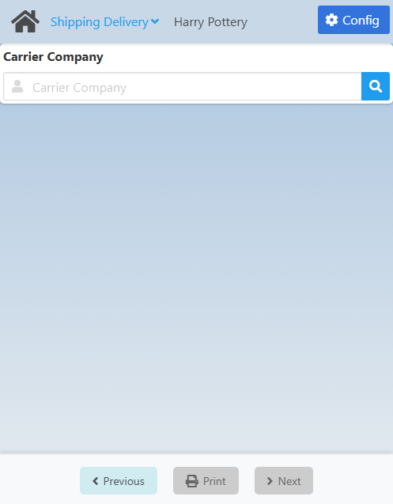

Click the <IIcon icon='iconamoon:search-bold' width='17' height='17' /> button to open the **Carrier Search** modal.

<CustomDetails summary='Carrier Search Modal'>

On this modal you need to select one of the **carriers** listed.

You can select any item by clicking on it, which will close the modal with that **carrier** already set.

You can filter the list of **carriers** using the search box.

If you want to close the modal without making any changes, click the <IIcon icon='zondicons:close-solid' width='17' height='17'/> button.

</CustomDetails>

Once you select a **carrier**, you will be taken to the [Carrier Purchase Order Selection](./shipping_delivery.md#carrier-purchase-order-selection) screen.

### Carrier Purchase Order Selection

On this screen you need to select a **carrier purchase order** associated with the carrier you previously chose.

The exact screen you will see will depend on the **Truck Log Enabled or disabled** option in the [Configuration](./shipping_delivery.md#configuration):

1. <u>**Truck Log Checked**</u>: The **Truck Log Enabled or disabled** option <u>is</u> checked. This will only give you the option for selecting a **Carrier Purchase Order**.
2. <u>**Truck Log Not Checked**</u>: The **Truck Log Enabled or disabled** option <u>is not</u> checked. This will give you both options, selecting a **Carrier Purchase Order** and creating a **Goods Receipt Purchase Order**. The options are <u>mutually exclusive</u>.

<Tabs>
  <TabItem value="checked" label="Truck Log Checked" default>
    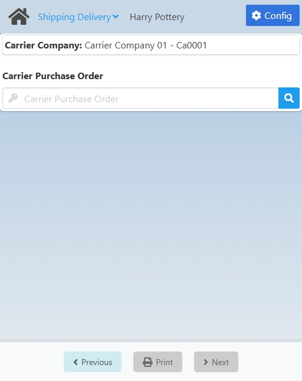
  </TabItem>
  <TabItem value="not-checked" label="Truck Log Not Checked">
    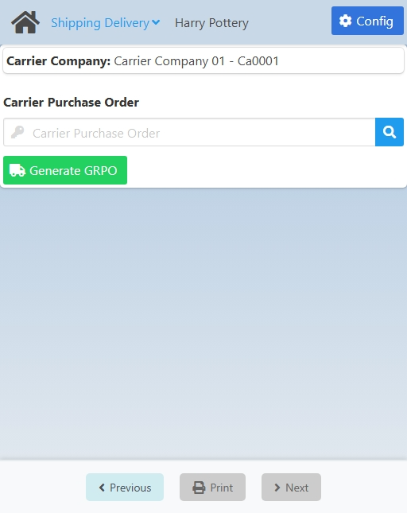
  </TabItem>
</Tabs>

---

If you want to use a **Carrier Purchase Order**, click the <IIcon icon='iconamoon:search-bold' width='17' height='17' /> button to open the **Carrier Purchase Order Search** modal.

:::note[INFO]
If **Truck Log Enabled or disabled** <u>is</u> checked in the [Configuration](./shipping_delivery.md#configuration), the search results will only include **carrier purchase orders** that are open <u>and</u> have already checked in.
:::

<CustomDetails summary='Carrier Purchase Order Search Modal'>

On this modal you need to select one of the **carrier purchase orders** listed.

You can select any item by clicking on it, which will close the modal with that **carrier purchase order** already set.

You can filter the list of **carrier purchase orders** using the search box.

If you want to close the modal without making any changes, click the <IIcon icon='zondicons:close-solid' width='17' height='17'/> button.

</CustomDetails>

Once you select a **carrier purchase order**, you will be taken to the [Sales Order Selection](./shipping_delivery.md#sales-order-selection) screen.

If instead you want to use a **Goods Receipt Purchase Order** <u>and it is available</u>, click the **Generate GRPO** button to go to the [GRPO Creation](./shipping_delivery.md#grpo-creation) screen.

### GRPO Creation

On this screen you need to create a **GRPO**. This is an <u>alternative</u> to a **Carrier Purchase Order**.

The **Carrier Company** comes from the previous screen and the **Item No** comes from the **Item to generate the Carrier PO** option in the [Configuration](./shipping_delivery.md#configuration). These fields <u>are not</u> editable.

By default, the **Warehouse** and **Bin Location** will be the location of the personnel in the system, <u>only if</u> the **Location linked to personnel ID as the default location** option <u>is</u> checked in the [Configuration](./shipping_delivery.md#configuration). These fields <u>are</u> editable.

If you want set a **Warehouse**, click the <IIcon icon="iconamoon:search-bold" width="17" height="17" /> button to open the **Warehouse Search** modal.

<CustomDetails summary="Warehouse Search Modal">

On this screen you need to select one of the **warehouses** listed.

You can select any item by clicking on it, which will close the modal and take you back with that **warehouse** already set.

You can filter the list of **warehouses** using the search box.

If you want to close the modal without making any changes, click the <IIcon icon="zondicons:close-solid" width="17" height="17"/> button.

</CustomDetails>

The **Bin Location** will only be enabled if the **Warehouse** is managed by one. Click the <IIcon icon="iconamoon:search-bold" width="17" height="17" /> button on the field to open the **Bin Location Search** modal.

<CustomDetails summary="Bin Location Search Modal">

On this screen you need to select one of the **bin locations** listed.

You can select any item by clicking on it, which will close the modal and take you back with that **bin location** already set.

You can filter the list of **bin locations** using the search box.

If you want to close the modal without making any changes, click the <IIcon icon="zondicons:close-solid" width="17" height="17"/> button.

</CustomDetails>

Next up is the **Batch/Serial Number**. This one is not enabled because for this specific procedure the **Item No** is not supposed to be managed by a batch/serial number, due to its nature.

<!-- NOTE: When enabled, the batch field allows the user to type in any value and that gives an error later when trying to create the GRPO  -->

And last but no least we have the **Quantity**. Set it to the value you see fit.

Once you are done, click **Save** at the bottom to create the **Goods Receipt Purchase Order** and to go to the [Sales Order Selection](./shipping_delivery.md#sales-order-selection) screen.

### Sales Order Selection

On this screen you need to select a **sales orders**.

The exact screen you will see will depend on what screen you got here from:

1. <u>**No Carrier**</u>: After selecting **No** on the [Option: Select Carrier](./shipping_delivery.md#option-select-carrier) screen.
2. <u>**GRPO**</u>: After generating a **Goods Receipt Purchase Order**.
3. <u>**Carrier PO**</u>: After selecting **Carrier Purchase Order**.

<Tabs>
  <TabItem value="no-carrier" label="No Carrier" default>
    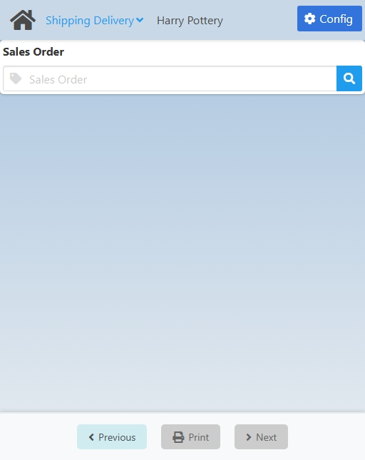
  </TabItem>
  <TabItem value="grpo-creation" label="GRPO">
    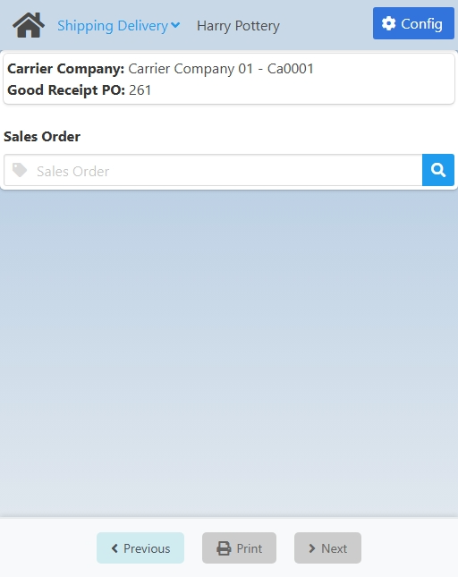
  </TabItem>
  <TabItem value="cpo-selection" label="Carrier PO">
    
  </TabItem>
</Tabs>

---

Click the <IIcon icon='iconamoon:search-bold' width='17' height='17' /> button to open the **Sales Order Search** modal.

:::note[INFO]
The search results will depend on if you are using a **GRPO** or a **Carrier PO**. If it is the latter, you will be able to choose from only the **Sales Orders** linked to the **Carrier PO**. If it is the former, you will be able to choose from all the **Sales Orders** currently **open**.
:::

<CustomDetails summary='Sales Order Search Modal'>

On this modal you need to select one of the **sales orders** listed.

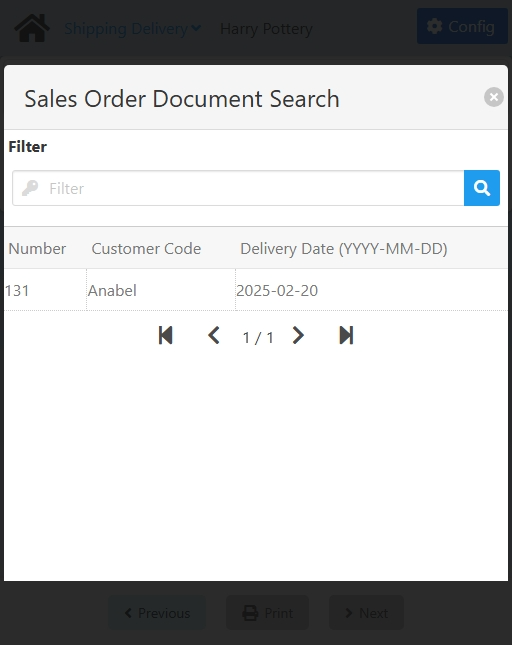

You can select any item by clicking on it, which will close the modal with that **sales order** already set.

You can filter the list of **sales orders** using the search box.

If you want to close the modal without making any changes, click the <IIcon icon='zondicons:close-solid' width='17' height='17'/> button.

</CustomDetails>

Once you select a **sales order**, you will be taken to the [Sales Order Summary](./shipping_delivery.md#sales-order-summary) screen.

### Sales Order Summary

On this screen you can **see** a summary of the information so far and **modify/select** sales order lines for delivery.

At the top you will see a summary of everything you have selected so far, so it may vary.

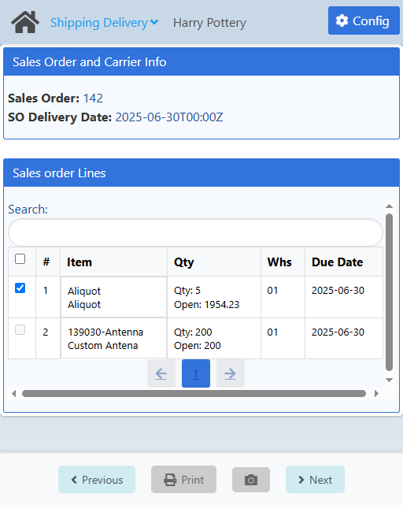

<CustomDetails summary="Table Reference">

| Column                                                | Description                                                                                                                                               |
| ----------------------------------------------------- | --------------------------------------------------------------------------------------------------------------------------------------------------------- |
| <IIcon icon="tabler:square" width="17" height="17" /> | Checkbox for selecting the line.                                                                                                                          |
| #                                                     | ID of the line.                                                                                                                                            |
| Item                                                  | 1\. **First Line**: ID of the item. 2. **Second Line**: Description of the item.                                                                       |
| Qty                                                   | 1\. **First Line**: The quantity currently selected to be delivered of that item. 2. **Second Line**: How many items are yet to be delivered.          |
| Whs                                                   | 1\. **First Line**: Warehouse from where the items are going to be taken. 2. **Second Line**: Bin Location from where the items are going to be taken. |
| Due Date                                              | Date for when the line is supposed to be delivered.                                                                                                      |

</CustomDetails>

In order to continue to the next screen, you need to check at least one line from the sales order. If it does not let you select them, that means you need to modify some information in them for them to be applicable for delivery.

You can **filter** the list of lines using the search box.

If you want to **select** a line, click the <IIcon icon="gg:check-r" width="17" height="17" /> button in the first column of the table for that line.

If you want to **modify** a line, click any of the other columns for that line to go to the [Modify Sale Order Line](./shipping_delivery.md#modify-sale-order-line) screen.

Once you are done, click **Next** at the bottom to go to the [Sign, Save and Print](./shipping_delivery.md#sign-save-and-print) screen.

### Modify Sale Order Line

On this screen you need to **modify** the necessary information on the line so that it matches what is going to be delivered.

You can use individual stock and/or you can select stock that is linked to **License Plate Numbers (LPN)**.

<Tabs>
  <TabItem value="inventory" label="Inventory" default>
    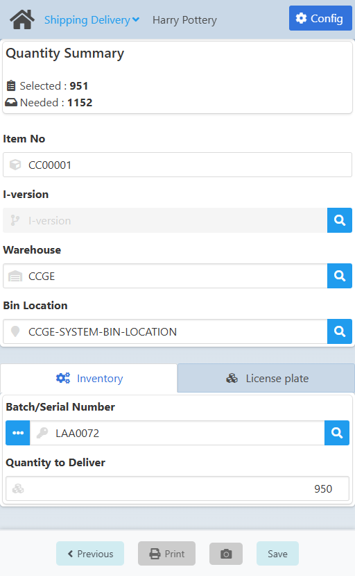
  </TabItem>
  <TabItem value="lpn" label="License Plate">
    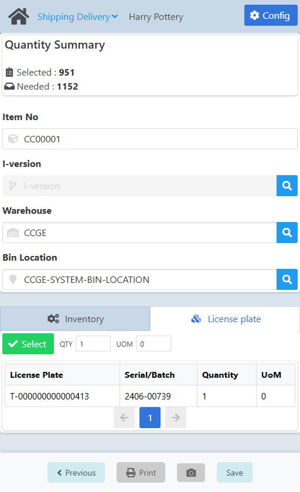
  </TabItem>
</Tabs>

The **Item No** comes from the previously chosen line.

Click the <IIcon icon="iconamoon:search-bold" width="17" height="17" /> button on the fields to open the search modals. You have the **I-Version**, **Warehouse** and **Bin Location**.

<CustomDetails summary="I-Version Search Modal">

On this screen you need to select one of the **I-Versions** listed.

You can select any item by clicking on it, which will close the modal and take you back with that **I-Version** already set.

You can filter the list of **I-Versions** using the search box.

If you want to close the modal without making any changes, click the <IIcon icon="zondicons:close-solid" width="17" height="17"/> button.
</CustomDetails>

<CustomDetails summary="Warehouse Search Modal">

On this screen you need to select one of the **warehouses** listed.

You can select any item by clicking on it, which will close the modal and take you back with that **warehouse** already set.

You can filter the list of **warehouses** using the search box.

If you want to close the modal without making any changes, click the <IIcon icon="zondicons:close-solid" width="17" height="17"/> button.

</CustomDetails>

<CustomDetails summary="Bin Location Search Modal">

On this screen you need to select one of the **bin locations** listed.

You can select any item by clicking on it, which will close the modal and take you back with that **bin location** already set.

You can filter the list of **bin locations** using the search box.

If you want to close the modal without making any changes, click the <IIcon icon="zondicons:close-solid" width="17" height="17"/> button.

</CustomDetails>

Now, if you want to select individual stock <u>not</u> linked to **LPN**s, make sure you are in the **Inventory** tab.

You can select one or multiple batch/serial numbers. For selecting only one, click the <IIcon icon="iconamoon:search-bold" width="17" height="17" /> button on that field to open the **Batch/Serial Number Search** modal.

<CustomDetails summary="Batch/Serial Number Search Modal">

On this screen you need to select one of the **Batches/Serial Numbers** listed.

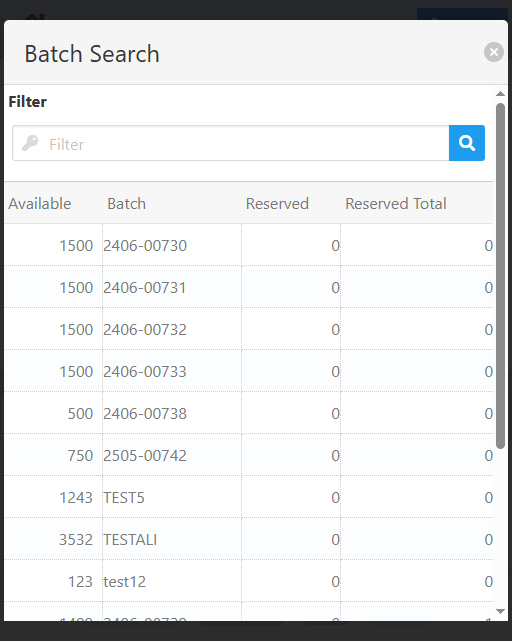

You can select any item by clicking on it, which will close the modal and take you back with that **Batch/Serial Number** already set.

You can filter the list of **Batches/Serial Numbers** using the search box.

If you want to close the modal without making any changes, click the <IIcon icon="zondicons:close-solid" width="17" height="17"/> button.
</CustomDetails>

If you want to select more than one batch/serial number, click the <IIcon icon="pepicons-pop:dots-x" width="17" height="17" /> button on the **Batch/Serial Number** field to open the **Batches/Serial Numbers: Extended Information** modal.

<CustomDetails summary="Batches/Serial Numbers: Extended Information">

On this screen you will be able to **add/modify** batches/serial numbers.

The first thing you will see is the **Batch** tab, giving you information for the batch selected. You can modify the fields on this tab, and that will be reflected once you are done.

If you want to add a new batch, click the <IIcon icon="subway:add" width="17" height="17" />  button to use the **Batch** tab as a form.

Click the <IIcon icon="iconamoon:search-bold" width="17" height="17" /> button on the fields to open the search modals. You have the **Batch/Serial Number** and **I-Version** search modals, that you can reference above this dropdown.

Once you are done adding/modifying the batches, you can click on the **Batches** tab to see the list of batches selected and their information.

If you want to delete a batch, click the <IIcon icon="ic:baseline-delete" width="17" height="17" /> button for the respective batch.

Once you have everything that you need, click the <IIcon icon="zondicons:close-solid" width="17" height="17"/> button to close the modal and take you back with the new batch information already set.

</CustomDetails>

On the other hand, if you want to select stock that is linked to **LPN**s, make sure you are in the **License Plate** tab. 

From there, for selecting LPN stock you first need to find an LPN. Click **Select** to open the **License Plate Stock Selection** modal.

<CustomDetails summary="License Plate Stock Selection Modal">

On this modal you need to find an LPN and select stock from it with a set quantity.

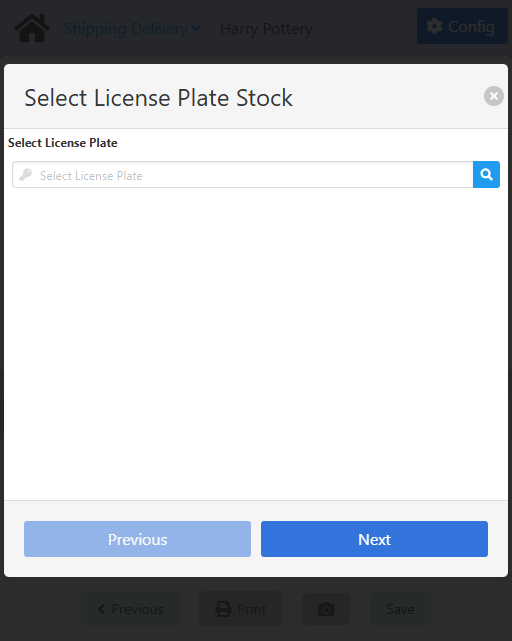

Click the <IIcon icon='iconamoon:search-bold' width='17' height='17' /> button to open the **License Plate Search** modal.

<CustomDetails summary="License Plate Search Modal">

On this screen you need to select one of the **License Plates** listed.

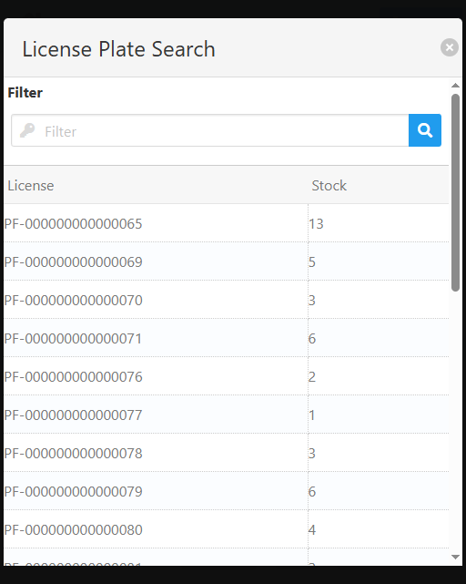

You can select any item by clicking on it, which will close the modal and take you back with that **License Plate** already set.

You can filter the list of **License Plates** using the search box.

If you want to close the modal without making any changes, click the <IIcon icon="zondicons:close-solid" width="17" height="17"/> button.
</CustomDetails>

After you select a License Plate, you will be taken back to select the specific stock with the quantity you want from it.

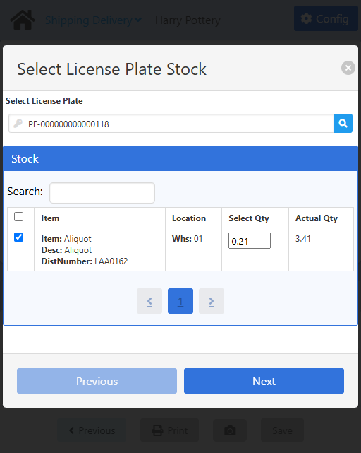

<CustomDetails summary="Table Reference">
| Column | Description |
| --- | --- |
| <IIcon icon="line-md:square" width="17" height="17"/> | Action button for selecting stock lines. |
| Item | ID of the item. Name of the item. Batch/Serial number. |
| Location | Warehouse from where the item will be taken.|
| Select Qty | Quantity that will be taken of that item. |
| Actual Qty | Total quantity the item has on system. |
</CustomDetails>

Set the **Select Qty** field to the quantity you need from the item. Then select the item by clicking the <IIcon icon="gg:check-r" width="17" height="17" /> button in the first column of the table for that item.

Once you are done, click **Next** at the bottom to go to the **Summary/Add More** section.

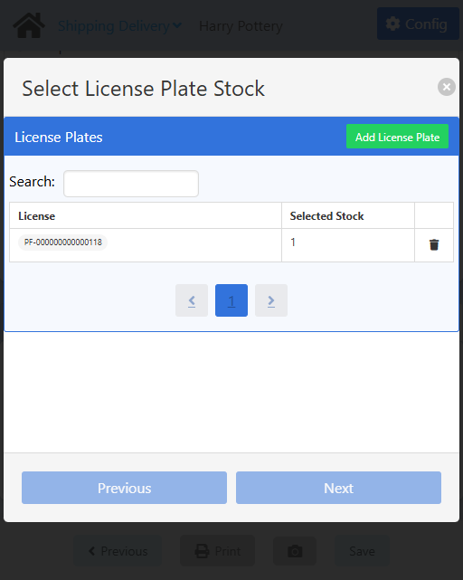

You can filter the list of **LPNs** using the search box at the top.

You can **unselect** any of the LPNs listed by clicking the <IIcon icon="ic:baseline-delete" width="17" height="17" /> button on the rightmost column.

You can **edit** the stock for any of the LPNs by clicking on them.

Once you are done, save the changes by clicking the <IIcon icon="zondicons:close-solid" width="17" height="17"/> button to close the modal and go back.
</CustomDetails>

If you have selected everything that you need, click **Save** at the bottom to save the changes and to go back to the [Sales Order Summary](./shipping_delivery.md#sales-order-summary) screen.

### Sign, Save and Print

On this screen you can **confirm** the delivery lines, **answer** some QC questions, **sign** the document, **save** it, **print** it and **attach** some pictures if you need.

At the top you will see a summary of everything you have selected so far, so it may vary.

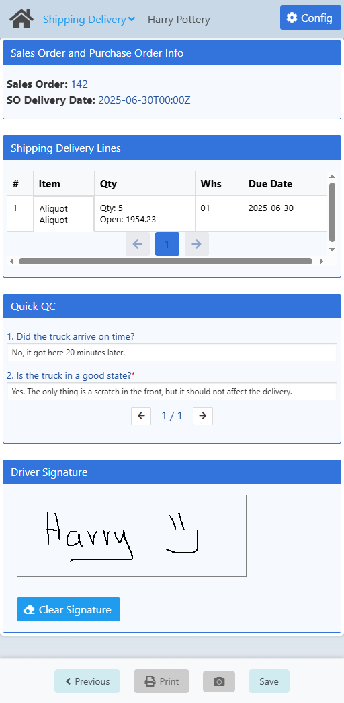

<CustomDetails summary="Table Reference">

| Column                                                | Description                                                                                                                                               |
| ----------------------------------------------------- | --------------------------------------------------------------------------------------------------------------------------------------------------------- |
| #                                                     | ID of the line.                                                                                                                                            |
| Item                                                  | 1\. **First Line**: ID of the item. 2. **Second Line**: Description of the item.                                                                       |
| Qty                                                   | 1\. **First Line**: The quantity currently selected to be delivered of that item. 2. **Second Line**: How many items are yet to be delivered.          |
| Whs                                                   | 1\. **First Line**: Warehouse from where the items are going to be taken. 2. **Second Line**: Bin Location from where the items are going to be taken. |
| Due Date                                              | Date for when the line is supposed to be delivered.                                                                                                      |
</CustomDetails>

Answer the questions in the **Quick QC** section. Questions with * are **mandatory**.

If the information on the screen is correct up to this point, sign the document in the **Driver Signature** section.

You can erase the signature by clicking the **Clear Signature** button.

Next up is saving the information in the system, click **Save** at the bottom for that. 

:::note[INFO]
Saving will create a **Delivery** document in SAP.
:::

At the end, you have the option of **printing** the document and **attaching** pictures. 

Click **Print** at the bottom to generate a PDF with the information for the delivery and the signature.

:::note[INFO]
The PDFs are saved in the **Report** folder for the project.
:::

You can also attach pictures as proof for eveything that was done. For that, click the <IIcon icon="mdi:camera" width="17" height="17"/> button at the bottom to open the **Add Picture** modal.

<CustomDetails summary="Add Picture Modal">

On this modal you can **attach a picture** and link it to the delivery.

First, you need to give the picture a name and then click **Confirm**.

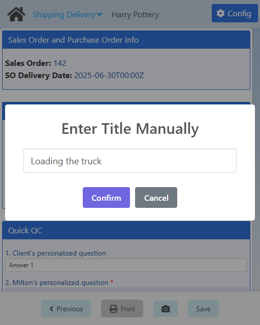

After that, you need to choose a device for taking the picture from the list of available options. Then, click **Take Photo** to take it and save it.

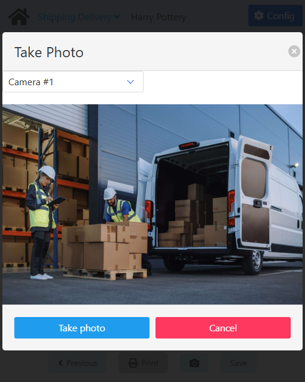

If you want to close any of the modals without saving anything, click the <IIcon icon="zondicons:close-solid" width="17" height="17"/> or **Cancel** buttons.

</CustomDetails>

:::note[INFO]
All pictures are listed in the **Attachments** tab for each **Delivery** document in SAP.
:::

Once you are done, click **Next** at the bottom to go to the [Home](./shipping_delivery.md#option-select-carrier) screen to log another delivery.

## Configuration

:::note[INFO]
Only administrators can access the configuration for a web app.
:::

On this screen you can set the settings that will apply to this web app.

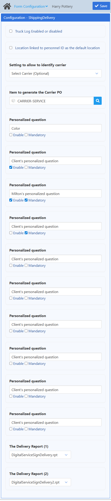

| Name | Description |
| :--- | :--- |
| Truck Log Enabled or disabled | If checked, the web app will only show Carrier POs that have already checked in. Otherwise, it will show all.     It will also skip the first screen in the flow giving the user the option of selecting a carrier or not.|
| Location linked to personnel ID as the default location | If checked, all item locations will be prefilled with the location the personnel has. Otherwise, all item locations will be prefilled with the location the item has. |
| Setting to allow to identify carrier | From this option will depend the first screen of the web app. You have three options:     <ol><li>**Select Carrier (Mandatory):** This will make the user select a carrier for the process.</li><li>**Select Carrier (Optional):** This will give the user the option of choosing if they want to select a carrier or not.</li><li>**Select Carrier Not Provided:** This will skip the screen for selecting a carrier and will let the user select a sales order directly.</li></ol> |
| Item to generate the Carrier PO | Here you can set the item that will be used when creating a GRPO. It can only be changed here. |
| Personalized questions | You can configure up to ten (10) questions to be shown to users as a sort of truck quality control. You can set the label, if its going to be shown (Enable), and if it's going to be required to continue with the process (Mandatory). |
