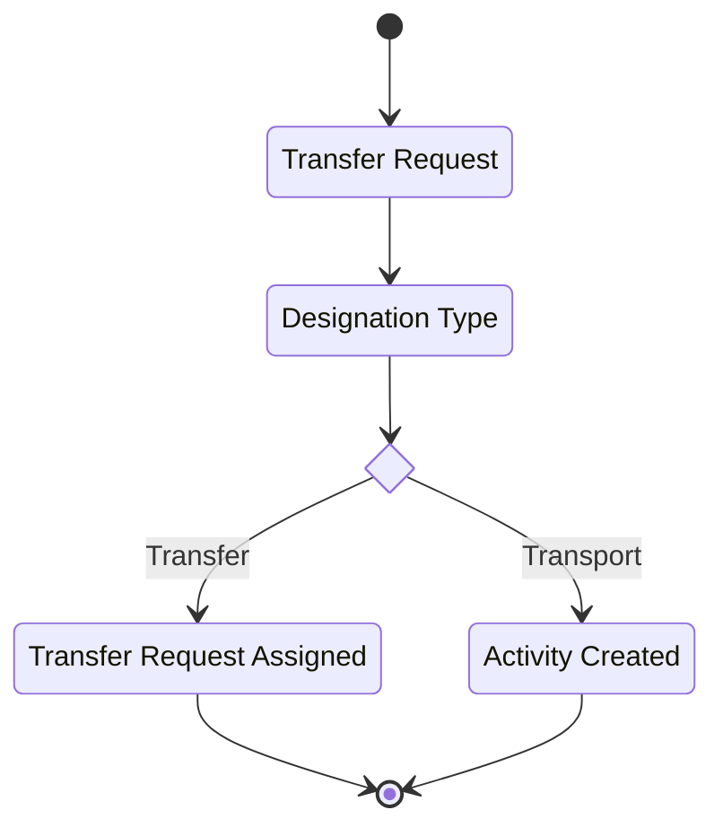
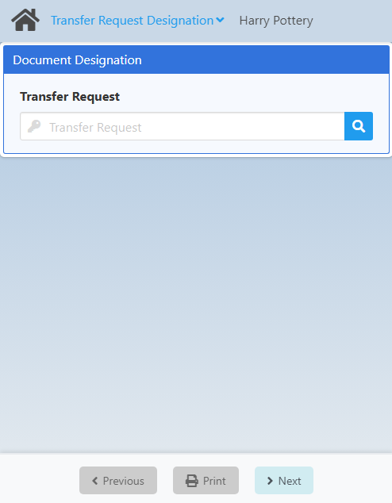
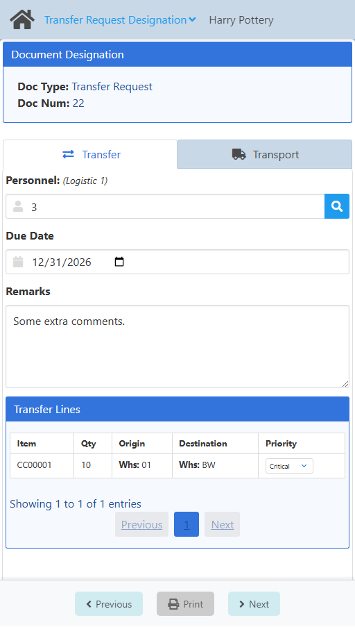
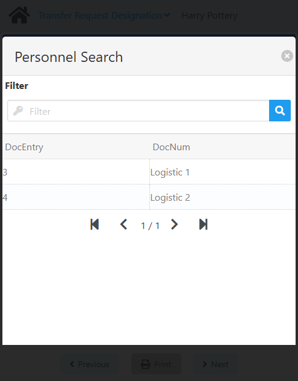
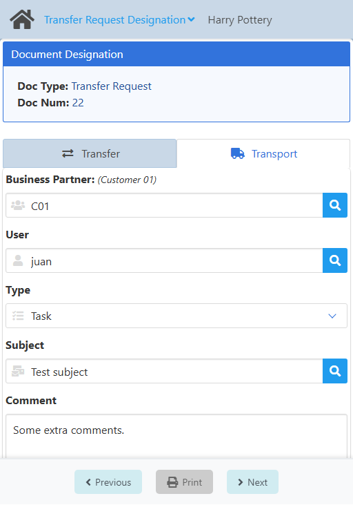
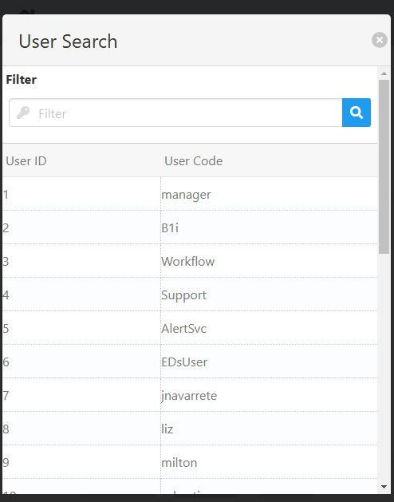

import CustomDetails from "@site/src/components/CustomDetails";

# Transfer Request Designation

The Transfer Request Designation WebApp allows you to assign a transfer request to someone.

## Flow Diagram

## Screens

### Transfer Request Selection

On this screen you need to select a **transfer request**.

Click the <IIcon icon="iconamoon:search-bold" width="17" height="17" /> button to open the **Transfer Request Search** modal.

<CustomDetails summary="Transfer Request Search Modal">

On this screen you need to select one of the **transfer requests** listed.

You can select any item by clicking on it, which will close the modal and take you to the [Transfer](./transfer_request_designation.md#transfer) screen with that **transfer request** already set.

You can filter the list of **transfer requests** using the search box.

If you want to close the modal without making any changes, click the <IIcon icon="zondicons:close-solid" width="17" height="17"/> button.

</CustomDetails>

### Transfer

On this screen/tab you can assign the transfer request to a **personnel**. This option is for local transfers using in-house means of transportation.

You first need to set the **Personnel**. Click the <IIcon icon="iconamoon:search-bold" width="17" height="17" /> button to open the **Personnel Search** modal.

<CustomDetails summary="Personnel Search Modal">

On this screen you need to select one of the **personnels** listed.

You can select any item by clicking on it, which will close the modal and take you back with that **personnel** already set.

You can filter the list of **personnels** using the search box.

If you want to close the modal without making any changes, click the <IIcon icon="zondicons:close-solid" width="17" height="17"/> button.

</CustomDetails>

Next up is the **Due Date**. Click the <IIcon icon="majesticons:calendar" width="17" height="17" /> button to select a date.

You also have the **Remarks** field to leave some comments.

And last but not least, you have the **Transfer Lines** associated with the current **transfer request**. Use this section to revise the information and to change the **Priority** of any of the lines, if needed.

:::note[INFO]
If you want to change the **designation type**, click the [Transport](./transfer_request_designation.md#transport) tab.
:::

Once you are done, click **Next** to finish the **transfer** process and to go to the [Home](./transfer_request_designation.md#transfer-request-selection) screen for you to start a new designation.

### Transport

On this screen/tab you can assign the transfer request to a **business partner**. This option is for transfers using third-party, larger means of transportation.

You first need to set the **Business Partner**. Click the <IIcon icon="iconamoon:search-bold" width="17" height="17" /> button on it to open the **Business Partner Search** modal.

<CustomDetails summary="Business Partner Search Modal">

On this screen you need to select one of the **business partners** listed.

You can select any item by clicking on it, which will close the modal and take you back with that **business partner** already set.

You can filter the list of **business partners** using the search box.

If you want to close the modal without making any changes, click the <IIcon icon="zondicons:close-solid" width="17" height="17"/> button.

</CustomDetails>

Next up is the **User**. Click the <IIcon icon="iconamoon:search-bold" width="17" height="17" /> button on it to open the **User Search** modal.

<CustomDetails summary="User Search Modal">

On this screen you need to select one of the **users** listed.

You can select any item by clicking on it, which will close the modal and take you back with that **user** already set.

You can filter the list of **users** using the search box.

If you want to close the modal without making any changes, click the <IIcon icon="zondicons:close-solid" width="17" height="17"/> button.

</CustomDetails>

After that, you need to set the **Type**, which is the **activity type**, using the dropdown menu. 

Continuing, you have the **Subject**. Click the <IIcon icon="iconamoon:search-bold" width="17" height="17" /> button on it to open the **Subject Search** modal.

<CustomDetails summary="Subject Search Modal">

On this screen you need to select one of the **subjects** listed.

You can select any item by clicking on it, which will close the modal and take you back with that **subject** already set.

You can filter the list of **subjects** using the search box.

If you want to close the modal without making any changes, click the <IIcon icon="zondicons:close-solid" width="17" height="17"/> button.

:::danger[development]
The title of the modal does not match its functionality. **~User~** <IIcon icon="mdi:arrow-right-thin" width="17" height="17" /> **Subject**.
:::

</CustomDetails>

And  last but not least, you can use the **Comment** field to add extra information on the process.

:::note[INFO]
If you want to change the **designation type**, click the [Transfer](./transfer_request_designation.md#transfer) tab.
:::

Once you are done, click **Next** to finish the **transport** process, create the corresponding **activity** (do not forget to take note of it), and to go to the [Home](./transfer_request_designation.md#transfer-request-selection) screen for you to start a new designation.
