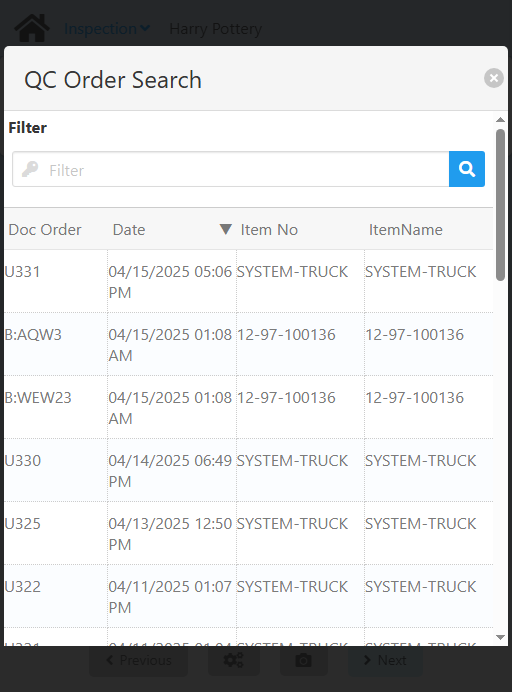
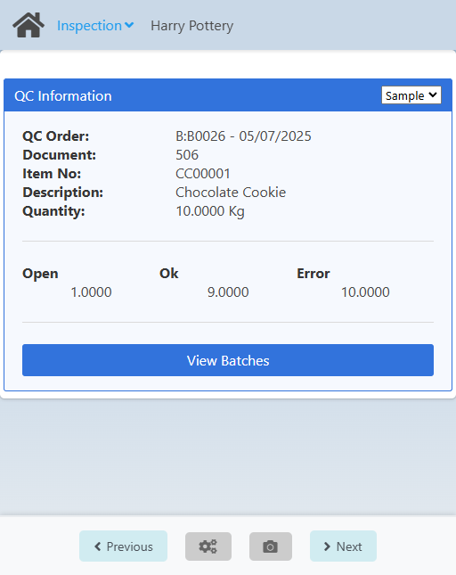
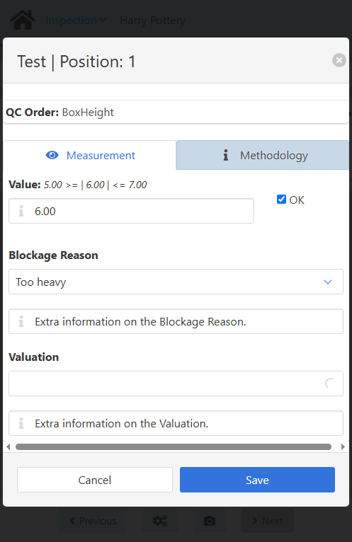
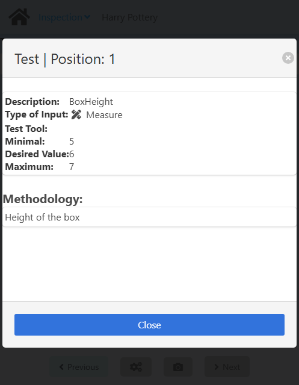
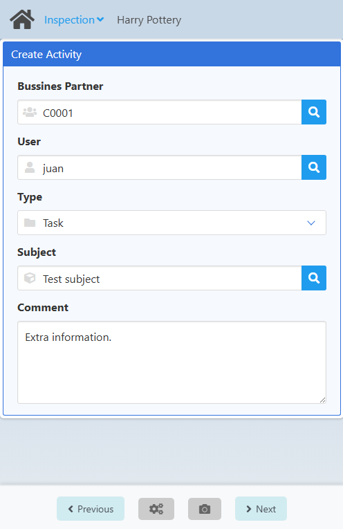
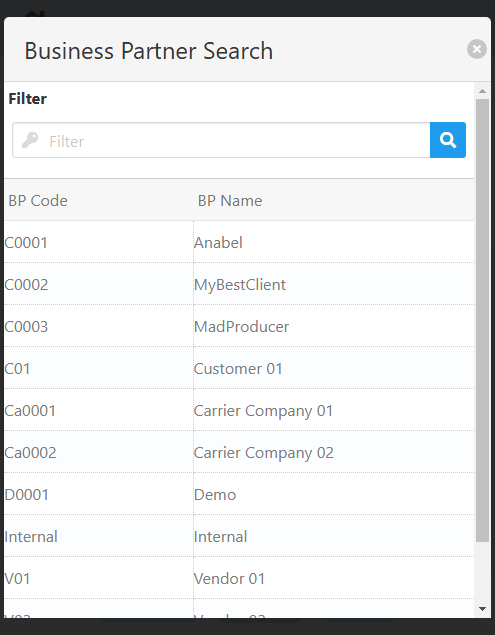
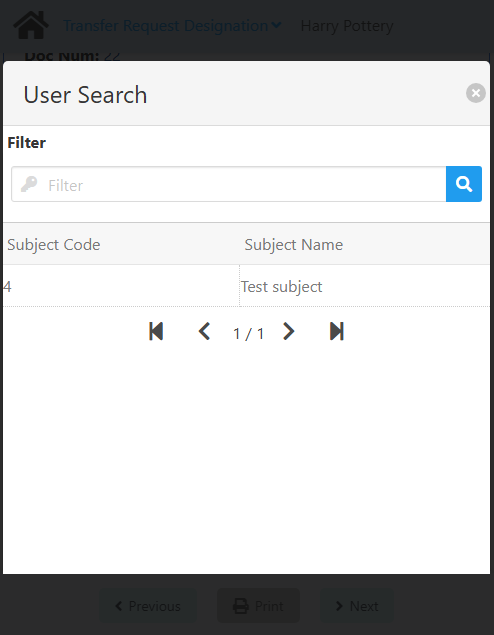

import CustomDetails from "@site/src/components/CustomDetails";
import Tabs from '@theme/Tabs';
import TabItem from '@theme/TabItem';

# Inspection

The Inspection web app allows you to log the results of quality checks on a production order by samples or tests.

## Flow Diagram

```mermaid
stateDiagram-v2
    state "QC Order" as qc_order
    state "QC Flow" as qc_flow
    state "Sample" as sample
    state "Test" as test
    state "Input results by test" as test_results
    state "Input results by sample" as sample_results
    state "Create Activity" as create_activity

    state select_qc_flow <<choice>>

    [*] --> qc_order
    qc_order --> qc_flow
    qc_flow --> select_qc_flow
    select_qc_flow --> sample
    select_qc_flow --> test
    sample --> test_results
    test --> sample_results
    test_results --> create_activity
    sample_results --> create_activity
    create_activity --> [*]
```

## Screens

### QC Order Selection

On this screen you need to select a **QC Order**.

Click the <IIcon icon="iconamoon:search-bold" width="17" height="17" /> button to open the **QC Order Search** modal.

<CustomDetails summary="QC Order Search Modal">

On this screen you need to select one of the **QC orders** listed.

You can select any item by clicking on it, which will close the modal and take you to the [QC Order Summary](./inspection.md#qc-order-summary) screen with that **QC order** already set.

You can filter the list of **QC orders** using the search box.

If you want to close the modal without making any changes, click the <IIcon icon="zondicons:close-solid" width="17" height="17"/> button.

</CustomDetails>

### QC Order Summary

On this screen you can see a summary of the **QC Order** you selected, including the number of lines in states of **Open**, **Ok**, and **Error**.

<!-- :::warning[documentation]
Explain the values shown in the summary.
::: -->

You can choose one of the available workflows for the QC: **Sample** and **Test**.

Once you select a workflow, click **Next** to go to that workflow screen: [Sample](./inspection.md#sf-samples-summary) or [Test](./inspection.md#tf-tests-summary).

### Sample Flow (SF)

#### SF: Samples Summary

On this screen you can see a summary of the **samples** associated with the selected QC order.

<CustomDetails summary="Table Reference">

| Column                                                      | Description                                                       |
| ------------------------------------------------------------| ----------------------------------------------------------------- |
| <IIcon icon="pepicons-pop:dots-x" width="17" height="17"/>  | Action button for opening the Sample: Extended Information modal. |
| Sample                                                      | The ID of the sample.                                             |
| Untested                                                    | Number of units left to test.                                     |
| Last Change                                                 | The date for when the actual sample was last modified.            |

</CustomDetails>

You can use the search box on the top of the screen to filter samples by the **Sample** and **Untested** values.

If you want to **add** a new sample, click the **Add New Sample** button. It will add a new row in the table with all the information pre-populated.

Click the <IIcon icon="pepicons-pop:dots-x" width="17" height="17"/> button on any of the samples to open the **Sample: Extended Information** modal.

<CustomDetails summary="Sample: Extended Information Modal">

On this modal you can see and update other information on a **sample**.

You can give a sample up to two release reasons using the **Release 1** and **Release 2** fields.

:::info
If you set **Release 1** to either **Released** or **Locked**, the **sample** will go away as completed.
:::

:::danger[development]
In **Release 1**, the options **Manually Locked** and **Manually Reopen** seem to not be working.
:::

**Release 2** can only be checked when **Release 1** is set to **Released.**

Use the **Blockage Reason** field for giving the sample a reason for a blockage by choosing one of the options. For giving it extra comments using the <IIcon icon="ion:information-sharp" width="17" height="17"/> field below it.

You can also give the sample a **Valuation** from the list of options and extra information.

:::danger[development]
The **Valuation** field is yet to be configured.
:::

If you want to close the modal without making any changes, click the <IIcon icon="zondicons:close-solid" width="17" height="17"/> or **Cancel** buttons.

Click **Save** to save the changes and close the modal.

</CustomDetails>

Click on any other columns of a sample to go to the [Tests](./inspection.md#sf-tests-summary) screen for it.

#### SF: Tests Summary

On this screen you can see a summary of the **tests** assigned to the selected sample.

<CustomDetails summary="Table Reference">

| Column   | Description                                                     |
| -------- | --------------------------------------------------------------- |
|          | Indication of passing                                           |
| Pos      | ID of the test.                                                 |
| QC Order | Name of the test.                                               |
| Measure  | Value taken.                                                    |
| UoM      | Unit of Measure, e.g. cm.                                       |
| OK       | Indication of passing.                                          |

</CustomDetails>

You can use the search box on the top of the screen to filter tests by the **Pos** and **QC Order** values.

Click on any columns of a test to open the **Test: Extended Information** modal.

<CustomDetails summary="Test: Extended Information Modal">

On the **Measurement** tab you can input the results for the test on a specific **sample**.

**NOTE**: The **Methodology** tab is purely informative. It shows a description of the methodology used for the test.

First, input the result that you got for this test. Use the **Value** field for that. Some tests will give you the conditions to pass. When the **value** meets those, the **OK** checkbox will automatically be ticked. You can always check/uncheck it manually.

Use the **Blockage Reason** field for giving the sample a reason for a blockage by choosing one of the options. For giving it extra comments using the <IIcon icon="ion:information-sharp" width="17" height="17"/> field below it.

:::info
If you give **OKs** or **Blockage Reasons** to all the tests for a sample, the sample will go away as completed.
:::

You can also give the sample a **Valuation** from the list of options and extra information.

:::danger[development]
The **Valuation** field is yet to be configured.
:::

If you want to close the modal without making any changes, click the <IIcon icon="zondicons:close-solid" width="17" height="17"/> or **Cancel** buttons.

Click **Save** to save the changes and close the modal.

</CustomDetails>

You will be seeing the results reflected on the table for each of the tests modified.

You can also add pictures as proof for the tests that were applied. For that, click the <IIcon icon="mdi:camera" width="17" height="17"/> button at the bottom to open the **Add Picture** modal.

<CustomDetails summary="Add Picture Modal">

On this modal you can **take a picture** of the samples, **link it** to the QC Order and **print a report**.

First, you need to give the picture a name and then click **Confirm**.

After that, you need to choose a device for taking the picture from the list of available options. Then, click **Take Photo** to take it and save it.

If you want to close any of the modals without saving anything, click the <IIcon icon="zondicons:close-solid" width="17" height="17"/> or **Cancel** buttons.

</CustomDetails>

Once you are done with all the samples in the QC Order, click the <IIcon icon="fa:gears" width="17" height="17"/> button at the bottom to go to the [Create Activity](./inspection.md#create-activity) screen.

### Test Flow (TF)

#### TF: Tests Summary

On this screen you can see a summary of the **tests** associated with the selected QC order.

<CustomDetails summary="Table Reference">

| Column      | Description                                                 |
| ----------- | ----------------------------------------------------------- |
|             | Action button for opening the Test: Extended Summary modal. |
| Pos         | ID of the test.                                             |
| T           | Type of the test.                                           |
| QC Order    | Name of the test.                                           |
| Methodology | Description of how the test works.                          |

</CustomDetails>

You can use the search box on the top of the screen to filter tests by the **Pos** and **QC Order** values.

Click the <IIcon icon="pepicons-pop:dots-x" width="17" height="17"/> button on any of the tests to open the **Test: Extended Summary** modal.

<CustomDetails summary="Test: Extended Summary Modal">

On this modal you can see an extended summary for a **test**, like the **conditions** to pass and its **methodology**.

If you want to close the modal, click the <IIcon icon="zondicons:close-solid" width="17" height="17"/> or **Cancel** buttons.

</CustomDetails>

Click on any other columns of a test to go to the [Samples](./inspection.md#tf-samples-summary) screen for it.

Once you are done with all the tests for all the samples in the QC Order, click the <IIcon icon="fa:gears" width="17" height="17"/> button at the bottom to go to the [Create Activity](./inspection.md#create-activity) screen.

#### TF: Samples Summary

On this screen you can see a summary of the **samples** for which the selected test applies.

:::danger[development]
The OK column is repeated.
:::

<CustomDetails summary="Table Reference">

| Column                                                     | Description                                                       |
| ---------------------------------------------------------- | ----------------------------------------------------------------- |
| <IIcon icon="pepicons-pop:dots-x" width="17" height="17"/> | Action button for opening the Sample: Extended Information modal. |
| Sample                                                     | ID of the sample.                                                 |
| Measure                                                    | Value taken.                                                      |
| UoM                                                        | Unit of Measure, e.g. cm.                                         |
| OK                                                         | Indication of passing.                                            |

</CustomDetails>

You can use the search box on the top of the screen to filter samples by the **Sample** value.

Click the <IIcon icon="pepicons-pop:dots-x" width="17" height="17"/> button on any of the tests to open the **Sample: Extended Summary** modal.

<CustomDetails summary="Sample: Extended Information Modal">

On this modal you can see and update other information on a **sample**.

You can give a sample up to two release reasons using the **Release 1** and **Release 2** fields.

:::info
If you set **Release 1** to either **Released** or **Locked**, the **sample** will go away as completed.
:::

:::danger[development]
In **Release 1**, the options **Manually Locked** and **Manually Reopen** seem to not be working.
:::

**Release 2** can only be checked when **Release 1** is set to **Released.**

Use the **Blockage Reason** field for giving the sample a reason for a blockage by choosing one of the options. For giving it extra comments using the <IIcon icon="ion:information-sharp" width="17" height="17"/> field below it.

You can also give the sample a **Valuation** from the list of options and extra information.

:::danger[development]
The **Valuation** field is yet to be configured.
:::

If you want to close the modal without making any changes, click the <IIcon icon="zondicons:close-solid" width="17" height="17"/> or **Cancel** buttons.

Click **Save** to save the changes and close the modal.

</CustomDetails>

Click on any columns of a sample to open the **Test: Extended Information** modal.

<CustomDetails summary="Test: Extended Information Modal">

On the **Measurement** tab you can input the results for the test on a specific **sample**.

**NOTE**: The **Methodology** tab is purely informative. It shows a description of the methodology used for the test.

First, input the result that you got for this test. Use the **Value** field for that. Some tests will give you the conditions to pass. When the **value** meets those, the **OK** checkbox will automatically be ticked. You can always check/uncheck it manually.

Use the **Blockage Reason** field for giving the sample a reason for a blockage by choosing one of the options. For giving it extra comments using the <IIcon icon="ion:information-sharp" width="17" height="17"/> field below it.

:::info
If you give **OKs** or **Blockage Reasons** to all the tests for a sample, the sample will go away as completed.
:::

You can also give the sample a **Valuation** from the list of options and extra information.

:::danger[development]
The **Valuation** field is yet to be configured.
:::

If you want to close the modal without making any changes, click the <IIcon icon="zondicons:close-solid" width="17" height="17"/> or **Cancel** buttons.

Click **Save** to save the changes and close the modal.

</CustomDetails>

You will be seeing the results reflected on the table for each of the samples selected.

You can also add pictures as proof for the tests that were applied. For that, click the <IIcon icon="mdi:camera" width="17" height="17"/> button at the bottom to open the **Add Picture** modal.

<CustomDetails summary="Add Picture Modal">

On this modal you can **take a picture** of the samples, **link it** to the QC Order and **print a report**.

First, you need to give the picture a name and then click **Confirm**.

After that, you need to choose a device for taking the picture from the list of available options. Then, click **Take Photo** to take it and save it.

If you want to close any of the modals without saving anything, click the <IIcon icon="zondicons:close-solid" width="17" height="17"/> or **Cancel** buttons.

</CustomDetails>

Once you are done with all the samples under the selected test, click the **Previous** button at the bottom to go to the [Tests](./inspection.md#tf-tests-summary) screen and continue with other tests, if appicable.

### Create Activity

On this screen you can create an activity for the QC Order. This is for continuing with the process. 

Once you are done logging the results of the tests, someone else needs to continue with the process by making decisions based on said results, this is that step.

You first need to set the **Business Partner**. Click the <IIcon icon="iconamoon:search-bold" width="17" height="17" /> button on it to open the **Business Partner Search** modal.

<CustomDetails summary="Business Partner Search Modal">

On this screen you need to select one of the **business partners** listed.

You can select any item by clicking on it, which will close the modal and take you back with that **business partner** already set.

You can filter the list of **business partners** using the search box.

If you want to close the modal without making any changes, click the <IIcon icon="zondicons:close-solid" width="17" height="17"/> button.

</CustomDetails>

Next up is the **User**. Click the <IIcon icon="iconamoon:search-bold" width="17" height="17" /> button on it to open the **User Search** modal.

<CustomDetails summary="User Search Modal">

On this screen you need to select one of the **users** listed.

You can select any item by clicking on it, which will close the modal and take you back with that **user** already set.

You can filter the list of **users** using the search box.

If you want to close the modal without making any changes, click the <IIcon icon="zondicons:close-solid" width="17" height="17"/> button.

</CustomDetails>

After that, you need to set the **Type**, which is the **activity type**, using the dropdown menu. 

Continuing, you have the **Subject**. Click the <IIcon icon="iconamoon:search-bold" width="17" height="17" /> button on it to open the **Subject Search** modal.

<CustomDetails summary="Subject Search Modal">

On this screen you need to select one of the **subjects** listed.

You can select any item by clicking on it, which will close the modal and take you back with that **subject** already set.

You can filter the list of **subjects** using the search box.

If you want to close the modal without making any changes, click the <IIcon icon="zondicons:close-solid" width="17" height="17"/> button.

:::danger[development]
The title of the modal does not match its functionality. **~User~** <IIcon icon="mdi:arrow-right-thin" width="17" height="17" /> **Subject**.
:::

</CustomDetails>

And  last but not least, you can use the **Comment** field to add extra information on the process.

Once you are done, click **Next** to create the corresponding **activity** (do not forget to take note of it) and to go to the [Home](./inspection.md#qc-order-selection) screen for you to start a new inspection.

:::danger[development]
After the activity is created, the user is taken back to the previous screen, instead of the [Home](./inspection.md#qc-order-selection) screen.
:::

:::danger[development]
Multiple activities can be created for the same QC order, instead of just one.
:::