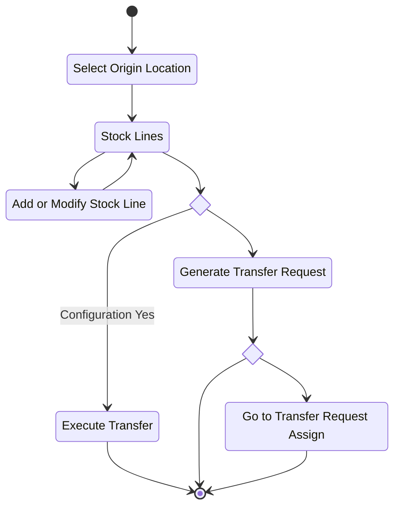
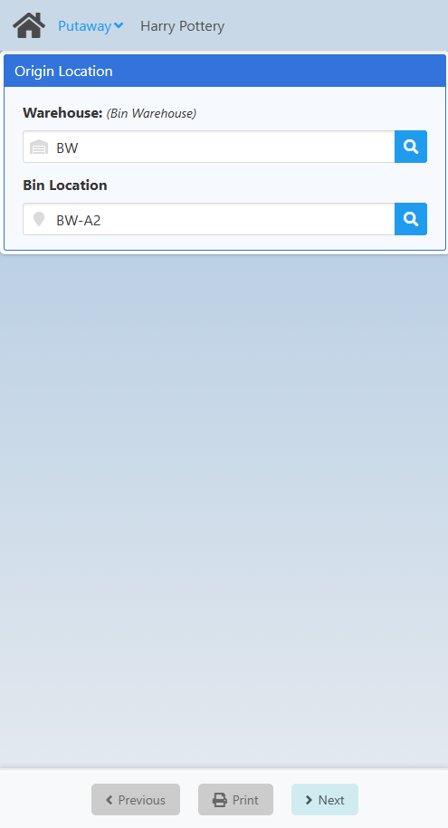
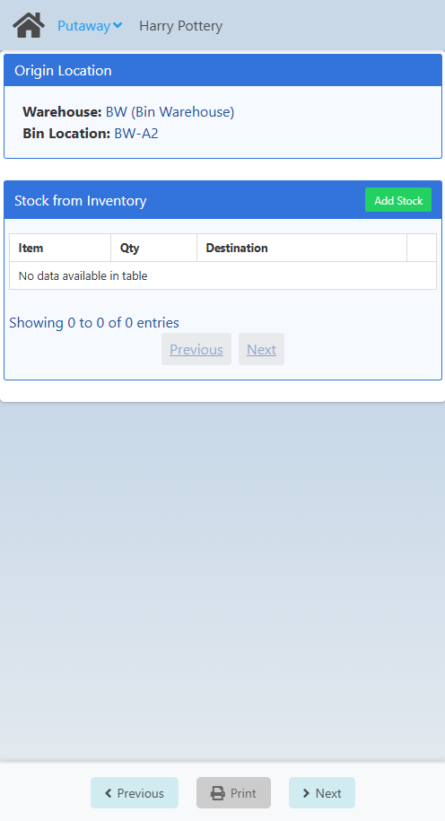
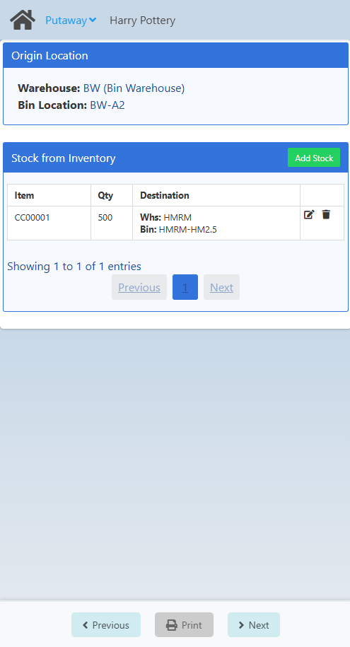

# Intra-Site Transfer (Putaway)

TODO: Write description.

## Flow Diagram


## Screens

### Select Origin Location

On this screen the user selects the origin location.



In the Origin Location fields box, the user defines the origin location. The BinLocation field depends on whether the Warehouse is managed by Bin.

Clicking the Next button redirects the WebApp to the [Stock Lines screen](./putaway.md#stock-lines), provided the origin location has been correctly defined.

:::info
If the **personnel_origin_location setting** is **True**, the Personnel's location is set as the origin location. If it is not set, the location must be defined.
:::

### Stock Lines

On this screen the user selects the origin location.



At first, the screen shows the lines but since none exist, it does not show any lines, but if you select the Add Stock button, it redirects to the [Add or Modify Stock Line screen](./putaway.md#add-or-modify-stock-line), where the stock is added.



### Add or Modify Stock Line

### Execute Transfer

### Generate Transfer Request

## Configuration

### Local Configuration

| Id | Description | Type | Values |
| :--- | :--- | :--- | :--- | 
| personnel_origin_location | Location linked to personnel ID as the default location | boolean | True or False |
| putaway_location | Setting to define the putaway location for the item | select | <ul><li>Y : Mandatory</li><li>N : It doesn't set the location </li><li>O : Sets the location, but the user can edit it.</li></ul> |

```json
[
    {
        "id":"personnel_origin_location",
        "description":"Location linked to personnel ID as the default location",
        "enable_type":"disabled",
        "enable_value":true,
        "type":"boolean",
        "value":false
    },
    {
        "id":"putaway_location",
        "description":"Setting to define the putaway location for the item",
        "enable_type":"disabled",
        "enable_value":true,
        "type":"select",
        "options":[
            {"id":"Y","description":"The destination location is the default of Item (Mandatory)"},
            {"id":"O","description":"The destination location is the default of Item (Optional)"},
            {"id":"N","description":"The destination location is chosen by the user"}
        ],
        "value":"O"
    }
]
```


