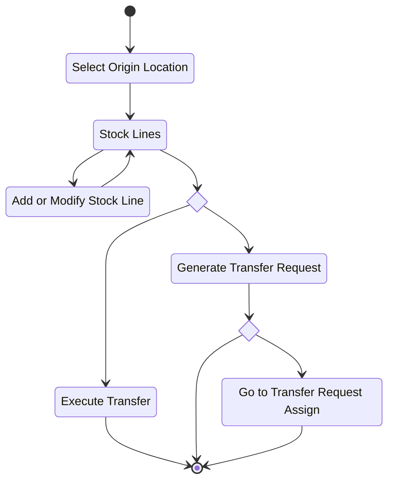

# Intra-Site Transfer (Putaway)

TODO: Write description.

## Flow Diagram

```mermaid
stateDiagram-v2
    state "Select Origin Location" as select_origin_location
    state "Stock Lines" as stock
    state "Add or Modify Stock Line" as select_stock
    state "Generate Transfer Request" as generate_transfer_req
    state "Go to Transfer Request Assign" as transfer_req_assign
    state "Execute Transfer" as exec_transfer

    state if_finish_op <<choice>>
    state if_transfer_req_assign <<choice>>

    [*] --> select_origin_location
    select_origin_location --> stock
    stock --> select_stock
    select_stock --> stock

    
    stock --> if_finish_op
    if_finish_op --> exec_transfer
    exec_transfer --> [*]

    if_finish_op --> generate_transfer_req
    generate_transfer_req --> if_transfer_req_assign
    if_transfer_req_assign --> transfer_req_assign
    if_transfer_req_assign --> [*]
    transfer_req_assign --> [*]
    
```
## Screens

### Select Origin Location

On this screen the user selects the origin location.

## Configuration

