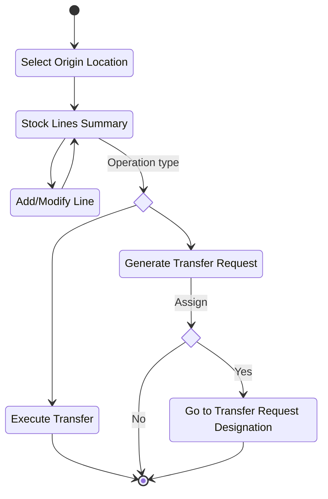
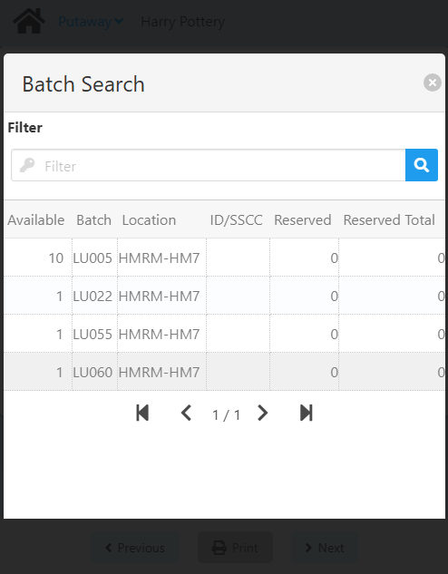

import CustomDetails from "@site/src/components/CustomDetails";

# Intra-Site Transfer (Putaway)

The Intra-Site Transfer (Putaway) WebApp allows you to transfer stock from one warehouse to another and/or from one bin to another, by either Executing a Transfer directly or by Generating a Transfer Request that will later be revised and approved/rejected.

## Flow Diagram



## Screens

### Origin Location

On this screen you need to select the location from where you will be taking the stock.


You first need to set the **Warehouse**. Click the <IIcon icon="iconamoon:search-bold" width="17" height="17" /> button to open the **Warehouse Search** modal.

<CustomDetails summary="Warehouse Search Modal">

On this screen you need to select one of the **warehouses** listed.


You can select any item by clicking on it, which will close the modal and take you back with that **warehouse** already set.

You can filter the list of **warehouses** using the search box.

If you want to close the modal without making any changes, click the <IIcon icon="zondicons:close-solid" width="17" height="17"/> button.

</CustomDetails>

The **Bin Location** will only show up if the **Warehouse** is managed by one. Click the <IIcon icon="iconamoon:search-bold" width="17" height="17" /> button on the field to open the **Bin Location Search** modal.

<CustomDetails summary="Bin Location Search Modal">

On this screen you need to select one of the **bin locations** listed.


You can select any item by clicking on it, which will close the modal and take you back with that **bin location** already set.

You can filter the list of **bin locations** using the search box.

If you want to close the modal without making any changes, click the <IIcon icon="zondicons:close-solid" width="17" height="17"/> button.

</CustomDetails>

:::info
In the [Configuration](./putaway.md#configuration), if **personnel_origin_location** is set to **true**, the *Personnel*'s location is set as the origin location, that includes the **Bin Location** as well, if applicable. If it is set to **false**, the location must be defined *manually*.
:::

Once you are done, click **Next** to go to the [Stock Lines Summary](./putaway.md#stock-lines) screen.

### Stock Lines Summary

<!-- [<IIcon icon="nrk:back" width="17" height="17" /> Go back to the **Origin Location** screen](./putaway.md#origin-location) -->

On this screen you need to select the stock lines that will be transferred.


First, you need to **add** a stock line. For that, click the **Add Stock** button. That will take you to the [Add or Modify Stock Line](./putaway.md#add-or-modify-stock-line) screen, for you to select/modify the necessary information.

You can also **edit** any of the stock lines you already have by clicking on the <IIcon icon="bx:edit" width="17" height="17" /> button associated with the respective stock line.

If you want to delete a stock line, click the <IIcon icon="ic:baseline-delete" width="17" height="17" /> button for the respective stock.

Once you are done, click **Next** to open the **Putaway Completion** modal.

<CustomDetails summary="Putaway Completion Modal">

On this modal you need to choose an option between **Execute Transfer** and **Generate Transfer Request**, depending on what you want to do with the stock lines you selected.

.

Select **Execute transfer** if you want to execute the transfer directly.

Select **Generate Transfer Request** if you want to generate a transfer request **and** assign it.

:::note[INFO]
Stock lines for which already a **Generate Transfer Request** has been applied, but has yet to be approved/rejected, will give an error if you try to apply to them another **Execute Transfer** or **Generate Transfer Request**.
:::

After any of the options is selected, you will see a summary of what was done and information on the document that was created.

Once you have taken note of the information you need, click the **Ok** or the <IIcon icon="zondicons:close-solid" width="17" height="17"/> button for closing the modal. If you chose **Execute Transfer**, the buttons will take you to the [**Home**](./putaway.md#origin-location) screen. If you chose **Generate Transfer Request**, then they will open the **Task Designation** modal.

#### Task Designation Modal

On this screen you need to choose between making a **Transfer Request Assignment** or **not**.


If you click **No**, the modal will close, the task **will not** be assigned, and you will be taken to the [**Home**](./putaway.md#origin-location) screen to start a new transfer.

If you click **Yes**, the modal will close and you will be taken to the [**Transfer Request Designation**](../core_functions/transfer_request_designation#transfer) web app, for you to assign the transfer to someone.

</CustomDetails>

### Add or Modify Stock Line

On this screen you select the stock line from the inventory.


Click the <IIcon icon="iconamoon:search-bold" width="17" height="17" /> button on the fields to open the search modals. You have the **Item**, **I-Version**, **Batch/Serial Number**, **Warehouse**, and **Location** search modals.

<CustomDetails summary="Item Search Modal">

On this screen you need to select one of the **items** listed.


You can select any item by clicking on it, which will close the modal and take you back with that **item** already set.

You can filter the list of **items** using the search box.

If you want to close the modal without making any changes, click the <IIcon icon="zondicons:close-solid" width="17" height="17"/> button.
</CustomDetails>

<CustomDetails summary="I-Version Search Modal">

On this screen you need to select one of the **I-Versions** listed.


You can select any item by clicking on it, which will close the modal and take you back with that **I-Version** already set.

You can filter the list of **I-Versions** using the search box.

If you want to close the modal without making any changes, click the <IIcon icon="zondicons:close-solid" width="17" height="17"/> button.
</CustomDetails>

<CustomDetails summary="Batch/Serial Number Search Modal">

On this screen you need to select one of the **Batches/Serial Numbers** listed.



You can select any item by clicking on it, which will close the modal and take you back with that **Batch/Serial Number** already set.

You can filter the list of **Batches/Serial Numbers** using the search box.

If you want to close the modal without making any changes, click the <IIcon icon="zondicons:close-solid" width="17" height="17"/> button.
</CustomDetails>

Click the <IIcon icon="pepicons-pop:dots-x" width="17" height="17" /> button on the **Batch/Serial Number** field to open the **Batches/Serial Numbers: Extended Information** modal.

<CustomDetails summary="Batches/Serial Numbers: Extended Information">

On this screen you will be able to **add/modify** batches/serial numbers.

The first thing you will see is the **Batch** tab, giving you information for the batch selected. You can modify the fields on this tab, and that will be reflected once you are done.


If you want to add a new batch, click the <IIcon icon="subway:add" width="17" height="17" />  button to use the **Batch** tab as a form.

Click the <IIcon icon="iconamoon:search-bold" width="17" height="17" /> button on the fields to open the search modals. You have the **Batch/Serial Number** and **I-Version** search modals, that you can reference above this dropdown.


Once you are done adding/modifying the batches, you can click on the **Batches** tab to see the list of batches selected and their information.


If you want to delete a batch, click the <IIcon icon="ic:baseline-delete" width="17" height="17" /> button for the respective batch.

Once you have everything that you need, click the <IIcon icon="zondicons:close-solid" width="17" height="17"/> button to close the modal and take you back with the new batch information already set.


</CustomDetails>

Selecting the **Item No** will enable the next fields, where applicable. The **I-Version** and **Batch/Serial Number** will only be enabled if the **Item No** has those associated with it.

The **Quantity** will depend on the **Batch/Serial Number** selected.

The **Destination Warehouse** is the location to where the stock is going to be transferred. Below the **Destination Warehouse**, you will find a **Destination Bin Location** field, only if the **Destination Warehouse** is managed by one.

:::info
If **putaway_location** is set to **Y**, the **Destination Warehouse** will be the *default* of the item selected, and that will be *mandatory*. If it is set to **N**, the **Destination Warehouse** will need to be selected *manually*. If it is set to **O**, the **Destination Warehouse** will be the *default* of the item selected, and that will be *optional*. This all includes the **Destination Bin Location** as well, if applicable.
:::

Once you are done, click **Next** to go back to the [Stock Lines Summary](./putaway.md#stock-lines) screen.

## Configuration

### Local Configuration

| Id | Description | Type | Values |
| :--- | :--- | :--- | :--- | 
| personnel_origin_location | Location linked to personnel ID as the default location | boolean | True or False |
| putaway_location | Setting to define the putaway location for the item | select | <ul><li>Y : Mandatory</li><li>N : It doesn't set the location </li><li>O : Sets the location, but the user can edit it.</li></ul> |

```json
[
    {
        "id":"personnel_origin_location",
        "description":"Location linked to personnel ID as the default location",
        "enable_type":"disabled",
        "enable_value":true,
        "type":"boolean",
        "value":false
    },
    {
        "id":"putaway_location",
        "description":"Setting to define the putaway location for the item",
        "enable_type":"disabled",
        "enable_value":true,
        "type":"select",
        "options":[
            {"id":"Y","description":"The destination location is the default of Item (Mandatory)"},
            {"id":"O","description":"The destination location is the default of Item (Optional)"},
            {"id":"N","description":"The destination location is chosen by the user"}
        ],
        "value":"O"
    }
]
```
