import CustomDetails from "@site/src/components/CustomDetails";
import Tabs from '@theme/Tabs';
import TabItem from '@theme/TabItem';

# Shipping Delivery

The Shipping Delivery web app allows you to log the information necessary when delivering a sales order, or part of it.

## Flow Diagram

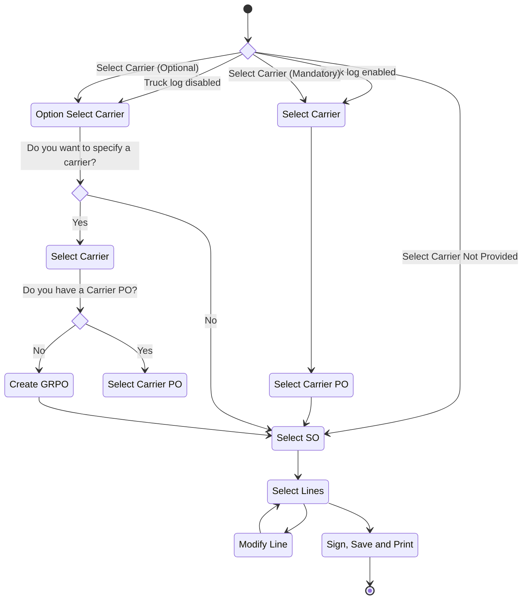

## Screens

### Option: Select Carrier

:::info
This screen is only shown if **Truck Log Enabled or disabled** <u>is not</u> checked in the [**Configuration**](./shipping_delivery.md#configuration).
:::

On this screen you have the option of deciding if you want to specify a **carrier** or not.

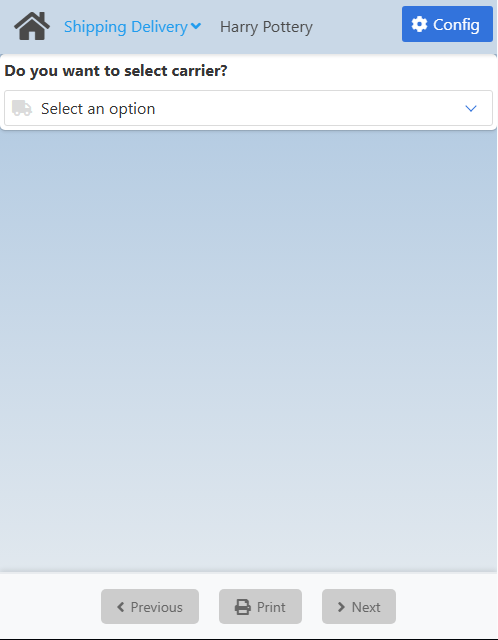

If you choose **Yes**, you will be taken to the [Carrier Selection](./shipping_delivery.md#carrier-selection) screen.

If you choose **No**, you will be taken to the [Sales Order Selection](./shipping_delivery.md#sales-order-selection) screen.

### Carrier Selection

On this screen you need to select a **carrier**.

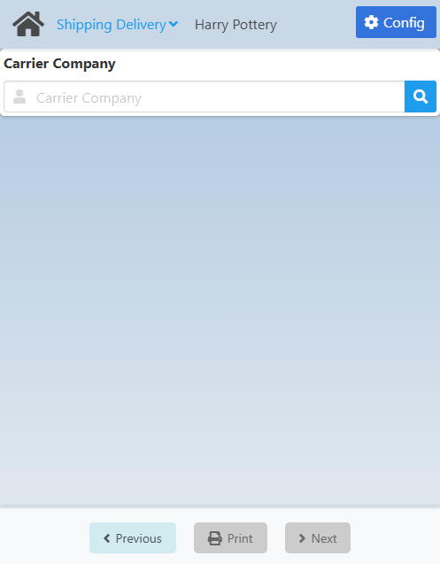

Click the <IIcon icon='iconamoon:search-bold' width='17' height='17' /> button to open the **Carrier Search** modal.

<CustomDetails summary='Carrier Search Modal'>

On this modal you need to select one of the **carriers** listed.

You can select any item by clicking on it, which will close the modal with that **carrier** already set.

You can filter the list of **carriers** using the search box.

If you want to close the modal without making any changes, click the <IIcon icon='zondicons:close-solid' width='17' height='17'/> button.

</CustomDetails>

Once you select a **carrier**, you will be taken to the [Carrier Purchase Order Selection](./shipping_delivery.md#carrier-purchase-order-selection) screen.

### Carrier Purchase Order Selection

On this screen you need to select a **carrier purchase order** associated with the carrier you previously chose.

The exact screen you will see will depend on the **Truck Log Enabled or disabled** option in the [Configuration](./shipping_delivery.md#configuration):

1. <u>**Truck Log Checked**</u>: The **Truck Log Enabled or disabled** option <u>is</u> checked. This will only give you the option for selecting a **Carrier Purchase Order**.
2. <u>**Truck Log Not Checked**</u>: The **Truck Log Enabled or disabled** option <u>is not</u> checked. This will give you both options, selecting a **Carrier Purchase Order** and creating a **Goods Receipt Purchase Order**. The options are <u>mutually exclusive</u>.

<Tabs>
  <TabItem value="checked" label="Truck Log Checked" default>
    
  </TabItem>
  <TabItem value="not-checked" label="Truck Log Not Checked">
    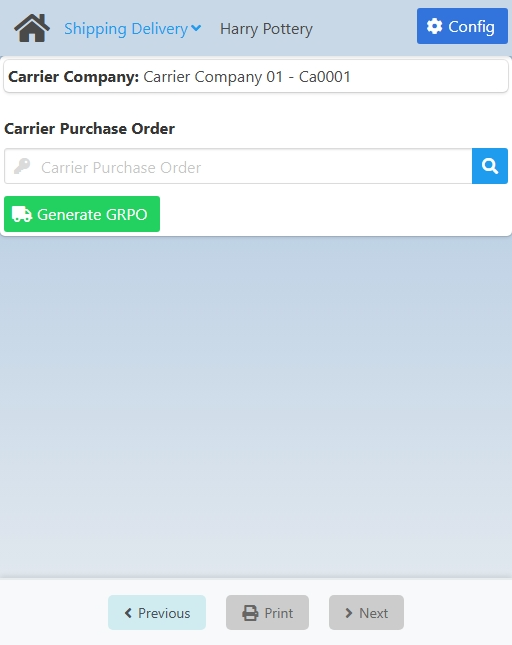
  </TabItem>
</Tabs>

---

Click the <IIcon icon='iconamoon:search-bold' width='17' height='17' /> button to open the **Carrier Purchase Order Search** modal.

:::info
If **Truck Log Enabled or disabled** <u>is</u> checked, the search results will only include carrier purchase orders that have already checked in.
:::

<CustomDetails summary='Carrier Purchase Order Search Modal'>

On this modal you need to select one of the **carrier purchase orders** listed.

You can select any item by clicking on it, which will close the modal with that **carrier purchase order** already set.

You can filter the list of **carrier purchase orders** using the search box.

If you want to close the modal without making any changes, click the <IIcon icon='zondicons:close-solid' width='17' height='17'/> button.

</CustomDetails>

Once you select a **carrier purchase order**, you will be taken to the [Sales Order Selection](./shipping_delivery.md#sales-order-selection) screen.

### Goods Receipt Purchase Order Generation

On this screen you need to create a **GRPO**. This is an alternative to the **Carrier Purchase Order**.

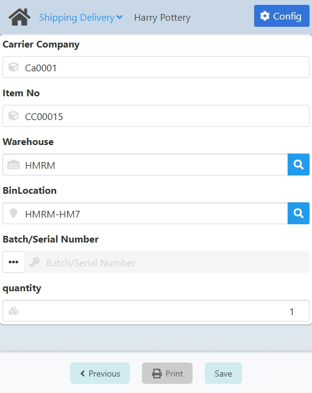

The **Carrier Company** comes from the previous screen and the **Item No** comes from the **Item to generate the Carrier PO** option in the [Configuration](./shipping_delivery.md#configuration). These fields <u>are not</u> editable.

By default, the **Warehouse** and **Bin Location** will be the location of the personnel in the system, <u>only if</u> the **Location linked to personnel ID as the default location** option <u>is</u> checked in the [Configuration](./shipping_delivery.md#configuration). These fields <u>are</u> editable.

If you want set a **Warehouse**, click the <IIcon icon="iconamoon:search-bold" width="17" height="17" /> button to open the **Warehouse Search** modal.

<CustomDetails summary="Warehouse Search Modal">

On this screen you need to select one of the **warehouses** listed.

You can select any item by clicking on it, which will close the modal and take you back with that **warehouse** already set.

You can filter the list of **warehouses** using the search box.

If you want to close the modal without making any changes, click the <IIcon icon="zondicons:close-solid" width="17" height="17"/> button.

</CustomDetails>

The **Bin Location** will only be enabled if the **Warehouse** is managed by one. Click the <IIcon icon="iconamoon:search-bold" width="17" height="17" /> button on the field to open the **Location Search** modal.

:::danger[development]
<u>**Visual:**</u> Field name. 

**~BinLocation~** <IIcon icon="mdi:arrow-right-thin" width="17" height="17" /> **Bin Location**.
:::

<CustomDetails summary="Location Search Modal">

On this screen you need to select one of the **bin locations** listed.

You can select any item by clicking on it, which will close the modal and take you back with that **bin location** already set.

You can filter the list of **bin locations** using the search box.

If you want to close the modal without making any changes, click the <IIcon icon="zondicons:close-solid" width="17" height="17"/> button.

</CustomDetails>

Next up is the **Batch/Serial Number**. This one is not enabled because for this specific procedure the **Item No** is not supposed to be managed by a batch/serial number, due to its nature.

<!-- NOTE: When enabled, the batch field allows the user to type in any value and that gives an error later when trying to create the GRPO  -->

:::danger[development]
The **Batch/Serial Number** should be disabled for this procedure. Currently, it gets enabled after setting the **Warehouse** manually.
:::

And last but no least we have the **Quantity**. Set it to the value you see fit.

:::danger[development]
<u>**Visual:**</u> Field name. 

**~quantity~** <IIcon icon="mdi:arrow-right-thin" width="17" height="17" /> **Quantity**.
:::

Once you are done, click **Save** at the bottom to create the **Goods Receipt Purchase Order** and to go to the [Sales Order Selection](./shipping_delivery.md#sales-order-selection) screen.

:::danger[development]
Cannot create a GRPO unless there is a Batch/Serial Number <u>correctly</u>set.
:::

### Sales Order Selection

On this screen you need to select a **sales orders**.

The exact screen you will see will depend on what screen you got here from:

1. <u>**No Carrier**</u>: After selecting **No** on the [Option: Select Carrier](./shipping_delivery.md#option-select-carrier) screen.
2. <u>**GRPO**</u>: After generating a **Goods Receipt Purchase Order**.
3. <u>**Carrier PO**</u>: After selecting **Carrier Purchase Order**.

<Tabs>
  <TabItem value="no-carrier" label="No Carrier" default>
    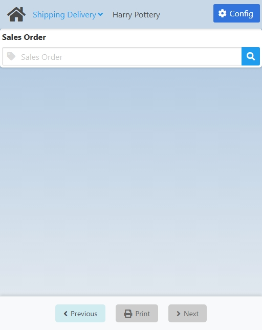
  </TabItem>
  <TabItem value="grpo-creation" label="GRPO">
    
  </TabItem>
  <TabItem value="cpo-selection" label="Carrier PO">
    
  </TabItem>
</Tabs>

---

Click the <IIcon icon='iconamoon:search-bold' width='17' height='17' /> button to open the **Sales Order Search** modal.

:::info
The search results will depend on if you are using a **GRPO** or a **Carrier PO**. If it is the latter, you will be able to choose from only the **Sales Orders** linked to the **Carrier PO**. If it is the former, you will be able to choose from all the **Sales Orders** currently **open**.
:::

<CustomDetails summary='Sales Order Search Modal'>

On this modal you need to select one of the **sales orders** listed.

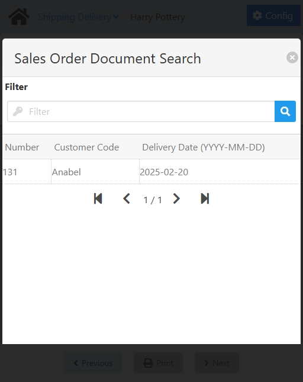

You can select any item by clicking on it, which will close the modal with that **sales order** already set.

You can filter the list of **sales orders** using the search box.

If you want to close the modal without making any changes, click the <IIcon icon='zondicons:close-solid' width='17' height='17'/> button.

</CustomDetails>

Once you select a **sales order**, you will be taken to the [Sales Order Summary](./shipping_delivery.md#sales-order-summary) screen.

### Sales Order Summary

On this screen you can **see** a summary of the information so far and **modify/select** sales order lines for delivery.

:::danger[development]
If you create a GRPO instead of selecting a Carrier PO, the summary section on the top does not show the **Carrier Company** and the **GRPO**.
:::

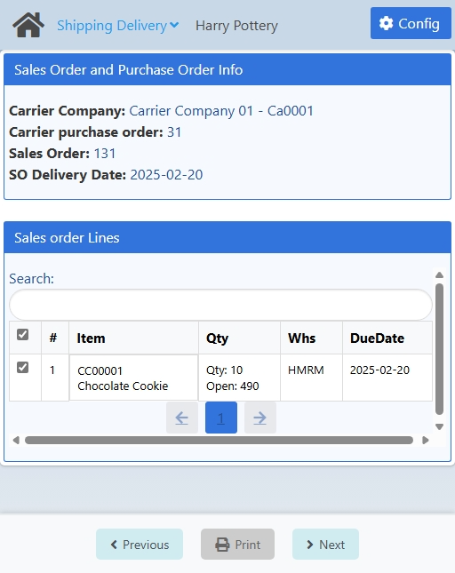

:::danger[development]
<u>**Visual:**</u> Field name. 

**~Carrier purchase order~** <IIcon icon="mdi:arrow-right-thin" width="17" height="17" /> **Carrier Purchase Order**.
:::

<CustomDetails summary="Table Reference">

| Column                                                | Description                                                                                                                                               |
| ----------------------------------------------------- | --------------------------------------------------------------------------------------------------------------------------------------------------------- |
| <IIcon icon="tabler:square" width="17" height="17" /> | Checkbox for selecting the line.                                                                                                                          |
| #                                                     | ID of the line.                                                                                                                                            |
| Item                                                  | 1\. **First Line**: ID of the item. 2. **Second Line**: Description of the item.                                                                       |
| Qty                                                   | 1\. **First Line**: The quantity currently selected to be delivered of that item. 2. **Second Line**: How many items are yet to be delivered.          |
| Whs                                                   | 1\. **First Line**: Warehouse from where the items are going to be taken. 2. **Second Line**: Bin Location from where the items are going to be taken. |
| Due Date                                              | Date for when the line is supposed to be delivered.                                                                                                      |

</CustomDetails>

:::danger[development]
<u>**Visual:**</u> Column name. 

**~DueDate~** <IIcon icon="mdi:arrow-right-thin" width="17" height="17" /> **Due Date**.
:::

:::danger[development]
The **Whs** column does not show the **Bin Location** when one is selected.
:::

In order to continue to the next screen, you need to check at least one line from the sales order. If it does not let you select them, that means you need to modify some information in them for them to be applicable for delivery.

:::danger[development]
<u>**Visual:**</u> Section name. 

**~Sales order Lines~** <IIcon icon="mdi:arrow-right-thin" width="17" height="17" /> **Sales Order Lines**.
:::

You can **filter** the list of lines using the search box.

If you want to **select** a line, click the <IIcon icon="gg:check-r" width="17" height="17" /> button in the first column of the table for that line.

If you want to **modify** a line, click any of the other columns for that line to go to the [Modify Sale Order Line](./shipping_delivery.md#modify-sale-order-line) screen.

Once you are done, click **Next** at the bottom to go to the [Modify Sale Order Line](./shipping_delivery.md#modify-sale-order-line) screen

### Modify Sale Order Line

On this screen you need to **modify** the necessary information on the line so that it matches what is going to be delivered.

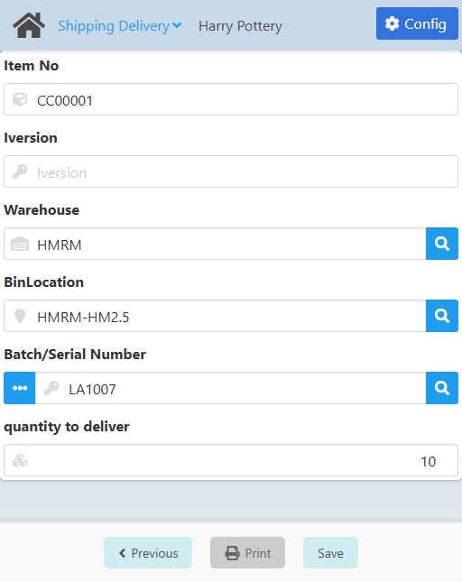

The **Item No** comes from the previously chosen line.

Click the <IIcon icon="iconamoon:search-bold" width="17" height="17" /> button on the fields to open the search modals. You have the **I-Version, Warehouse**, **Bin Location** and **Batch/Serial Number**.

<CustomDetails summary="I-Version Search Modal">

On this screen you need to select one of the **I-Versions** listed.

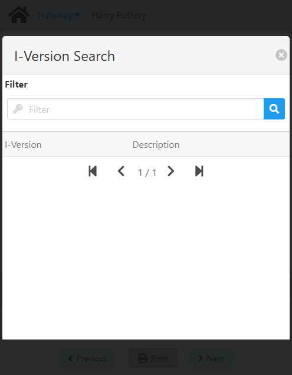

You can select any item by clicking on it, which will close the modal and take you back with that **I-Version** already set.

You can filter the list of **I-Versions** using the search box.

If you want to close the modal without making any changes, click the <IIcon icon="zondicons:close-solid" width="17" height="17"/> button.
</CustomDetails>

:::danger[development]
<u>**Visual:**</u> Field name. 

**~Iversion~** <IIcon icon="mdi:arrow-right-thin" width="17" height="17" /> **I-Version**.
:::

:::danger[development]
<u>**Visual:**</u> Field state. 

The **I-Version** field is not disabled when the item does not have said attribute, it's just read-only.
:::

<CustomDetails summary="Warehouse Search Modal">

On this screen you need to select one of the **warehouses** listed.

You can select any item by clicking on it, which will close the modal and take you back with that **warehouse** already set.

You can filter the list of **warehouses** using the search box.

If you want to close the modal without making any changes, click the <IIcon icon="zondicons:close-solid" width="17" height="17"/> button.

</CustomDetails>

<CustomDetails summary="Location Search Modal">

On this screen you need to select one of the **bin locations** listed.

You can select any item by clicking on it, which will close the modal and take you back with that **bin location** already set.

You can filter the list of **bin locations** using the search box.

If you want to close the modal without making any changes, click the <IIcon icon="zondicons:close-solid" width="17" height="17"/> button.

</CustomDetails>

:::danger[development]
<u>**Visual:**</u> Field name. 

**~BinLocation~** <IIcon icon="mdi:arrow-right-thin" width="17" height="17" /> **Bin Location**.
:::

<CustomDetails summary="Batch/Serial Number Search Modal">

On this screen you need to select one of the **Batches/Serial Numbers** listed.

You can select any item by clicking on it, which will close the modal and take you back with that **Batch/Serial Number** already set.

You can filter the list of **Batches/Serial Numbers** using the search box.

If you want to close the modal without making any changes, click the <IIcon icon="zondicons:close-solid" width="17" height="17"/> button.
</CustomDetails>

Click the <IIcon icon="pepicons-pop:dots-x" width="17" height="17" /> button on the **Batch/Serial Number** field to open the **Batches/Serial Numbers: Extended Information** modal.

<CustomDetails summary="Batches/Serial Numbers: Extended Information">

On this screen you will be able to **add/modify** batches/serial numbers.

The first thing you will see is the **Batch** tab, giving you information for the batch selected. You can modify the fields on this tab, and that will be reflected once you are done.

If you wan to add a new batch, click the <IIcon icon="subway:add" width="17" height="17" />  button to use the **Batch** tab as a form.

Click the <IIcon icon="iconamoon:search-bold" width="17" height="17" /> button on the fields to open the search modals. You have the **Batch/Serial Number** and **I-Version** search modals, that you can reference above this dropdown.

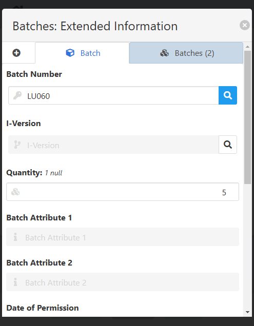

Once you are done adding/modifying the batches, you can click on the **Batches** tab to see the list of batches selected and their information.

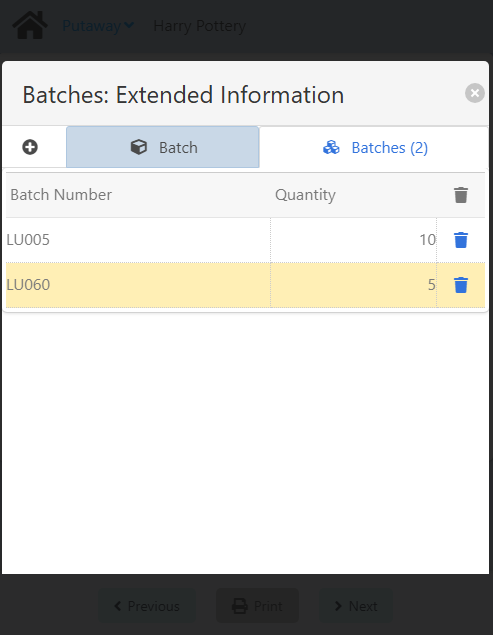

If you want to delete a batch, click the <IIcon icon="ic:baseline-delete" width="17" height="17" /> button for the respective batch.

Once you have everything that you need, click the <IIcon icon="zondicons:close-solid" width="17" height="17"/> button to close the modal and take you back to the [Add or Modify Stock Line](./putaway.mdx#add-or-modify-stock-line) screen with the new batch information already set.

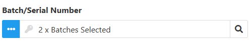

</CustomDetails>

The **Quantity** will depend on the **Batch/Serial Number** selected. You can select up to that number.

:::danger[development]
<u>**Visual:**</u> Field name. 

**~quantity to deliver~** <IIcon icon="mdi:arrow-right-thin" width="17" height="17" /> **Quantity**.
:::

:::danger[development]
Currently, there is no validation for the **Quantity** field. For example, if the **Batch/Serial Number** has a maximum number of items of 10, you *can* set the **Quantity** to a value exceding that limit, i.e. 15, but that will give you an error later on.
:::

Once you are done, click **Save** at the bottom to save the changes and to go back to the [Sales Order Summary](./shipping_delivery.md#sales-order-summary) screen.

### Signing and Printing

On this screen you need to **confirm** the delivery lines, **sign** the document and **print** it.

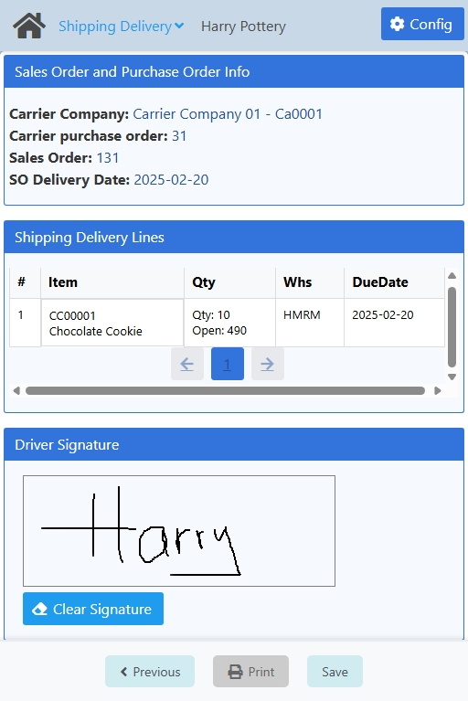

:::danger[development]
<u>**Visual:**</u> Field name. 

**~Carrier purchase order~** <IIcon icon="mdi:arrow-right-thin" width="17" height="17" /> **Carrier Purchase Order**.
:::

<CustomDetails summary="Table Reference">

| Column                                                | Description                                                                                                                                               |
| ----------------------------------------------------- | --------------------------------------------------------------------------------------------------------------------------------------------------------- |
| #                                                     | ID of the line.                                                                                                                                            |
| Item                                                  | 1\. **First Line**: ID of the item. 2. **Second Line**: Description of the item.                                                                       |
| Qty                                                   | 1\. **First Line**: The quantity currently selected to be delivered of that item. 2. **Second Line**: How many items are yet to be delivered.          |
| Whs                                                   | 1\. **First Line**: Warehouse from where the items are going to be taken. 2. **Second Line**: Bin Location from where the items are going to be taken. |
| Due Date                                              | Date for when the line is supposed to be delivered.                                                                                                      |
</CustomDetails>

:::danger[development]
<u>**Visual:**</u> Column name. 

**~DueDate~** <IIcon icon="mdi:arrow-right-thin" width="17" height="17" /> **Due Date**.
:::

:::danger[development]
The **Whs** column does not show the **Bin Location** when one is selected.
:::

If the information on the screen is correct, sign the document in the **Driver Signature** section.

You can erase the signature by clicking the **Clear Signature** button.

Next up is saving the information for the delivery in the system, click **Save** at the bottom for that.

At the end, you have the option of **printing** the document. Click **Print** at the bottom to generate a PDF with the information for the delivery and the signature.

Once you are done, click **Next** at the bottom to go to the [Home](./shipping_delivery.md#option-select-carrier) screen to log another delivery.

:::danger[development]
Currently, if after saving the information in the system you click **Previous** and then click **Next** from the previous screen, you will be taken to the **Home** screen, instead of to the **Signing and Printing** screen.
:::

## Configuration

:::danger[development]
Currently, all users can access the configuration.
:::

:::info
Only administrators can access the configuration for a web app.
:::

On this screen you can set the settings that will apply to this web app.

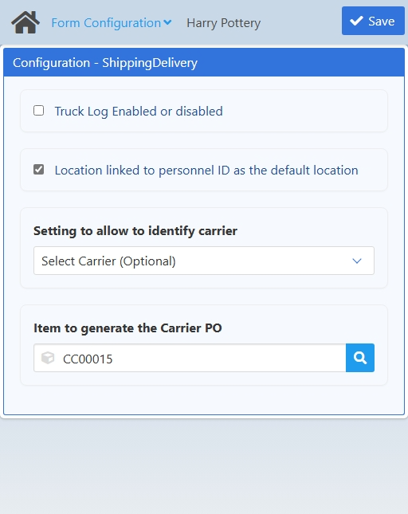

:::danger[development]
The search modal for the **Item to generate the Carrier PO** field does not find the **CARRIER-SERVICE** item.
:::

| Name | Description |
| :--- | :--- |
| Truck Log Enabled or disabled | If checked, the web app will only show Carrier POs that have already checked in. Otherwise, it will show all.     It will also skip the first screen in the flow giving the user the option of selecting a carrier or not.|
| Location linked to personnel ID as the default location | If checked, all item locations will be prefilled with the location the personnel has. Otherwise, all item locations will be prefilled with the location the item has. |
| Setting to allow to identify carrier | From this option will depend the first screen of the web app. You have three options:     <ol><li>**Select Carrier (Mandatory):** This will make the user select a carrier for the process.</li><li>**Select Carrier (Optional):** This will give the user the option of choosing if they want to select a carrier or not.</li><li>**Select Carrier Not Provided:** This will skip the screen for selecting a carrier and will let the user select a sales order directly.</li></ol> |
| Item to generate the Carrier PO | Here you can set the item that will be used when creating a GRPO. It can only be changed here. |