import CustomDetails from "@site/src/components/CustomDetails";
import Tabs from '@theme/Tabs';
import TabItem from '@theme/TabItem';

# Shipping Multi-Site Transfer

The Shipping Multi-Site Transfer web app allows you to log the necessary information when transfering stock lines from one warehouse to another.

## Flow Diagram

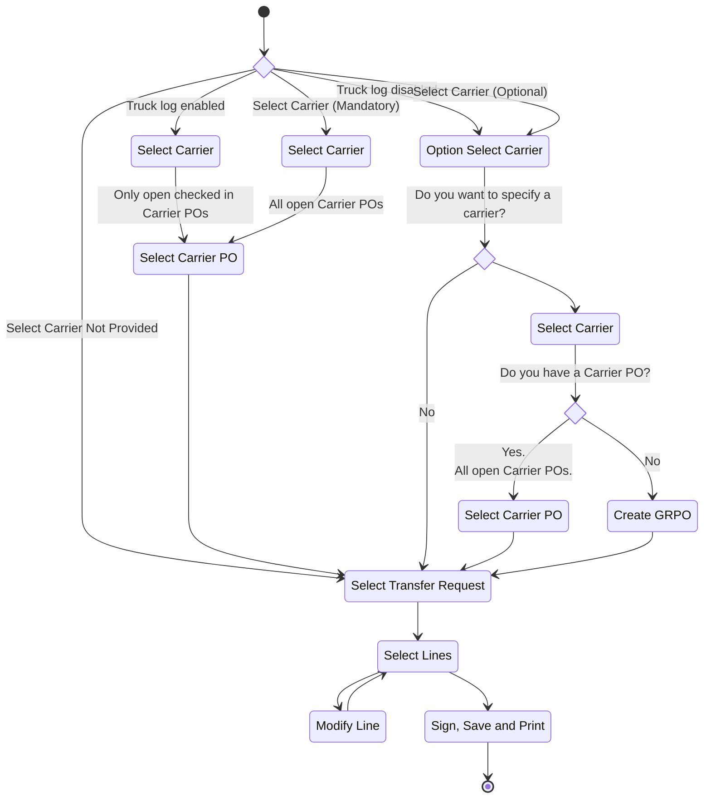

## Screens

### Option: Select Carrier

:::info
This screen is only shown if **Check if the Transfer Request document has a Truck Log linked** <u>is not</u> checked in the [**Configuration**](./shipping_multi_site_transfer.md#configuration).
:::

On this screen you have the option of deciding if you want to specify a **carrier** or not.

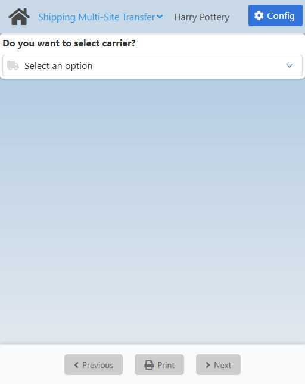

If you choose **Yes**, you will be taken to the [Carrier Selection](./shipping_multi_site_transfer.md#carrier-selection) screen.

If you choose **No**, you will be taken to the [Transfer Request Selection](./shipping_multi_site_transfer.md#transfer-request-selection) screen.

### Carrier Selection

On this screen you need to select a **carrier**.

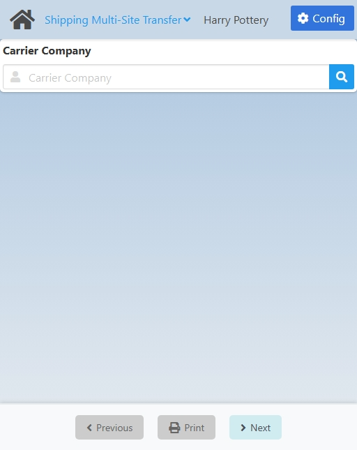

:::danger[development]
The **Previous** button is always disabled. If you get to this screen from the [Option: Select Carrier](./shipping_multi_site_transfer.md#option-select-carrier) screen, there isn't a way to go back and change the decision made.
:::

Click the <IIcon icon='iconamoon:search-bold' width='17' height='17' /> button to open the **Carrier Search** modal.

<CustomDetails summary='Carrier Search Modal'>

On this modal you need to select one of the **carriers** listed.

You can select any item by clicking on it, which will close the modal with that **carrier** already set.

You can filter the list of **carriers** using the search box.

If you want to close the modal without making any changes, click the <IIcon icon='zondicons:close-solid' width='17' height='17'/> button.

</CustomDetails>

Once you select a **carrier**, you will be taken to the [Carrier Purchase Order Selection](./shipping_multi_site_transfer.md#carrier-purchase-order-selection) screen.

### Carrier Purchase Order Selection

On this screen you need to select a **carrier purchase order** associated with the carrier you previously chose.

The exact screen you will see will depend on the **Check if the Transfer Request document has a Truck Log linked** option in the [Configuration](./shipping_multi_site_transfer.md#configuration):

1. <u>**Truck Log Checked**</u>: The **Check if the Transfer Request document has a Truck Log linked** option <u>is</u> checked. This will only give you the option for selecting a **Carrier Purchase Order**.
2. <u>**Truck Log Not Checked**</u>: The **Check if the Transfer Request document has a Truck Log linked** option <u>is not</u> checked. This will give you both options, selecting a **Carrier Purchase Order** and creating a **Goods Receipt Purchase Order**. The options are <u>mutually exclusive</u>.

<Tabs>
  <TabItem value="checked" label="Truck Log Checked" default>
    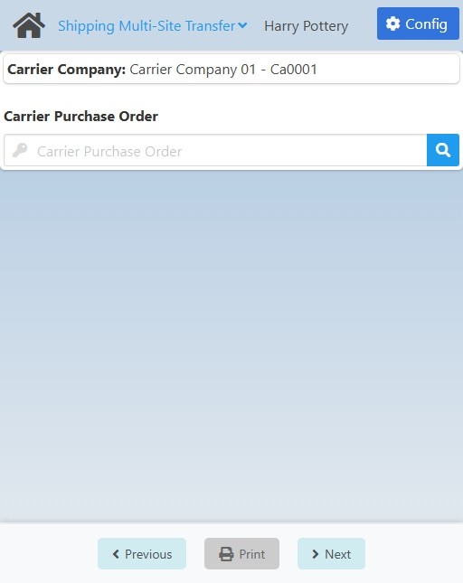
  </TabItem>
  <TabItem value="not-checked" label="Truck Log Not Checked">
    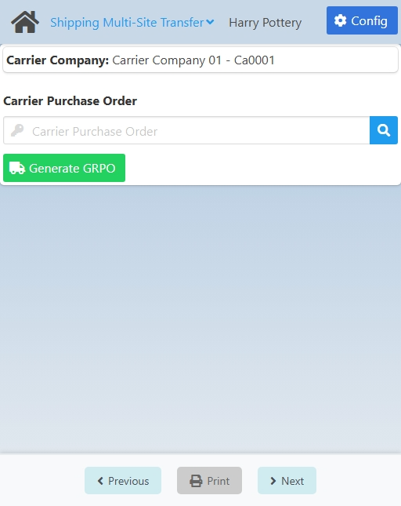
  </TabItem>
</Tabs>

---

:::danger[development]
Currently, if you select first a **Carrier PO** and then change it to a GRPO, or viceversa, on screen, both the selected Carrier PO and the created GRPO will show, and if you try to select a **Transfer Request**, it will only show the ones assigned to the Carrier PO.

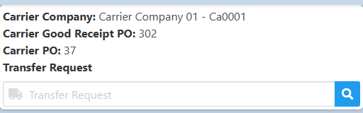
:::

If you want to use a **Carrier Purchase Order**, click the <IIcon icon='iconamoon:search-bold' width='17' height='17' /> button to open the **Carrier Purchase Order Search** modal.

:::info
If **Check if the Transfer Request document has a Truck Log linked** <u>is</u> checked in the [Configuration](./shipping_multi_site_transfer.md#configuration), the search results will only include carrier purchase orders that are open <u>and</u> have already checked in.
:::

<CustomDetails summary='Carrier Purchase Order Search Modal'>

On this modal you need to select one of the **carrier purchase orders** listed.

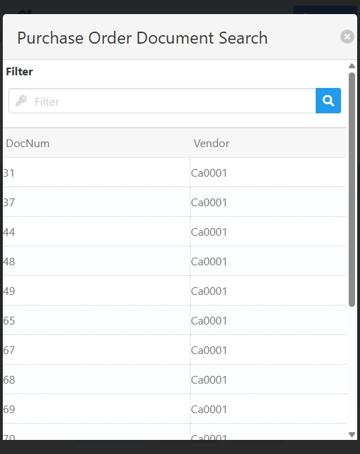

You can select any item by clicking on it, which will close the modal with that **carrier purchase order** already set.

You can filter the list of **carrier purchase orders** using the search box.

If you want to close the modal without making any changes, click the <IIcon icon='zondicons:close-solid' width='17' height='17'/> button.

</CustomDetails>

Once you select a **carrier purchase order**, you will be taken to the [Transfer Request Selection](./shipping_multi_site_transfer.md#transfer-request-selection) screen.

If instead you want to use a **Goods Receipt Purchase Order** <u>and it is available</u>, click the **Generate GRPO** button to go to the [Goods Receipt Purchase Order Generation](./shipping_multi_site_transfer.md#goods-receipt-purchase-order-generation) screen.

:::danger[development]
Currently, the **Generate GRPO** button takes you to the [Transfer Request](./shipping_multi_site_transfer.md#transfer-request-selection) screen instead.
:::

### Goods Receipt Purchase Order Generation

:::danger[development]
Currently, this screen is missing. 

When the user clicks the **Create GRPO button** in the previous screen, the web app automatically creates the **GRPO** and takes them to the [Transfer Request Selection](./shipping_multi_site_transfer.md#transfer-request-selection) screen directly.
:::

On this screen you need to create a **GRPO**. This is an <u>alternative</u> to a **Carrier Purchase Order**.

:::warning[documentation]
Change the image when this screen is added to the web app.
:::

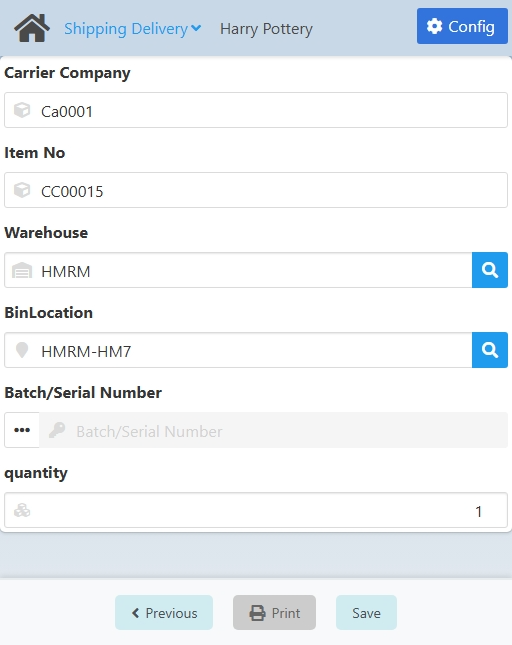

The **Carrier Company** comes from the previous screen and the **Item No** comes from the **Item to generate the Carrier Goods Receipt PO** option in the [Configuration](./shipping_multi_site_transfer.md#configuration). These fields <u>are not</u> editable.

By default, the **Warehouse** and **Bin Location** will be the location of the personnel in the system, <u>only if</u> the **Location linked to personnel ID as the default location** option <u>is</u> checked in the [Configuration](./shipping_multi_site_transfer.md#configuration). These fields <u>are</u> editable.

If you want set a **Warehouse**, click the <IIcon icon="iconamoon:search-bold" width="17" height="17" /> button to open the **Warehouse Search** modal.

<CustomDetails summary="Warehouse Search Modal">

On this screen you need to select one of the **warehouses** listed.

You can select any item by clicking on it, which will close the modal and take you back with that **warehouse** already set.

You can filter the list of **warehouses** using the search box.

If you want to close the modal without making any changes, click the <IIcon icon="zondicons:close-solid" width="17" height="17"/> button.

</CustomDetails>

The **Bin Location** will only be enabled if the **Warehouse** is managed by one. Click the <IIcon icon="iconamoon:search-bold" width="17" height="17" /> button on the field to open the **Location Search** modal.

:::danger[development]
<u>**Visual:**</u> Field name. 

**~BinLocation~** <IIcon icon="mdi:arrow-right-thin" width="17" height="17" /> **Bin Location**.
:::

<CustomDetails summary="Location Search Modal">

On this screen you need to select one of the **bin locations** listed.

You can select any item by clicking on it, which will close the modal and take you back with that **bin location** already set.

You can filter the list of **bin locations** using the search box.

If you want to close the modal without making any changes, click the <IIcon icon="zondicons:close-solid" width="17" height="17"/> button.

</CustomDetails>

Next up is the **Batch/Serial Number**. This one is not enabled because for this specific procedure the **Item No** is not supposed to be managed by a batch/serial number, due to its nature.

<!-- NOTE: When enabled, the batch field allows the user to type in any value and that gives an error later when trying to create the GRPO  -->

:::danger[development]
The **Batch/Serial Number** should be disabled for this procedure. Currently, it gets enabled after setting the **Warehouse** manually.
:::

And last but no least we have the **Quantity**. Set it to the value you see fit.

:::danger[development]
<u>**Visual:**</u> Field name. 

**~quantity~** <IIcon icon="mdi:arrow-right-thin" width="17" height="17" /> **Quantity**.
:::

Once you are done, click **Save** at the bottom to create the **Goods Receipt Purchase Order** and to go to the [Transfer Request Selection](./shipping_multi_site_transfer.md#transfer-request-selection) screen.

:::danger[development]
Cannot create a GRPO unless there is a Batch/Serial Number <u>correctly</u> set.
:::

### Transfer Request Selection

:::danger[development]
This screen does not show if you select a **Carrier PO** that has only one **Transfer Request** assigned. It takes you directly to the [Transfer Request Summary](./shipping_multi_site_transfer.md#transfer-request-summary) screen instead. This is not consistent with other web apps.
:::

On this screen you need to select a **transfer requests**.

The exact screen you will see will depend on what screen you got here from:

1. <u>**No Carrier**</u>: After selecting **No** on the [Option: Select Carrier](./shipping_multi_site_transfer.md#option-select-carrier) screen.
2. <u>**GRPO**</u>: After generating a **Goods Receipt Purchase Order**.
3. <u>**Carrier PO**</u>: After selecting **Carrier Purchase Order**.

<Tabs>
  <TabItem value="no-carrier" label="No Carrier" default>
    
  </TabItem>
  <TabItem value="grpo-creation" label="GRPO">
    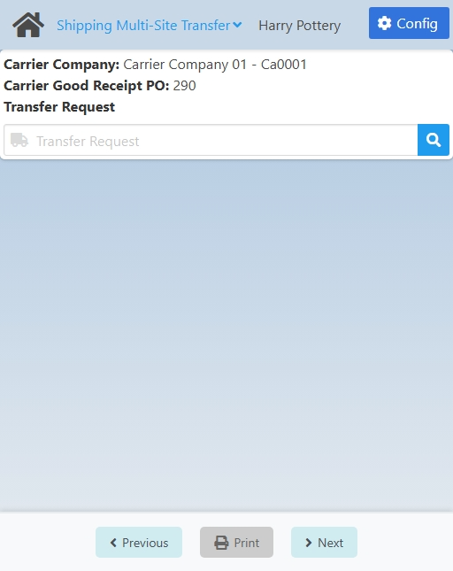
  </TabItem>
  <TabItem value="cpo-selection" label="Carrier PO">
    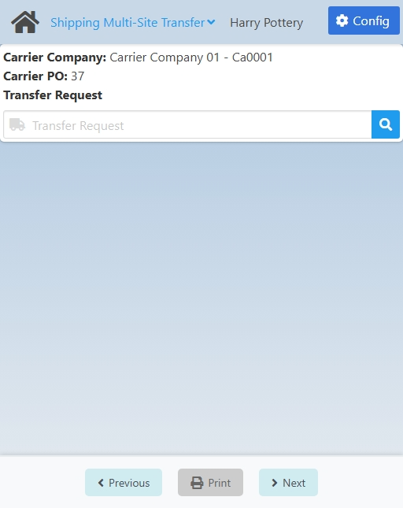
  </TabItem>
</Tabs>

---

Click the <IIcon icon='iconamoon:search-bold' width='17' height='17' /> button to open the **Transfer Request Search** modal.

:::info
The search results will depend on if you are using a **GRPO** or a **Carrier PO**. If it is the latter, you will be able to choose from only the **Transfer Requests** linked to the **Carrier PO**. If it is the former, you will be able to choose from all the **Transfer Requests** currently **open**.
:::

<CustomDetails summary="Transfer Request Search Modal">

On this screen you need to select one of the **transfer requests** listed.

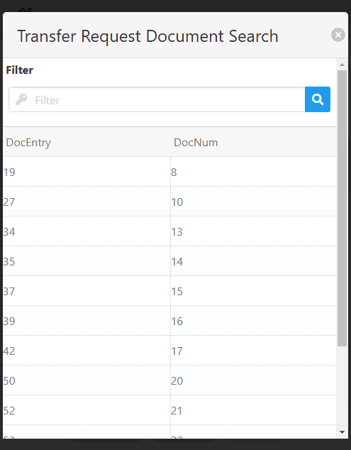

You can select any item by clicking on it, which will close the modal with that **transfer request** already set.

You can filter the list of **transfer requests** using the search box.

If you want to close the modal without making any changes, click the <IIcon icon="zondicons:close-solid" width="17" height="17"/> button.

</CustomDetails>

Once you select a **transfer request**, you will be taken to the [Transfer Request Summary](./shipping_multi_site_transfer.md#transfer-request-summary) screen.

### Transfer Request Summary

On this screen you can **see** a summary of the information so far and **modify/select** transfer request lines for transfer.

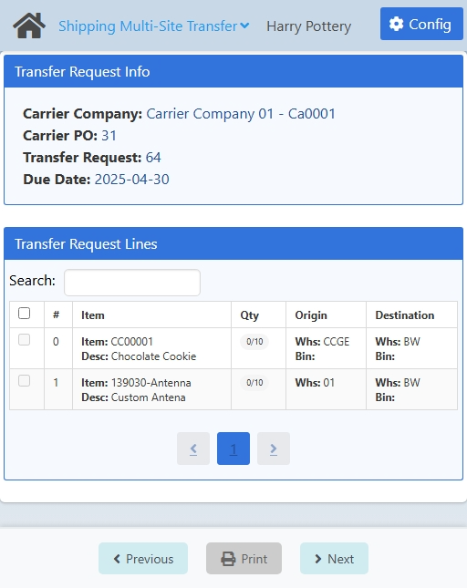

:::danger[development]
<u>**Visual:**</u> Field name. Summary section for GRPO. 

**~Carrier Good Receipt PO~** <IIcon icon="mdi:arrow-right-thin" width="17" height="17" /> **Carrier Goods Receipt PO**.
:::

<CustomDetails summary="Table Reference">

| Column                                                | Description                                                                                                                                               |
| ----------------------------------------------------- | --------------------------------------------------------------------------------------------------------------------------------------------------------- |
| <IIcon icon="tabler:square" width="17" height="17" /> | Checkbox for selecting the line.                                                                                                                          |
| #                                                     | ID of the line.                                                                                                                                            |
| Item                                                  | 1\. **First Line**: ID of the item. 2. **Second Line**: Description of the item.                                                                       |
| Qty                                                   | 1\. **First Line**: The quantity currently selected to be delivered of that item. 2. **Second Line**: How many items are yet to be delivered.          |
| Origin                                                | 1\. **First Line**: Warehouse from where the items are going to be taken. 2. **Second Line**: Bin Location from where the items are going to be taken. |
| Destination                                           | 1\. **First Line**: Warehouse to where the items are going to be transferred. 2. **Second Line**: Bin Location to where the items are going to be transferred. |                                                                                                    |

</CustomDetails>

In order to continue to the next screen, you need to check at least one line from the transfer request. If it does not let you select them, that means you need to modify some information in them for them to be applicable for a transfer.

You can **filter** the list of lines using the search box.

If you want to **select** a line, click the <IIcon icon="gg:check-r" width="17" height="17" /> button in the first column of the table for that line.

If you want to **modify** a line, click any of the other columns for that line to go to the [Modify Transfer Request Line](./shipping_multi_site_transfer.md#modify-transfer-request-line) screen.

Once you are done, click **Next** at the bottom to go to the [Sign, Save and Print](./shipping_multi_site_transfer.md#sign-save-and-print) screen.

:::danger[development]
When using a **Carrier PO**, the **Previous** button takes you to the [Carrier Purchase Order Selection](./shipping_multi_site_transfer.md#carrier-purchase-order-selection) screen, instead of to the [Transfer Request Selection](./shipping_multi_site_transfer.md#transfer-request-selection) screen, which is supposed to be the previous screen. This happens both for Carrier POs that have only one and multiple Transfer Requests assigned.
:::

### Modify Transfer Request Line

On this screen you need to **modify** the necessary information on the line so that it matches what is going to be transferred.

:::danger[development]
The vertical scroll does not work as expected. On small-viewport devices like the iPhone SE or the Samsung Galaxy S8+ in the devtools, the screen does not let you see/interact with the **Destination** locations.
:::

The **Item No** comes from the previously chosen line.

:::danger[development]
The **Item No** field should not be editable.
:::

Click the <IIcon icon="iconamoon:search-bold" width="17" height="17" /> button on the fields to open the search modals. You have the **I-Version**, **Origin Warehouse**, **Origin Bin Location**, **Batch/Serial Number**, **Destination Warehouse**, and **Destination Bin Location**.

<CustomDetails summary="I-Version Search Modal">

On this screen you need to select one of the **I-Versions** listed.

You can select any item by clicking on it, which will close the modal and take you back with that **I-Version** already set.

You can filter the list of **I-Versions** using the search box.

If you want to close the modal without making any changes, click the <IIcon icon="zondicons:close-solid" width="17" height="17"/> button.
</CustomDetails>

<CustomDetails summary="Origin and Destination Warehouse Search Modal">

On this screen you need to select one of the **warehouses** listed.

You can select any item by clicking on it, which will close the modal and take you back with that **warehouse** already set.

You can filter the list of **warehouses** using the search box.

If you want to close the modal without making any changes, click the <IIcon icon="zondicons:close-solid" width="17" height="17"/> button.

</CustomDetails>

<CustomDetails summary="Origin and Destination Location Search Modal">

On this screen you need to select one of the **bin locations** listed.

You can select any item by clicking on it, which will close the modal and take you back with that **bin location** already set.

You can filter the list of **bin locations** using the search box.

If you want to close the modal without making any changes, click the <IIcon icon="zondicons:close-solid" width="17" height="17"/> button.

</CustomDetails>

:::danger[development]
The **Origin** locations do not get prefilled with the personnel's default location according to the settings in the Configuration.
:::

:::danger[development]
The **Destination** locations do not get prefilled with the item's default location according to the settings in the Configuration.
:::

<CustomDetails summary="Batch/Serial Number Search Modal">

On this screen you need to select one of the **Batches/Serial Numbers** listed.

You can select any item by clicking on it, which will close the modal and take you back with that **Batch/Serial Number** already set.

You can filter the list of **Batches/Serial Numbers** using the search box.

If you want to close the modal without making any changes, click the <IIcon icon="zondicons:close-solid" width="17" height="17"/> button.
</CustomDetails>

Click the <IIcon icon="pepicons-pop:dots-x" width="17" height="17" /> button on the **Batch/Serial Number** field to open the **Batches/Serial Numbers: Extended Information** modal.

<CustomDetails summary="Batches/Serial Numbers: Extended Information">

On this screen you will be able to **add/modify** batches/serial numbers.

The first thing you will see is the **Batch** tab, giving you information for the batch selected. You can modify the fields on this tab, and that will be reflected once you are done.

If you want to add a new batch, click the <IIcon icon="subway:add" width="17" height="17" />  button to use the **Batch** tab as a form.

Click the <IIcon icon="iconamoon:search-bold" width="17" height="17" /> button on the fields to open the search modals. You have the **Batch/Serial Number** and **I-Version** search modals, that you can reference above this dropdown.

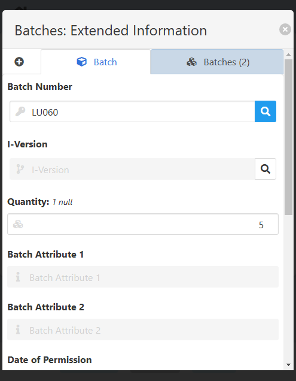

Once you are done adding/modifying the batches, you can click on the **Batches** tab to see the list of batches selected and their information.

If you want to delete a batch, click the <IIcon icon="ic:baseline-delete" width="17" height="17" /> button for the respective batch.

Once you have everything that you need, click the <IIcon icon="zondicons:close-solid" width="17" height="17"/> button to close the modal and take you back to the [Add or Modify Stock Line](./putaway.mdx#add-or-modify-stock-line) screen with the new batch information already set.

</CustomDetails>

The **Quantity** will depend on the **Batch/Serial Number** selected. You can select up to that number.

:::danger[development]
Currently, there is no validation for the **Quantity** field. For example, if the **Batch/Serial Number** has a maximum number of items of 10, you *can* set the **Quantity** to a value exceding that limit, i.e. 15, but that will give you an error later on.
:::

Once you are done, click **Save** at the bottom to save the changes and to go back to the [Transfer Request Summary](./shipping_multi_site_transfer.md#transfer-request-summary) screen.

### Sign, Save and Print

On this screen you can **confirm** the transfer lines, **sign** the document, **save** it, and **print** it.

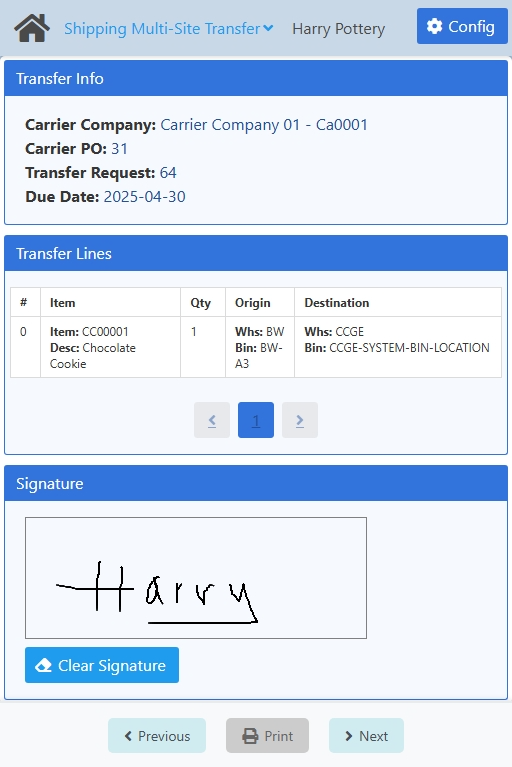

:::danger[development]
The vertical scroll does not work as expected. On small-viewport devices like the iPhone SE or the Samsung Galaxy S8+ in the devtools, the screen does not let you see/interact with the **Clear Signature** button.
:::

:::danger[development]
<u>**Visual:**</u> Field name. Summary section for GRPO. 

**~Carrier Good Receipt PO~** <IIcon icon="mdi:arrow-right-thin" width="17" height="17" /> **Carrier Goods Receipt PO**.
:::

<CustomDetails summary="Table Reference">

| Column                                                | Description                                                                                                                                               |
| ----------------------------------------------------- | --------------------------------------------------------------------------------------------------------------------------------------------------------- |
| #                                                     | ID of the line.                                                                                                                                            |
| Item                                                  | 1\. **First Line**: ID of the item. 2. **Second Line**: Description of the item.                                                                       |
| Qty                                                   | 1\. **First Line**: The quantity currently selected to be delivered of that item. 2. **Second Line**: How many items are yet to be delivered.          |
| Whs                                                   | 1\. **First Line**: Warehouse from where the items are going to be taken. 2. **Second Line**: Bin Location from where the items are going to be taken. |
| Due Date                                              | Date for when the line is supposed to be delivered.                                                                                                      |
</CustomDetails>

If the information on the screen is correct, sign the document in the **Driver Signature** section.

You can erase the signature by clicking the **Clear Signature** button.

Next up is saving the information for the transfer in the system, click **Save** at the bottom for that.

At the end, you have the option of **printing** the document. Click **Print** at the bottom to generate a PDF with the information for the transfer and the signature.

Once you are done, click **Next** at the bottom to go to one of the home screens, depending on the [Configuration](./shipping_multi_site_transfer.md#configuration), to log another transfer: [Option: Select Carrier](./shipping_multi_site_transfer.md#option-select-carrier), [Carrier Selection](./shipping_multi_site_transfer.md#carrier-selection) or [Transfer Request Selection](./shipping_multi_site_transfer.md#transfer-request-selection).

:::danger[development]
Currently, after saving the information in the system, if you click **Next**, you will always be taken to the **Carrier Selection** screen, even if the **Select Carrier (Optional)** or **Select Carrier not provided** options are selected in the Configuration, which should take you to the **Option: Select Carrier** and **Transfer Request Selection** screens instead.
:::

## Configuration

:::danger[development]
Currently, all users can access the configuration.
:::

:::info
Only administrators can access the configuration for a web app.
:::

On this screen you can set the settings that will apply to this web app.

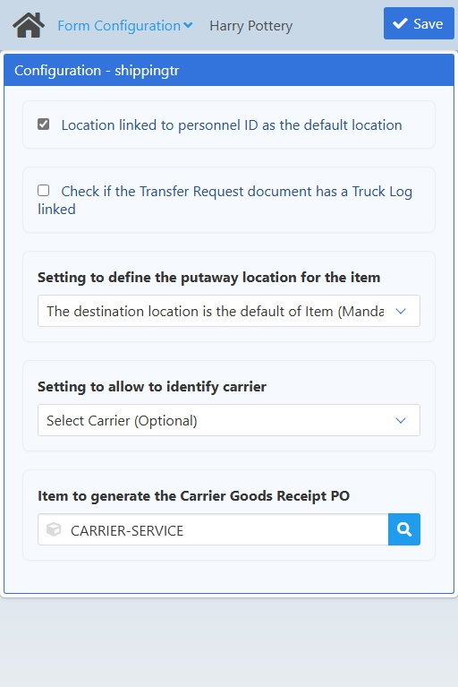

| Name | Description |
| :--- | :--- |
| Location linked to personnel ID as the default location | If checked, it will prefill the **origin** location of the item with the default location for the personnel. Otherwise, it will prefill the **origin** location of the item with the location with which the line was created for the transfer request. |
| Check if the Transfer Request document has a Truck Log linked | If checked, the web app will only show Carrier POs that are open <u>and</u> have already checked in. Otherwise, it will show all that are open.     It will also skip the first screen in the flow giving the user the option of selecting a carrier or not.|
| Setting to define the putaway location for the item | <ol><li>**The destination location is the default of Item (Mandatory):** This will prefill the **destination** location of the item with the default location for the item. The user <u>cannot</u> edit it.</li><li>**The destination location is the default of Item (Optional):** This will prefill the **destination** location of the item with the default location for the item. The user <u>can</u> edit it.</li><li>**The destination location is chosen by the user:** This will prefill the **destination** location of the item with the location with which the line was created for the transfer request.</li></ol> |
| Setting to allow to identify carrier | From this option will depend the first screen of the web app.     <ol><li>**Select Carrier (Mandatory):** This will make the user select a carrier for the process.</li><li>**Select Carrier (Optional):** This will give the user the option of choosing if they want to select a carrier or not.</li><li>**Select Carrier Not Provided:** This will skip the screen for selecting a carrier and will let the user select a transfer request directly.</li></ol> |
| Item to generate the Carrier Goods Receipt PO | Here you can set the item that will be used when creating a GRPO. It can only be changed here. |