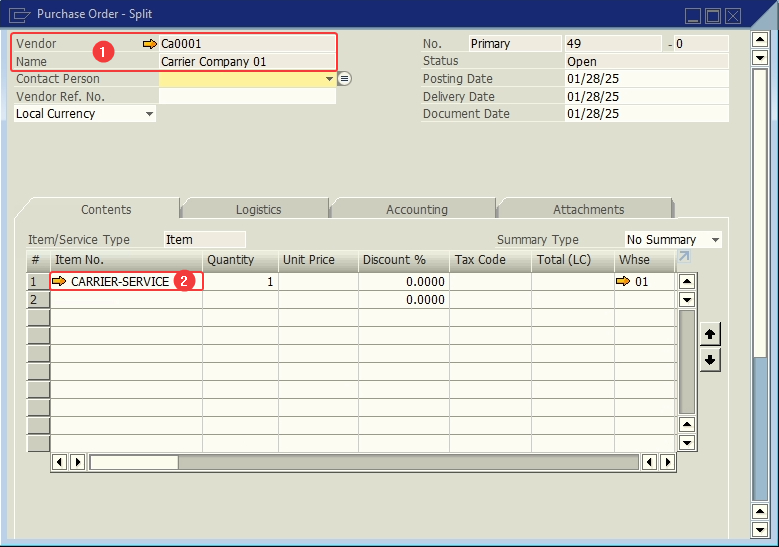
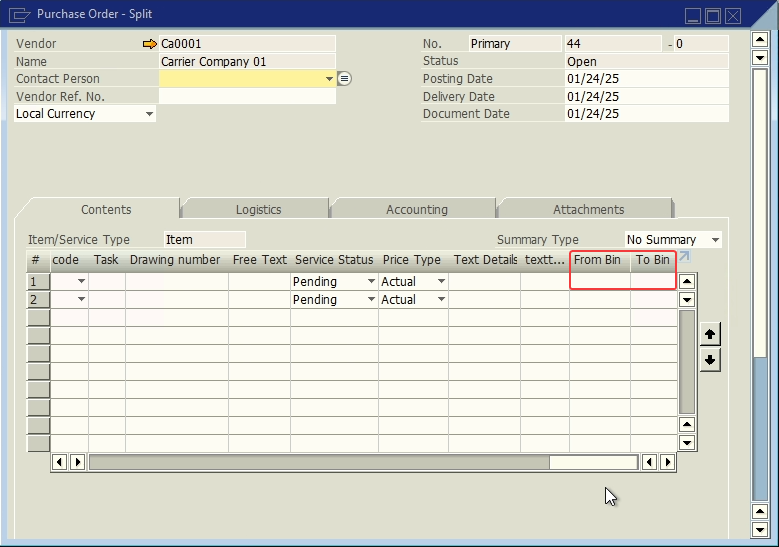
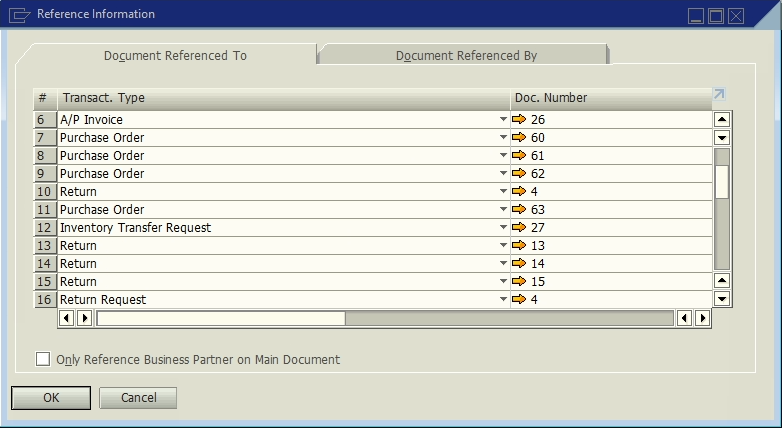

# Carrier PO

A **Purchase Order** assigned to a **Carrier** and with the item **CARRIER-SERVICE**.

1. **Business Partner**.
2. **Item**.

## User Defines Fields

| Display Name | Table | Field | Description | Type |
| --- | --- | --- | --- | --- |
| From Bin | POR1 | U_lwms_frombin | From where the stock came | Text |
| To Bin | POR1 | U_lwms_tobin | To where the stock went | Text |

## Referenced Documents

In contrast with a regular PO, a carrier PO can have a variety of documents assigned to it, for transportation purposes.

## References

- [Shipping Delivery.](/docs/apps/shipping_delivery)
- [Shipping Multi-Site Transfer.](/docs/apps/shipping_multi_site_transfer)
- [Receive.](/docs/apps/receive)
