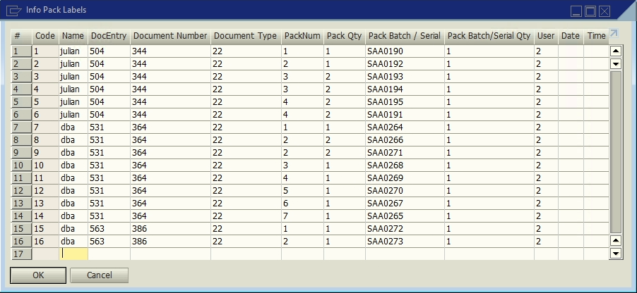

# Info pack labels

**UDT** for storing information about the labels generated.

### Fields

Table **PACKS_LABELS**.

| Display Name | Field | Description | Type |
| --- | --- | --- | --- |
| DocEntry | U_docen | Document id | Number |
| Document Number | U_docnum | Document number | Number |
| Document type | U_doctype | Document type | Number |
| Pack Num | U_packnum | Pack number | Number |
| Pack Qty | U_packqty | Total quantity in the pack | Number |
| Pack Batch/Serial | U_packbatch | Batch/serial number in the pack | Text |
| Pack Batch/Serial Qty | U_packbatchqty | Batch/serial number quantity in the pack | Text |
| User | U_user | User | Text |
| Date | U_date | Creation date | Date |
| Time | U_time | Creation time | Number |

# References

- [Inspection.](/docs/apps/inspection)
- [Shipping Delivery.](/docs/apps/shipping_delivery)
- [Shipping Multi-Site Transfer.](/docs/apps/shipping_multi_site_transfer)
- [Receive.](/docs/apps/receive)
