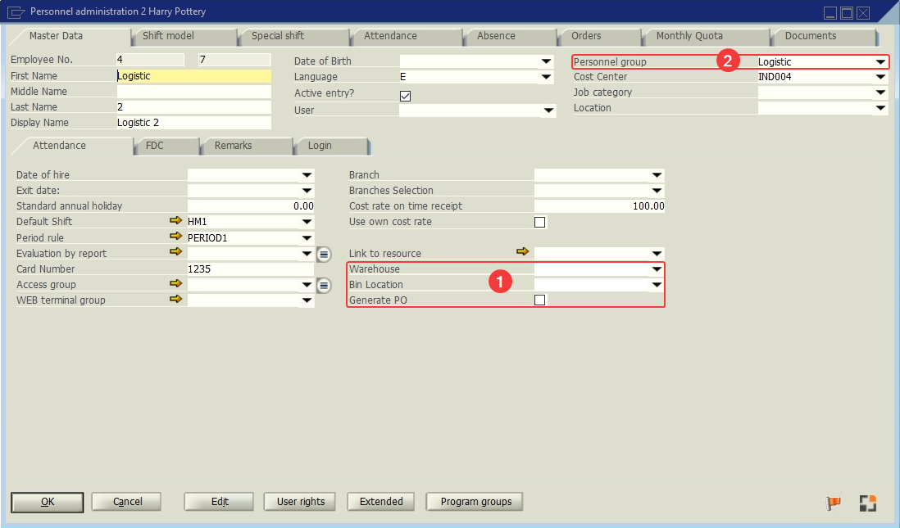

# Personnel

Users who interact with the WebApps.

<!-- This section describes the UDFs, UDTs and data created for managing Personnel (Users who interact with the WebApps). -->

## 1. User Defined Fields

<!-- The Personnel table (*BEAS_PERS*) has the following **UDFs** used. -->

<!-- | Field | Description | Type |
| --- | --- | --- |
| UDF1 | Location Warehouse | Text | 
| UDF2 | Location BinLocation | Text | 
| UDF3 | Generate PO | Checkbox |  -->

| Display Name | Table | Field | Description | Type |
| --- | --- | --- | --- | --- |
| Warehouse | BEAS_PERS | UDF1 | Personnel's Warehouse | Text |
| Bin Location | BEAS_PERS | UDF2 | Personnel's Bin Location | Text |
| Generate PO | BEAS_PERS | UDF3 | PO generation permissions | Checkbox |

:::note
The Personnel table doesn't allow you to add UDFs because it's a Beas table. The UDFs included in the table are used.
:::

## 2. Personnel Group

<!-- These data are complementary to create personnel types. -->

| Group | Description |
| --- | --- |
| Non_Employee_Driver | External Driver |
| Employee | Internal Employee |
| Logistic | Employee assigned logistics tasks |

## References

- [All WebApps.](/docs/category/web-apps)

<!-- ## User Defined Tables

### Personnel Master Data Complement

Supplementary table (*LWMS_Personnel*) required to save the other characteristics for the Personnel.

| Field | Description | Type |
| --- | --- | --- |
| pers_id | Personnnel Id | Alphanumeric(50) | 
| exec_transfer | Execute Transfer | Alphanumeric(1) | 
| gen_transfer_req | Generate Transfer Request | Alphanumeric(1) | 

:::caution
The necessary information for the user to modify the values ​​has not been generated.
::: -->
