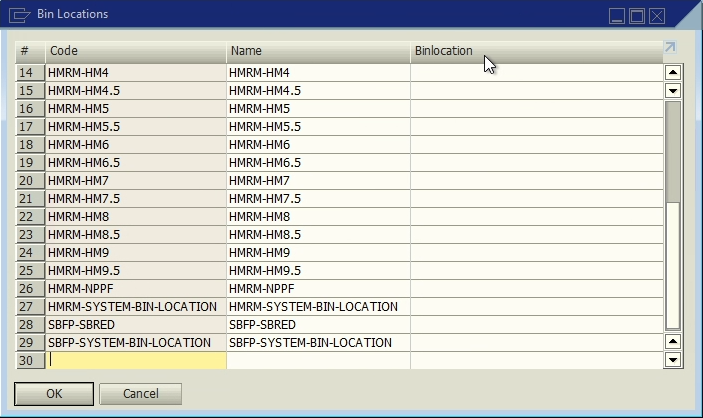

# Bin locations

**UDT** for **Bin Locations**.

### Fields

Table **LWMS_BINLOCATION**.

| Display Name | Field | Description | Type |
| --- | --- | --- | --- |
| BinLocation | U_BinLocation | Bin id | Text |
