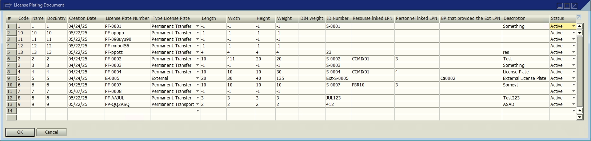

# LPN

**UDT**s for the **License Plating** workflows.

## License Plating Document

Stores information specific to each **License Plate Number**.

### Fields

Table **LWMS_PLATING_DOC**.

| Display Name | Field | Description | Type |
| --- | --- | --- | --- |
| DocEntry | U_docentry | Document entry | Number |
| Creation Date | U_docdate | Creation date | Date |
| License Plate Number | U_license | License plate number| Text |
| Type License Plate | U_type | License plate type | Text |
| Length | U_length | Length of the associated item | Number |
| Width | U_width | Width of the associated item | Number |
| Height | U_Height | Height of the associated item |
| Weight | U_weight | Actual weight of the associated item |
| DIM Weight | U_dim_weight | Dimensional weight of the associated item | Number |
| ID Number | U_dim_weight | License plate type | Text |
| Resource Linked LPN | U_dim_weight | License plate type | Text |
| Personnel Linked LPN | U_dim_weight | License plate type | Text |
| BP that provided the Ext LPN | U_dim_weight | License plate type | Text |
| Description | U_dim_weight | License plate type | Text |
| Status | U_dim_weight | License plate type | Text |

#### License Plate Types

| Option | Description |
| --- | --- |
| PF | Permanent Trans<u>f</u>er. |
| PP | Permanent Trans<u>p</u>ort. |
| T | Temporary. |
| E | External. |

#### Statuses

| Option | Description |
| --- | --- |
| A | Active. |
| I | Inactive. |

## References

- [Shipping Multi-Site Transfer.](/docs/core_functions/shipping_multi_site_transfer)
- [Receive.](/docs/core_functions/receive)
