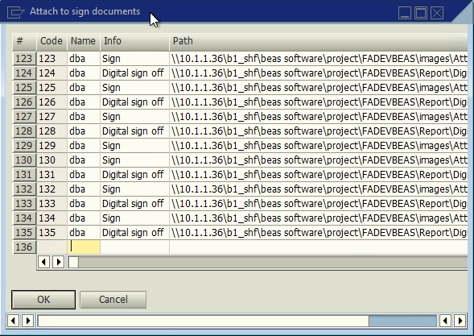

# Attach to sign documents

**UDT** for storing the information for **signatures** and the **report documents** they belong to.

### Fields

Table **LWMS_DOC_ATTACH**.

| Display Name | Field | Description | Type |
| --- | --- | --- | --- |
| Info | U_info | Description | Text |
| Path | U_path | Directory path | Text |
| Date | U_date | Date | Date |
| DocEntry | U_docentry | Document id | Text |
| BaseType | U_basetype | Basetype id | Text |
| Status | U_basetype | Status | Text |
| Log | U_log | Log | Text |
| Type | U_type | Document type | Text |
| Text | U_img | Image URI | Text |

# References

- [Inspection.](/docs/core_functions/inspection)
- [Shipping Delivery.](/docs/core_functions/shipping_delivery)
- [Shipping Multi-Site Transfer.](/docs/core_functions/shipping_multi_site_transfer)
- [Receive.](/docs/core_functions/receive)
