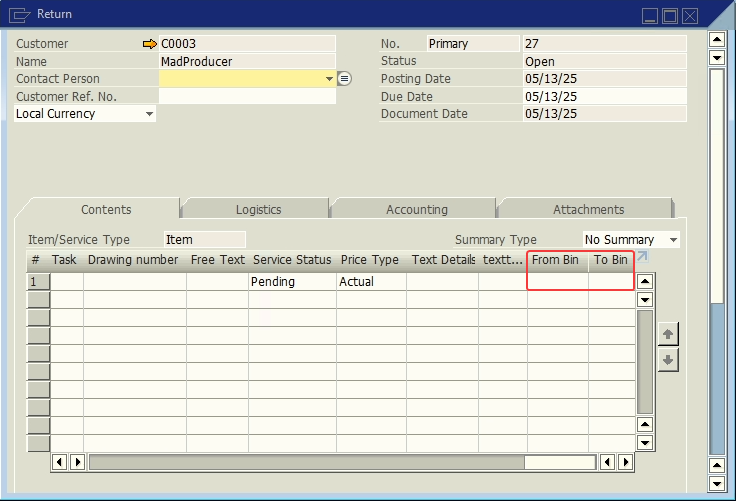

# Return

- **User Defined fields**:
  
| Display Name | Table | Field | Description | Type |
| --- | --- | --- | --- | --- |
| From Bin | RRN1 | U_lwms_frombin | From where the stock came | Text |
| To Bin | RRN1 | U_lwms_tobin | To where the stock went | Text |

## References

- [Receive.](/docs/core_functions/receive)
