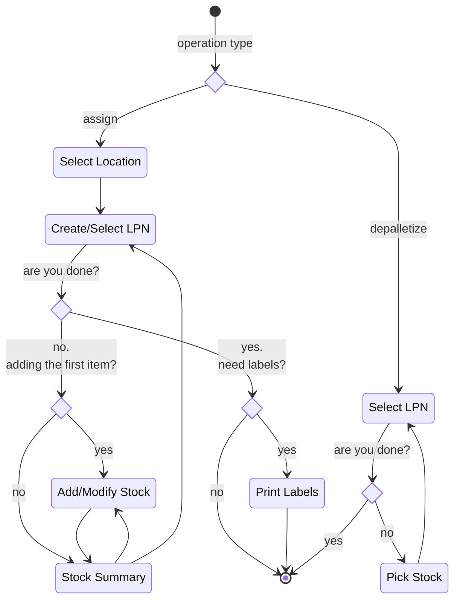
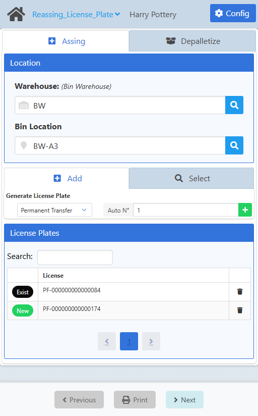
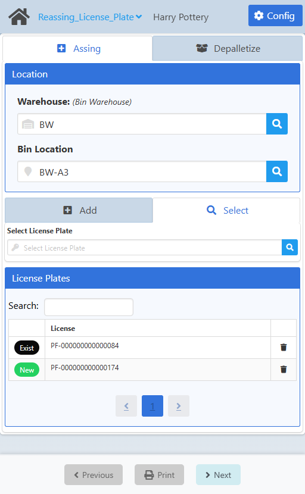
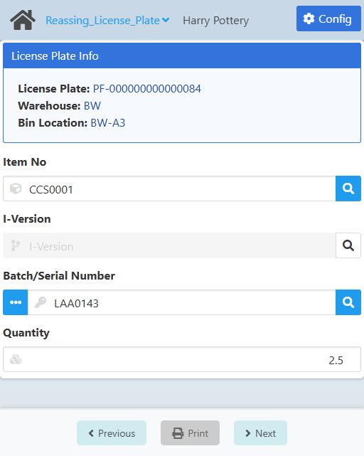
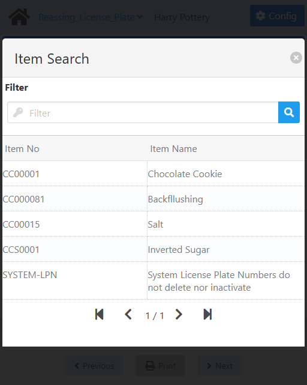
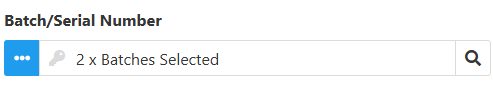
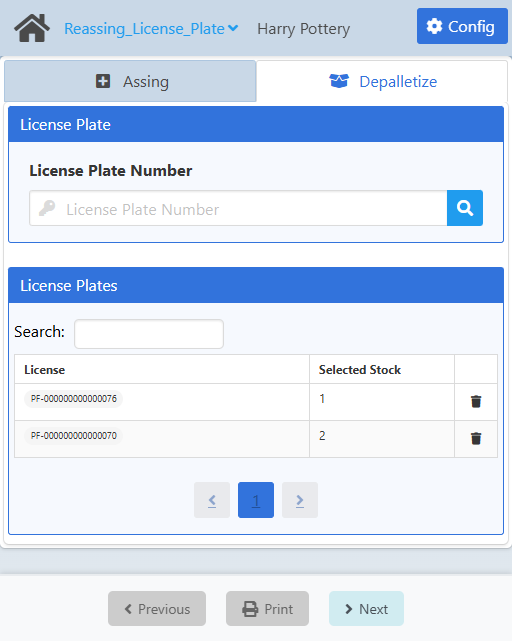
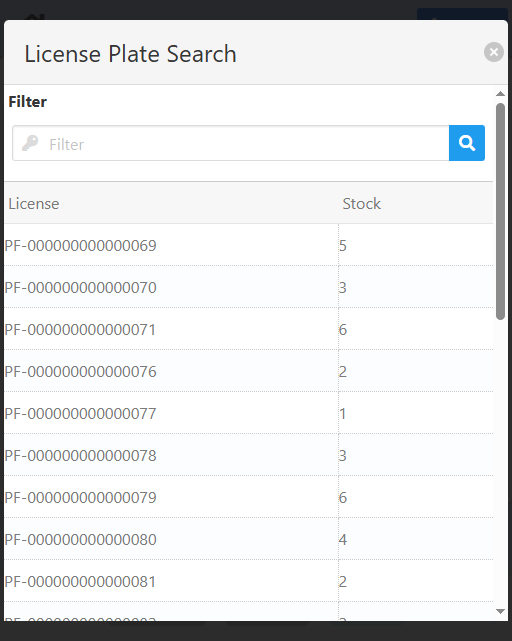
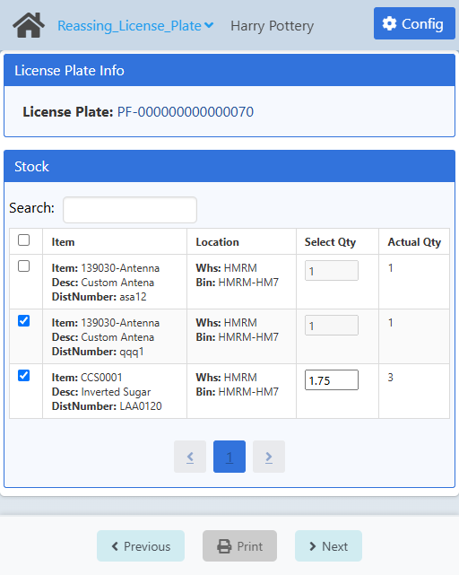
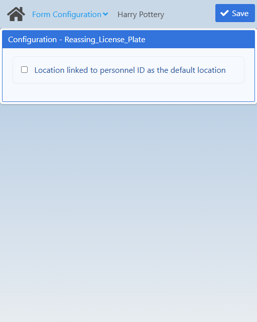

import CustomDetails from "@site/src/components/CustomDetails";
import Tabs from '@theme/Tabs';
import TabItem from '@theme/TabItem';

# Reassign License Plate

The Reassign License Plate WebApp allows you to assign and depalletize (unassign) stock to and from LPNs.

## Flow Diagram



## Introduction

You have two options: **Assign** and **Depalletize**.

If you want to **assign** stock to new or already existing LPNs, make sure you are in the **Assign** tab and follow from [here](./reassign_lpn.md#assign-createselect-lpn).

If you want to **depalletize** or **unassign** stock from LPNs, make sure you are in the **Depalletize** tab and follow from [here](./reassign_lpn.md#depalletize-select-lpn).

You can switch back and forth whenever you want to do what you need.

## Screens

### Assign: Create/Select LPN

On this screen you can create or select the LPNs that you want to assign stock to.

<Tabs>
  <TabItem value="create" label="Create LPN" default>
    
  </TabItem>
  <TabItem value="select" label="Select LPN">
    
  </TabItem>
</Tabs>

<CustomDetails summary="Table Reference">
  | Column | Description |
  | --- | --- |
  |  | Status of the LPN. |
  | License | License Plate Number (LPN). |
  |  | Action button for removing LPNs from the list. |
</CustomDetails>

First, you have to select a **warehouse** and **bin** (if available) to create the LPNS into or to select the LPNs from.

:::note[INFO]
The behavior of the **Location** will vary depending on the **Location linked to personnel ID as the default location** setting in the [Configuration](./reassign_lpn.md#configuration).
:::

Once you do that, the next part of the screen will load below to continue with the LPN creation/selection.

Let's go over the process for **creating** new LPNs. Make sure you are in the **Create** tab.

You need to select the type of LPN you are going to create: **Permanent Transfer** (PF-XXXX), **Permanent Transport** (PP-XXXX), **Temporary** (T-XXXX) and **External** (E-XXXX).

Next, you need to set the **Auto N°** field to the number of LPNs you want to create. LPNs are **auto-incremental**.

Once you are done, click the <IIcon icon="ph:plus-fill" width="17" height="17" /> button to create the number of LPNs you specified. You can find them in the **License Plates** section. Up until this point no actual LPN has been created in the system, it's all locally.

The leftmost column in the table of LPNs will tell you if the LPN is already in the system (**Exist**) or if the LPN is a new one that will be created at the end of the process (**New**).

You can **filter** the list of LPNs using the search box.

You can **remove** any of the LPNs by clicking the <IIcon icon="ic:baseline-delete" width="17" height="17" /> button on the rightmost column.

Now, let's go over the process for **selecting** already existing LPNs. Make sure you are in the **Select** tab.

Click the <IIcon icon='iconamoon:search-bold' width='17' height='17' /> button in the **Select License Plate** field to open the **License Plate Search** modal.

:::note[INFO]
Only LPNs for the location you specified will be shown.
:::

<CustomDetails summary="License Plate Search Modal">

On this screen you need to select one of the **License Plates** listed.


You can select any item by clicking on it, which will close the modal and take you back with that **License Plate** already set.

You can filter the list of **License Plates** using the search box.

If you want to close the modal without making any changes, click the <IIcon icon="zondicons:close-solid" width="17" height="17"/> button.

</CustomDetails>

You can find all selected LPNs in the **License Plates** section.

Next up is **adding stock** to the LPNs. For that, click on any of the LPNs to go to the [Assign: Add/Modify Stock](./reassign_lpn.md#assign-addmodify-stock) screen, if it's the first time you are editing the LPN, or to the [Assign: Stock Summary](./reassign_lpn.md#assign-addmodify-stock) screen, if it is not the first time.

Once you are done, click **Next** at the bottom to save (**in the system**), which assigns the selected stock to the corresponding LPNs in the specified amount and with the specified batches/serial numbers.

:::note[INFO]
Keep in mind that assigning stock to LPNs creates a **reservation** for the stock and a **GRPO** for the new LPNs under the hood.
:::

At the end, you will get a modal asking you if you want to print the labels. Click **Yes** to print the labels and to start anew, or **No** to just start anew.

:::note[INFO]
All printed labels can be found in the ```/PDF/PO/``` folder for the project.
:::

### Assign: Stock Summary

On this screen you can **see**, **add**, **edit** and **remove** the stock that will be assigned to the LPN.


<CustomDetails summary="Table Reference">
  | Column | Description |
  | --- | --- |
  | Item | ID of the item selected. |
  | Qty | Quantity selected to be assigned to the License Plate Number (LPN). |
  |  | Action buttons for editing and removing items from the list, respectively. |
</CustomDetails>

At the top you can see the **License Plate Info** section that shows you what you are working on.

On the **Lines** section you can see listed the items/stock/lines you have added so far and that will be assigned to the LPN.

If you want to **add** stock, click the **Add Stock** button to go to the [Assign: Add/Modify Stock](./reassign_lpn.md#assign-addmodify-stock) screen.

If you want to **edit** stock, click the <IIcon icon="bx:edit" width="17" height="17" /> button for the respective stock line to go to the [Assign: Stock Summary](./reassign_lpn.md#assign-stock-summary) screen.

If you want to **remove** stock, click the <IIcon icon="ic:baseline-delete" width="17" height="17" /> button for the respective stock line.

Once you are done, click **Next** at the bottom to save (**locally**) and to go back to the [Assign: Create/Select LPN](./reassign_lpn.md#assign-createselect-lpn) screen.

### Assign: Add/Modify Stock

On this screen you can **add** or **modify** the stock you want assign to the LPN.



At the top you can see the **License Plate Info** section that shows you what you are working on.

First, select an item using the **Item No** field. Click the <IIcon icon='iconamoon:search-bold' width='17' height='17' /> button to open the **Item Search** modal.

<CustomDetails summary='Item Search Modal'>

On this modal you need to select one of the **items** listed.



You can select any item by clicking on it, which will close the modal and take you back with that **item** already set.

You can filter the list of **items** using the search box.

If you want to close the modal without making any changes, click the <IIcon icon='zondicons:close-solid' width='17' height='17'/> button.

</CustomDetails>

Next, you need to select a version for the item using the **I-Version** field. Click the <IIcon icon="iconamoon:search-bold" width="17" height="17" /> button to open the **I-Version Search** modal. This field is only going to be enabled if the item has them available.

<CustomDetails summary="I-Version Search Modal">

On this screen you need to select one of the **I-Versions** listed.


You can select any item by clicking on it, which will close the modal and take you back with that **I-Version** already set.

You can filter the list of **I-Versions** using the search box.

If you want to close the modal without making any changes, click the <IIcon icon="zondicons:close-solid" width="17" height="17"/> button.
</CustomDetails>

After that, you have to select one or more batches/serial numbers. For selecting only one, click the <IIcon icon='iconamoon:search-bold' width='17' height='17' /> button to open the **Batch/Serial Number Search** modal. If you see this field disabled, that means the item is not managed by batch or serial number.

<CustomDetails summary="Batch/Serial Number Search Modal">

On this screen you need to select one of the **Batches/Serial Numbers** listed.


You can select any item by clicking on it, which will close the modal and take you back with that **Batch/Serial Number** already set.

You can filter the list of **Batches/Serial Numbers** using the search box.

If you want to close the modal without making any changes, click the <IIcon icon="zondicons:close-solid" width="17" height="17"/> button.

</CustomDetails>

If you want to select more than one batch/serial number, click the <IIcon icon="pepicons-pop:dots-x" width="17" height="17" /> button on the **Batch/Serial Number** field to open the **Batches/Serial Numbers: Extended Information** modal.

<CustomDetails summary="Batches/Serial Numbers: Extended Information">

On this screen you will be able to **add/modify** batches/serial numbers.

The first thing you will see is the **Batch** tab, giving you information for the batch selected. You can modify the fields on this tab, and that will be reflected once you are done.


If you want to add a new batch, click the <IIcon icon="subway:add" width="17" height="17" />  button to use the **Batch** tab as a form.

Click the <IIcon icon="iconamoon:search-bold" width="17" height="17" /> button on the fields to open the search modals. You have the **Batch/Serial Number** and **I-Version** search modals, that you can reference above this dropdown.


Once you are done adding/modifying the batches, you can click on the **Batches** tab to see the list of batches selected and their information.


If you want to delete a batch, click the <IIcon icon="ic:baseline-delete" width="17" height="17" /> button for the respective batch.

Once you have everything that you need, click the <IIcon icon="zondicons:close-solid" width="17" height="17"/> button to close the modal and take you back with the new batch information already set.



</CustomDetails>

And last we have the **Quantity** field. Set it to what you want to assign from that batch/serial number to the LPN.

Once you are done, click **Next** at the bottom to save (**locally**) and to go to the [Assign: Stock Summary](./reassign_lpn.md#assign-stock-summary) screen.

### Depalletize: Select LPN

On this screen you can select the LPNs that you want to **depallitize** or **unassign** stock from.



<CustomDetails summary="Table Reference">
  | Column | Description |
  | --- | --- |
  | License | License Plate Number (LPN). |
  | Selected Stock | Number of items selected to assign to the LPN. |
  |  | Action button for removing items from the list. |
</CustomDetails>

First, you need to find the LPN you want to update. Click the <IIcon icon='iconamoon:search-bold' width='17' height='17' /> button in the **License Plate Number** field to open the **License Plate Search** modal.

:::note[INFO]
LPNs from all locations will be shown.
:::

<CustomDetails summary="License Plate Search Modal">

On this screen you need to select one of the **License Plates** listed.



You can select any item by clicking on it, which will close the modal and take you back with that **License Plate** already set.

You can filter the list of **License Plates** using the search box.

If you want to close the modal without making any changes, click the <IIcon icon="zondicons:close-solid" width="17" height="17"/> button.

</CustomDetails>

You can find all selected LPNs in the **License Plates** section.

You can **filter** the list of LPNs using the search box.

You can **remove** any of the LPNs by clicking the <IIcon icon="ic:baseline-delete" width="17" height="17" /> button on the rightmost column.

Next is picking the stock and wuantity you want to depalletize, for that click on any of the LPNs to go to the [Depalletize: Pick Stock](./reassign_lpn.md#depalletize-pick-stock).

Once you are done, click **Next** at the bottom to save (**in the system**), which depallitizes or unassigns the selected stock in the specified quantity.

:::note[INFO]
Keep in mind that depalletizing or unassigning stock from LPNs removes the **reservation** for that portion of the stock under the hood.
:::

### Depalletize: Pick Stock

On this sceen you can pick the stock you want to depalletize or unassign from the LPN in the quantity you need.



<CustomDetails summary="Table Reference">
  | Column | Description |
  | --- | --- |
  | <IIcon icon="line-md:square" width="17" height="17"/> | Action button for selecting items/stock/lines. |
  | Item | ID of the item. Name of the item. Batch/Serial number. |
  | Location | Warehouse and Bin (if available) where the item is located.|
  | Select Qty | Actual quantity of the item that will be depalletized or unassigned from the LPN. |
  | Actual Qty | Total quantity the item has currenlty assigned on system to the LPN in the specified location. |
</CustomDetails>

At the top you can see the **License Plate Info** section that shows you what you are working on.

On the **Stock** section you can see listed the items/stock/lines that are currently assigned to the LPN.

You can **filter** the list of items using the search box.

Set the **Select Qty** field to the actual quantity you want to depalletize or unassign from the LPN. If you see this field disabled, that means the item is managed by serial number, and they always come in one per item, as a whole.

Select items/stock/lines by clicking the <IIcon icon="line-md:square" width="17" height="17"/> button on the leftmost column.

Once you are done, click **Next** at the bottom to save (**locally**) and to go back to the [Depalletize: Select LPN](./reassign_lpn.md#depalletize-select-lpn) screen.

### Configuration

:::note[INFO]
Only administrators can access the configuration for a web app.
:::

On this screen you can set the settings that will apply to this web app.



| Name | Description |
| --- | --- |
| Location linked to personnel ID as the default location | This applies to **Assigning** only. <br/><br/> If checked, it will prefill the **location** with the default location for the personnel. Otherwise, it will leave the **location** empty for the user to choose one manually. |