import CustomDetails from "@site/src/components/CustomDetails";
import Tabs from '@theme/Tabs';
import TabItem from '@theme/TabItem';

# Truck CheckIn

The Truck CheckIn web app allows you to log the entrance of a truck and its reason.

## Flow Diagram

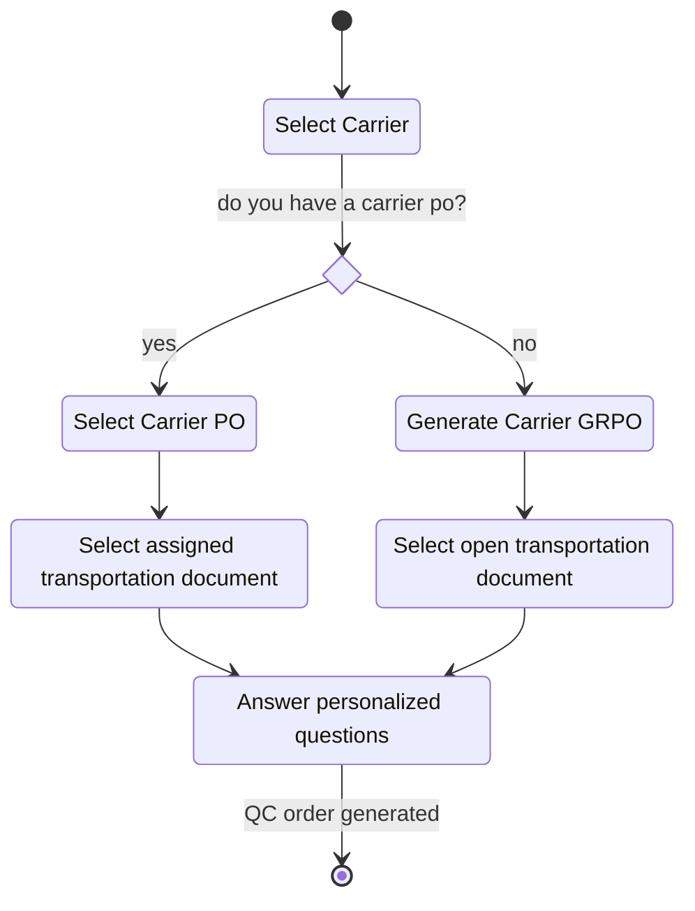

## Screens

### Carrier Selection

On this screen you need to select a **carrier**.

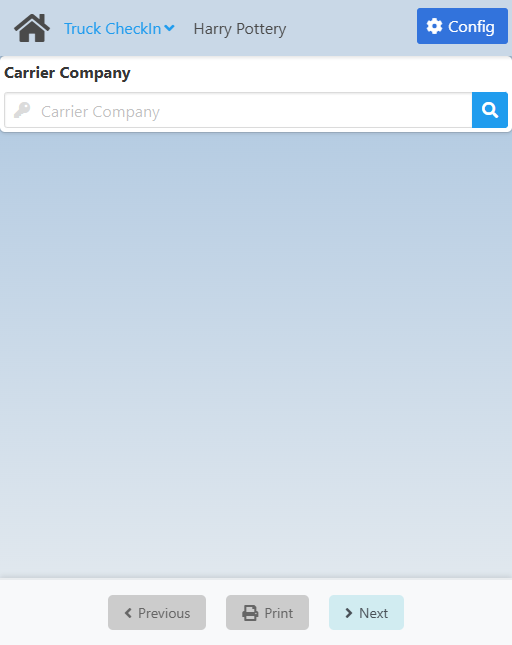

Click the <IIcon icon='iconamoon:search-bold' width='17' height='17' /> button to open the **Carrier Search** modal.

<CustomDetails summary='Carrier Search Modal'>

On this modal you need to select one of the **carriers** listed.

You can select any item by clicking on it, which will close the modal with that **carrier** already set.

You can filter the list of **carriers** using the search box.

If you want to close the modal without making any changes, click the <IIcon icon='zondicons:close-solid' width='17' height='17'/> button.

</CustomDetails>

Once you select a **carrier**, you will be taken to the [Carrier Purchase Order Selection](./shipping_delivery.md#carrier-purchase-order-selection) screen.

### Select Carrier PO/Generate Carrier GRPO

On this screen you need to either select a **carrier po**, if you have one, or generate a **carrier grpo**.

If you want to use a **Carrier Purchase Order**, click the <IIcon icon='iconamoon:search-bold' width='17' height='17' /> button to open the **Carrier Purchase Order Search** modal.

<CustomDetails summary='Carrier Purchase Order Search Modal'>

On this modal you need to select one of the **carrier purchase orders** listed.

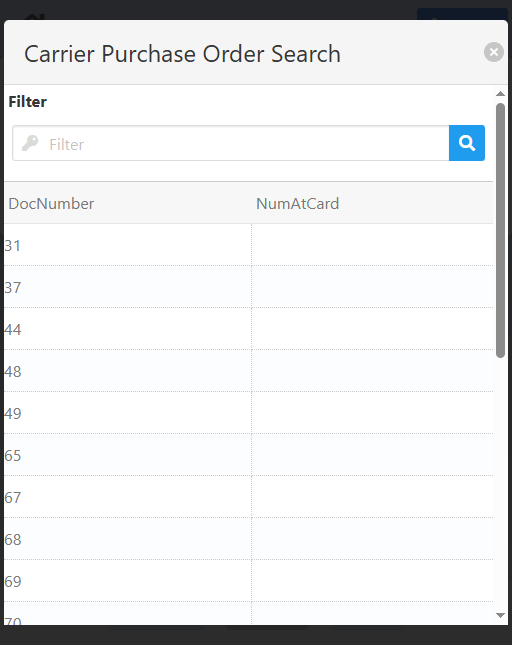

You can select any item by clicking on it, which will close the modal with that **carrier purchase order** already set.

You can filter the list of **carrier purchase orders** using the search box.

If you want to close the modal without making any changes, click the <IIcon icon='zondicons:close-solid' width='17' height='17'/> button.

</CustomDetails>

Once you select a **Carrier PO**, you will be taken to the [*Assigned* Transportation Document Selection](./truck_checkin.md#assigned-transportation-document-selection) screen.

On the other hand, if you need to use a **Carrier GRPO**, click the **Generate Purchase Order** button to automatically create a **GRPO** for the truck and to go to the [*Open* Transportation Document Selection](./truck_checkin.md#open-transportation-document-selection) screen.

### *Assigned* Transportation Document Selection

On this screen you need to select a **transportation document** from the list of **currently assigned** to the **carrier po** chosen.

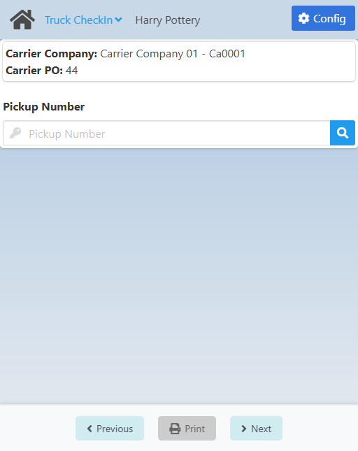

Select a **transportation document**. Click the <IIcon icon='iconamoon:search-bold' width='17' height='17' /> button in the **Pickup Number** field to open the **Transportation Document Search** modal.

<CustomDetails summary='Transportation Document Search Modal'>

On this modal you need to select one of the **transportation documents** listed.

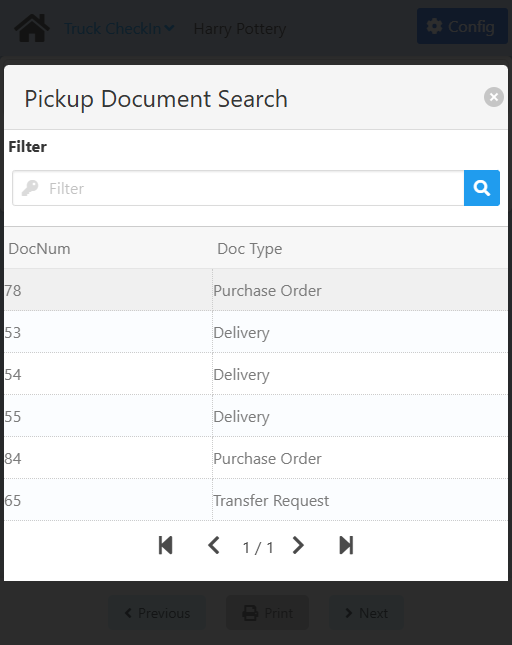

You can select any item by clicking on it, which will close the modal with that **transportation document** already set.

You can filter the list of **transportation documents** using the search box.

If you want to close the modal without making any changes, click the <IIcon icon='zondicons:close-solid' width='17' height='17'/> button.

</CustomDetails>

Once you select a **tansportation document**, you will be taken to the [Questions](./truck_checkin.md#questions) screen.

### *Open* Transportation Document Selection

On this screen you need to select a **transportation document** from the list of <u>all</u> the **currently open** globally.

The exact screen you will see will depend on the **type of transportation document** you need.

<Tabs>
  <TabItem value="delivery" label="Delivery" default>
    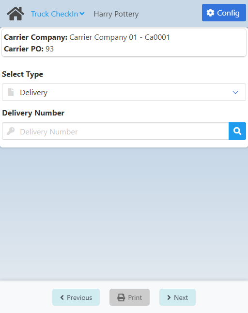
  </TabItem>
  <TabItem value="po" label="Purchase Order">
    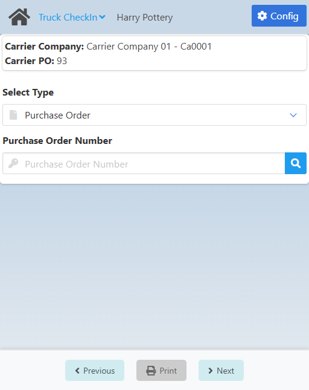
  </TabItem>
  <TabItem value="tr" label="Transfer Request">
    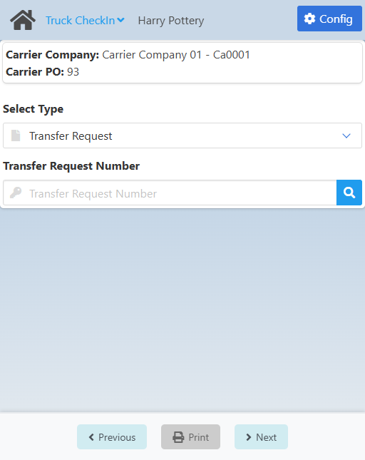
  </TabItem>
</Tabs>

First select the type of document you are dealing with to get the respective field for setting the document itself.

After that, click the <IIcon icon='iconamoon:search-bold' width='17' height='17' /> button for any of the fields to open the respective search modal.

<CustomDetails summary="Delivery Number Search Modal">

On this screen you need to select one of the **deliveries** listed.

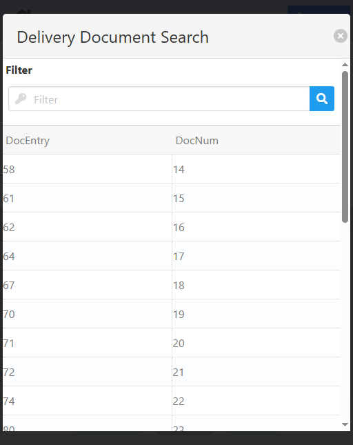

You can select any item by clicking on it, which will close the modal with that **delivery** already set.

You can filter the list of **deliveries** using the search box.

If you want to close the modal without making any changes, click the <IIcon icon="zondicons:close-solid" width="17" height="17"/> button.

</CustomDetails>

<CustomDetails summary="Purchase Order Number Search Modal">

On this screen you need to select one of the **purchase orders** listed.

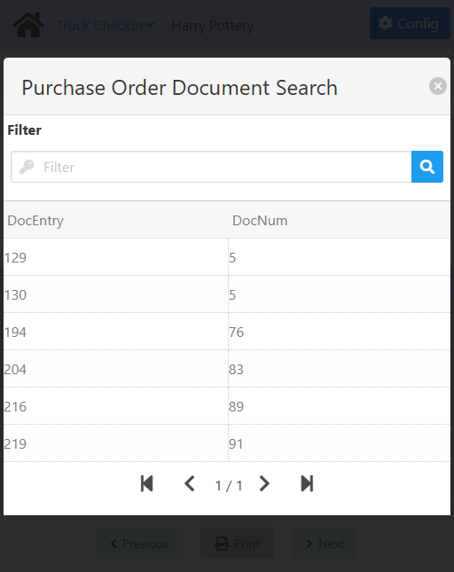

You can select any item by clicking on it, which will close the modal with that **purchase order** already set.

You can filter the list of **purchase orders** using the search box.

If you want to close the modal without making any changes, click the <IIcon icon="zondicons:close-solid" width="17" height="17"/> button.

</CustomDetails>

<CustomDetails summary="Transfer Request Number Search Modal">

On this screen you need to select one of the **transfer requests** listed.

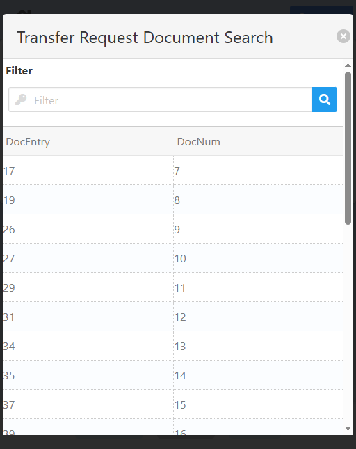

You can select any item by clicking on it, which will close the modal with that **transfer request** already set.

You can filter the list of **transfer requests** using the search box.

If you want to close the modal without making any changes, click the <IIcon icon="zondicons:close-solid" width="17" height="17"/> button.

</CustomDetails>

Once you select a **transportation document**, you will be taken to the [Questions](./truck_checkin.md#questions) screen.

:::note[INFO]
Keep in mind that once you select one of the open transportation documents, said document will automatically be assigned in SAP to the GRPO you previously created.
:::

### Questions

On this screen you need to answer the personalized questions necessary for the check-in process.

The exact screen you will see will depend on the **type of transportation document** you selected before.

<Tabs>
  <TabItem value="delivery" label="Delivery" default>
    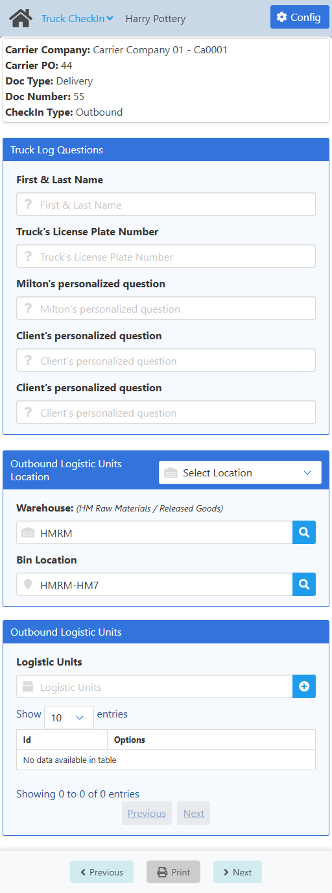
  </TabItem>
  <TabItem value="po" label="Purchase Order">
    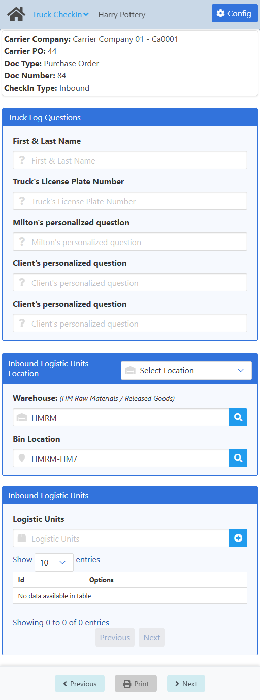
  </TabItem>
  <TabItem value="tr" label="Transfer Request">
    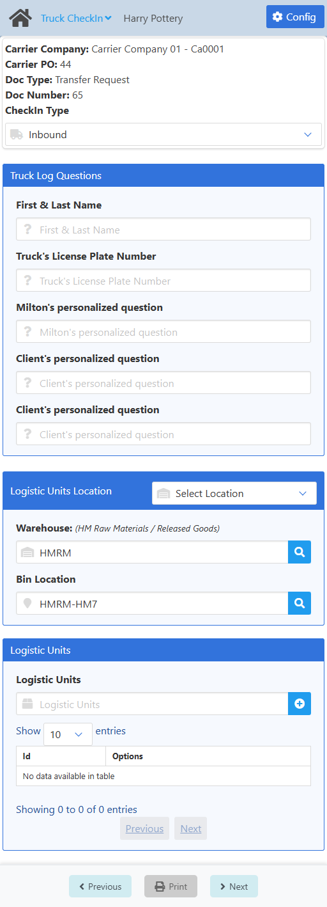
  </TabItem>
</Tabs>

At the top you see a summary  of what you are working with.

For **transfer requests**, you need to select the **CheckIn Type**: **Inbound** for when the truck is bringing stuff in, **Outbound** for when the truck is taken stuff out.

Once you answer the questions click **Next** at the bottom to complete the check-in process. After that, you have a the same screen as a summary, you can click **Next** again to go to the [Home](./truck_checkin.md#carrier-selection) screen.

:::note[INFO]
Completing the check-in process will create a QC Order document in BEAS with the status set to **CheckIn**.
:::

:::warning[documentation]
The **Outbound Logitic Units Location** and **Outbound Logistic Units** sections are not documented because they will most likely change in the near future following LPN implementations, according to the dev team.
:::

