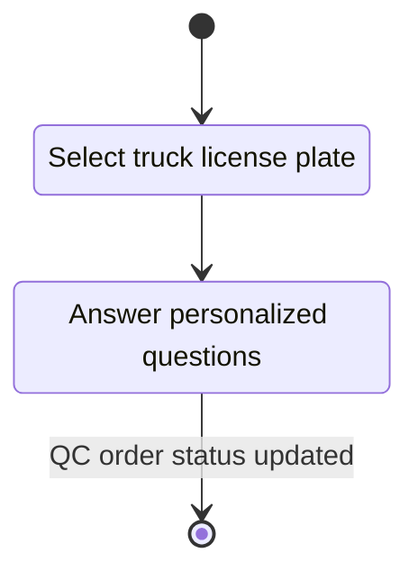
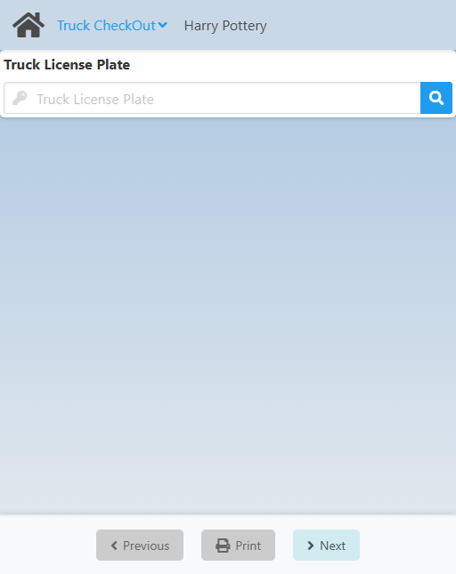
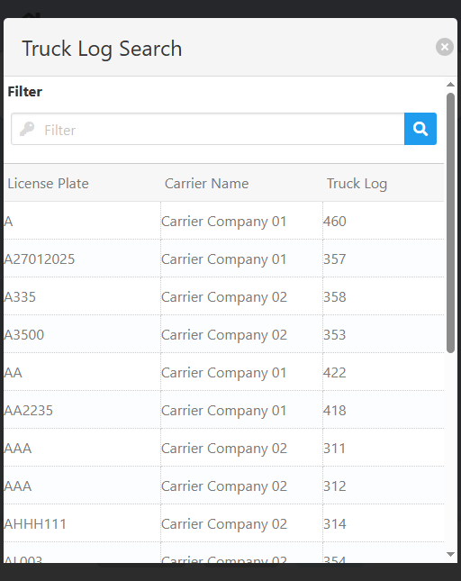
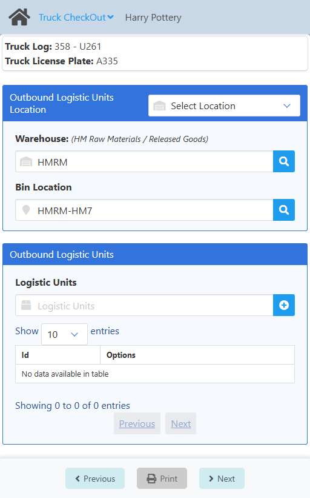

import CustomDetails from "@site/src/components/CustomDetails";
import Tabs from '@theme/Tabs';
import TabItem from '@theme/TabItem';

# Truck CheckOut

The Truck CheckOut web app allows you to log the departure of a truck and its reason.

## Flow Diagram

## Screens

### Truck License Plate Selection

On this screen you need to select a **truck license plate** to get the QC order/Truck log associated with it.

Click the <IIcon icon='iconamoon:search-bold' width='17' height='17' /> button to open the **Truck License Plate Search** modal.

<CustomDetails summary='Truck License Plate Search'>

On this modal you need to select one of the **truck license plates** listed.

You can select any item by clicking on it, which will close the modal with that **truck license plate** already set.

You can filter the list of **truck license plates** using the search box.

If you want to close the modal without making any changes, click the <IIcon icon='zondicons:close-solid' width='17' height='17'/> button.

</CustomDetails>

Once you select a **truck license plate**, you will be taken to the [Carrier Purchase Order Selection](./shipping_delivery.md#carrier-purchase-order-selection) screen.

### Questions

On this screen you need to answer the personalized questions necessary for the check-in process.

The exact screen you will see will depend on the **type of transportation document** you selected before.

At the top you see a summary  of what you are working with.

Click **Next** at the bottom to complete the check-out process. After that, you have a the same screen as a summary, you can click **Next** again to go to the [Home](./truck_checkin.md#carrier-selection) screen.

:::note[INFO]
Completing the check-out process will change the status of the QC Order/Truck Log to **CheckOut**.
:::

:::warning[documentation]
The **Outbound Logitic Units Location** and **Outbound Logistic Units** sections are not documented because they will most likely change in the near future following LPN implementations, according to the dev team.
:::

