import CustomDetails from "@site/src/components/CustomDetails";
import Tabs from '@theme/Tabs';
import TabItem from '@theme/TabItem';

# Truck Inspect

The Truck Inspect web app allows you to log the results of quality checks on a truck and execute further actions.

## Flow Diagram

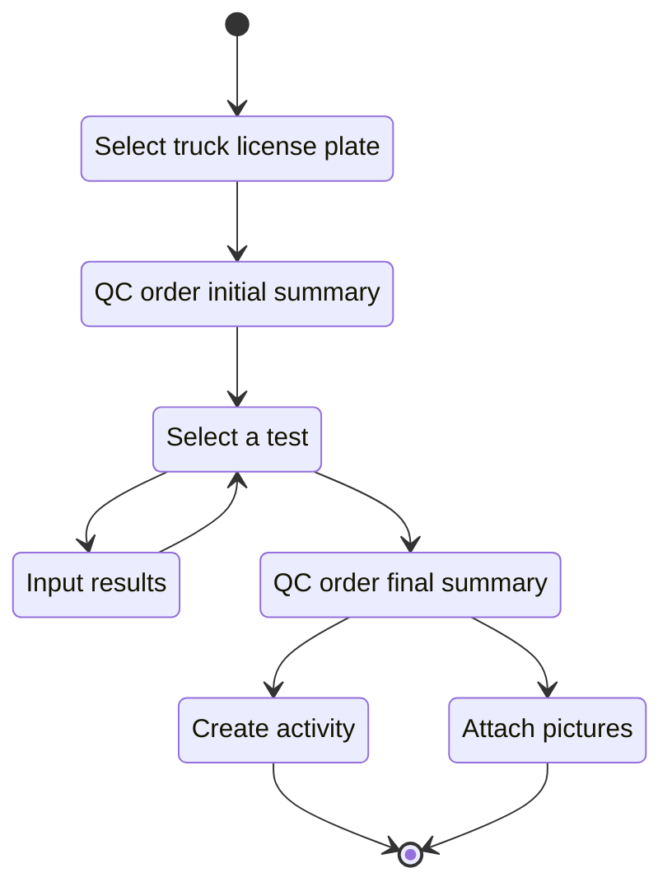

## Screens

### Truck License Plate Selection

On this screen you can if you need input a **truck license plate** to create a **QC order** for the truck.

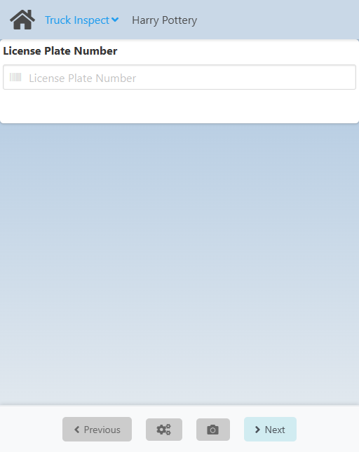

If you have a **license plate**, put it in the **License Plate Number** field.

Click **Next** at the bottom to create a **QC order** with or without a **license plate**, depending on if you used one or not, and to go to the [Truck QC Order Summary](./truck_inspect.md#truck-qc-order-final-summary) screen.

### Truck QC Order Initial Summary

On this screen you can see a summary of the **QC Order** that was just created.

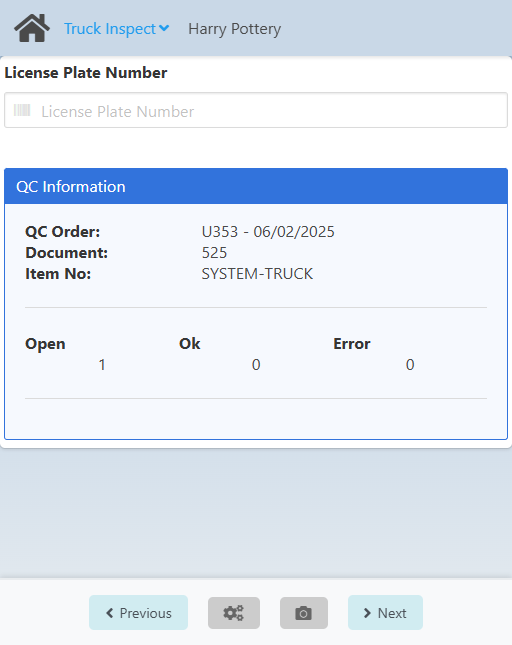

<CustomDetails summary="Field Reference">
| Field | Description |
| ---| --- |
| QC Order | QC Order number and the creation date. |
| Document | Document ID. |
| Item No | Item ID. |
| Open | Number of samples not yet released. |
| Ok | Number of released samples. |
| Error | Number of samples marked as faulty. |
</CustomDetails>

Click **Next** at the bottom to go to the [Tests Summary](./truck_inspect.md#tests-summary) screen.

### Tests Summary

On this screen you can see the **list of tests** that apply to all trucks based on the inspection plan.

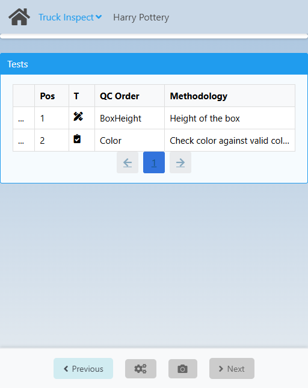

<CustomDetails summary="Table Reference">
| Column      | Description                                                 |
| ----------- | ----------------------------------------------------------- |
|  <IIcon icon="pepicons-pop:dots-x" width="17" height="17"/>           | Action button for opening the **Test: Extended Summary** modal. |
| Pos         | ID of the test.                                             |
| T           | Type of the test.                                           |
| QC Order    | Name of the test.                                           |
| Methodology | Description of how the test works.                          |
</CustomDetails>

You need to go through all the tests and input the results for each one.

Click the <IIcon icon="pepicons-pop:dots-x" width="17" height="17"/> button on any of the tests to open the **Test: Extended Summary** modal.

<CustomDetails summary="Test: Extended Summary Modal">

On this modal you can see an extended summary for a **test**, like the **conditions** to pass and its **methodology**.

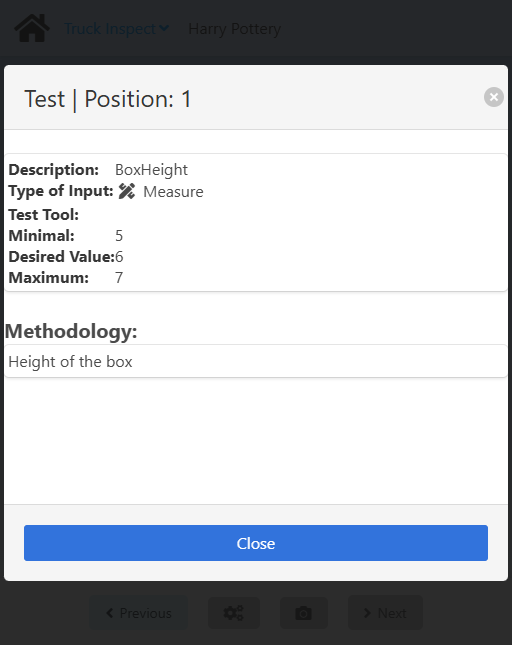

If you want to close the modal, click the <IIcon icon="zondicons:close-solid" width="17" height="17"/> or **Cancel** buttons.

</CustomDetails>

Click on any other columns of a test to go to the [Samples Summary](./truck_inspect.md#) screen for it.

If there aren't any more **samples** to input the results of the tests for, click **Previous** at the bottom to go to the [Truck QC Order Final Summary](./truck_inspect.md#truck-qc-order-final-summary) screen.

### Samples Summary

On this screen you can see a summary of the **samples** for which the selected test applies. 

Because it's one inspection per truck, you will always see only one sample.

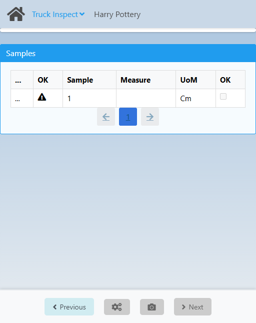

<CustomDetails summary="Table Reference">
| Column                                                     | Description                                                       |
| ---------------------------------------------------------- | ----------------------------------------------------------------- |
| <IIcon icon="pepicons-pop:dots-x" width="17" height="17"/> | Action button for opening the **Sample: Extended Information modal**. |
| Sample                                                     | ID of the sample.                                                 |
| Measure                                                    | Value measured.                                                      |
| UoM                                                        | Unit of Measure, e.g. kg.                                         |
| OK                                                         | Indication of passing.                                            |
</CustomDetails>

You can use the search box on the top of the screen to filter samples by the **Sample** value.

Click the <IIcon icon="pepicons-pop:dots-x" width="17" height="17"/> button on any of the tests to open the **Sample: Extended Summary** modal.

<CustomDetails summary="Sample: Extended Information Modal">

On this modal you can see and update other information on a **sample**.

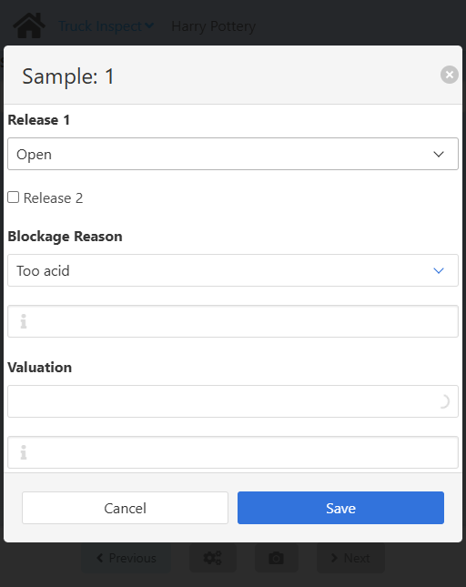

You can give a sample up to two release reasons using the **Release 1** and **Release 2** fields.

:::note[INFO]
If you set **Release 1** to **Released**, the sample will be released and removed from the list. You can only release it from here if the sample does not have measurements already saved.

If you set **Release 1** to **Locked**, the sample will be locked and removed from the list.
:::

**Release 2** can only be checked when **Release 1** is set to **Released.**

Use the **Blockage Reason** field for giving the sample a reason for a blockage by choosing one of the options. For giving it extra comments use the <IIcon icon="ion:information-sharp" width="17" height="17"/> field below it.

You can also give the sample a **Valuation** from the list of options and extra information.

If you want to close the modal without making any changes, click the <IIcon icon="zondicons:close-solid" width="17" height="17"/> or **Cancel** buttons.

Click **Save** to save the changes and close the modal.

</CustomDetails>

Click on any of the other columns of a sample to open the **Test: Extended Information** modal.

<CustomDetails summary="Test: Extended Information Modal">

On the **Measurement** tab you can input the results for the test on the truck.

**NOTE**: The **Methodology** tab is purely informative. It shows a description of the methodology used for the test.

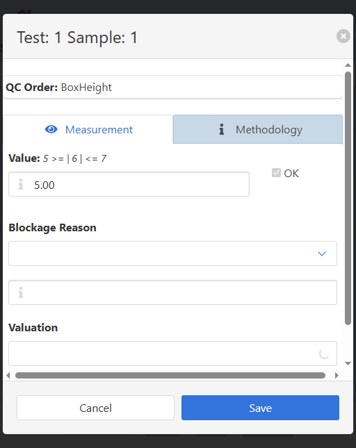

First, input the result that you got for this test. Use the **Value** field for that. Some tests will give you the conditions to pass. When the **value** meets those, the **OK** checkbox will automatically be ticked. This will depend on the inspection plan.

:::note[INFO]
If you give **OKs** to all the tests for a sample, it will be **released** and removed from the list.
:::

Use the **Blockage Reason** field for giving the sample a reason for a blockage by choosing one of the options. For giving it extra comments use the <IIcon icon="ion:information-sharp" width="17" height="17"/> field below it.

You can also give the sample a **Valuation** from the list of options and extra information.

If you want to close the modal without making any changes, click the <IIcon icon="zondicons:close-solid" width="17" height="17"/> or **Cancel** buttons.

Click **Save** to save the changes and close the modal.

</CustomDetails>

You will be seeing the results reflected on the table for the sample.

Once you are done here, click **Previous** at the bottom to go back to the [Tests Summary](./truck_inspect.md#tests-summary) screen and continue with other tests, if applicable.

### Truck QC Order Final Summary

On this screen you can see a summary of the **QC Order** after inputting the results for the tests.

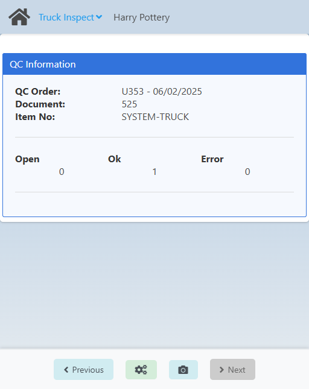

<CustomDetails summary="Field Reference">
| Field | Description |
| ---| --- |
| QC Order | QC Order number and the creation date. |
| Document | Document ID. |
| Item No | Item ID. |
| Open | Number of samples not yet released. |
| Ok | Number of released samples. |
| Error | Number of samples marked as faulty. |
</CustomDetails>

If you want to create an activity for the QC order now that you are done, click the <IIcon icon="fa:gears" width="17" height="17"/> button at the bottom to go to the [Create Activity](./truck_inspect.md#create-activity) screen.

You can also add pictures as proof for the tests that were applied. For that, click the <IIcon icon="mdi:camera" width="17" height="17"/> button at the bottom to open the **Add Picture** modal.

<CustomDetails summary="Add Picture Modal">

On this modal you can **take a picture** of the truck and **link it** to the QC Order.

First, you need to select one of the categories (parts of the truck) and then click **Confirm**.

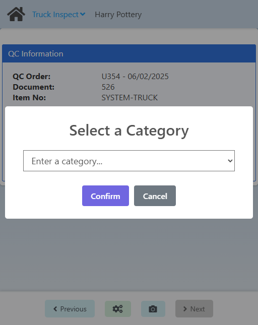

After that, you need to choose a device for taking the picture from the list of available options. Then, click **Take Photo** to take it and save it.

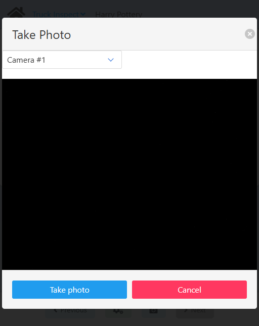

If you want to close any of the modals without saving anything, click the <IIcon icon="zondicons:close-solid" width="17" height="17"/> or **Cancel** buttons.

</CustomDetails>

### Create Activity

On this screen you can create an activity for the QC Order. This is for someone else to continue with the process. 

Once you are done logging the results of the tests, someone else needs to continue with the process by making decisions based on said results, this is that step.

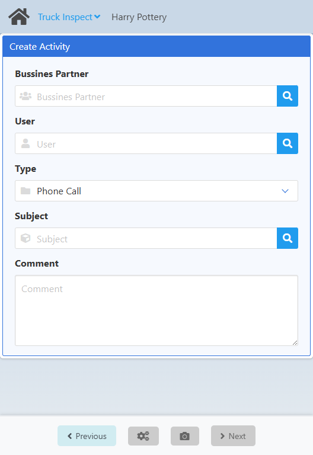

You first need to set the **Business Partner**. Click the <IIcon icon="iconamoon:search-bold" width="17" height="17" /> button on it to open the **Business Partner Search** modal.

<CustomDetails summary="Business Partner Search Modal">

On this screen you need to select one of the **business partners** listed.

You can select any item by clicking on it, which will close the modal and take you back with that **business partner** already set.

You can filter the list of **business partners** using the search box.

If you want to close the modal without making any changes, click the <IIcon icon="zondicons:close-solid" width="17" height="17"/> button.

</CustomDetails>

Next up is the **User**. Click the <IIcon icon="iconamoon:search-bold" width="17" height="17" /> button on it to open the **User Search** modal.

<CustomDetails summary="User Search Modal">

On this screen you need to select one of the **users** listed.

You can select any item by clicking on it, which will close the modal and take you back with that **user** already set.

You can filter the list of **users** using the search box.

If you want to close the modal without making any changes, click the <IIcon icon="zondicons:close-solid" width="17" height="17"/> button.

</CustomDetails>

After that, you need to set the **Type**, which is the **activity type**, using the dropdown menu. 

Continuing, you have the **Subject**. Click the <IIcon icon="iconamoon:search-bold" width="17" height="17" /> button on it to open the **Subject Search** modal.

<CustomDetails summary="Subject Search Modal">

On this screen you need to select one of the **subjects** listed.

You can select any item by clicking on it, which will close the modal and take you back with that **subject** already set.

You can filter the list of **subjects** using the search box.

If you want to close the modal without making any changes, click the <IIcon icon="zondicons:close-solid" width="17" height="17"/> button.

:::danger[development]
The title of the modal does not match its functionality. **~User~** <IIcon icon="mdi:arrow-right-thin" width="17" height="17" /> **Subject**.
:::

</CustomDetails>

And  last but not least, you can use the **Comment** field to add extra information on the process.

Once you are done, click **Next** to create the corresponding **activity** (do not forget to take note of it) and to go to the [Home](./truck_inspect.md#truck-license-plate-selection) screen to start a new truck inspection.