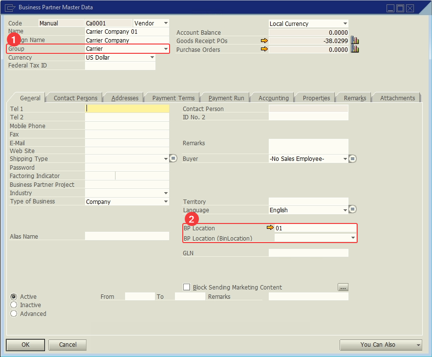

# Carrier

A **Business Partner (BP)** with the **Group** field set to **Carrier**.

1. **Group**.
2. **User Defined Fields**:

| Display Name | Table | Field | Description | Type |
| --- | --- | --- | --- | --- |
| BP Location | OCRD | U_LWMS_Whscode | Business Partner's Warehouse | Text |
| BP Location (BinLocation) | OCRD | U_LWMS_Bincode | Business Partner's Bin Location | Text |

# References

- [Shipping Delivery.](/docs/apps/shipping_delivery)
- [Shipping Multi-Site Transfer.](/docs/apps/shipping_multi_site_transfer)
- [Receive.](/docs/apps/receive)
