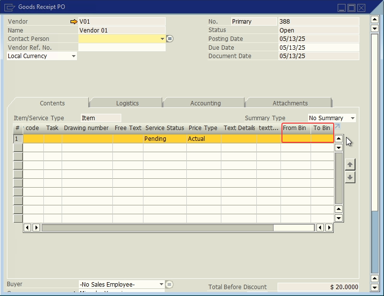

# GRPO

- **User Defined fields**:
  
| Display Name | Table | Field | Description | Type |
| --- | --- | --- | --- | --- |
| From Bin | PDN1 | U_lwms_frombin | From where the stock came | Text |
| To Bin | PDN1 | U_lwms_tobin | To where the stock went | Text |

## References

- [Shipping Delivery.](/docs/apps/shipping_delivery)
- [Shipping Multi-Site Transfer.](/docs/apps/shipping_multi_site_transfer)
- [Receive.](/docs/apps/receive)
