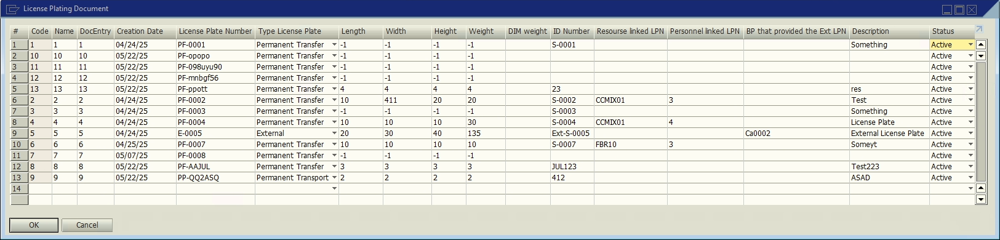
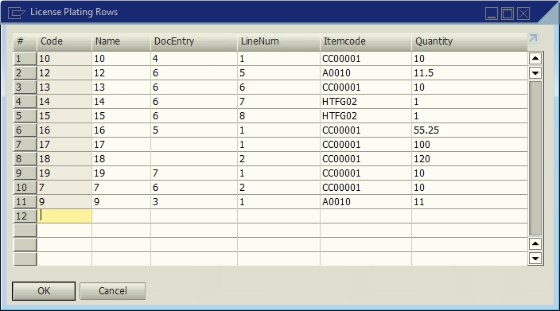
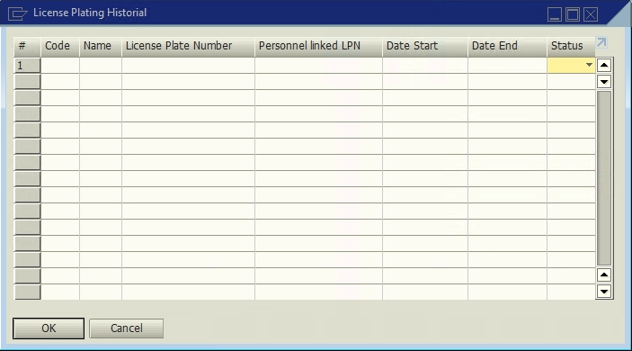
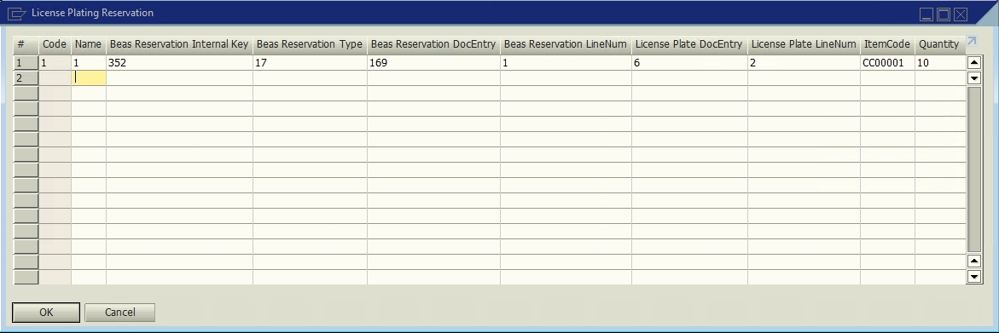

# LPN

**UDT**s for the **License Plating** workflows.

## License Plating Document

Stores information specific to each **License Plate Number**.

### Fields

Table **LWMS_PLATING_DOC**.

| Display Name | Field | Description | Type |
| --- | --- | --- | --- |
| DocEntry | U_docentry | Internal LPN id | Number |
| Creation Date | U_docdate | Creation date | Date |
| License Plate Number | U_license | License plate number| Text |
| Type License Plate | U_type | License plate type | Checkbox |
| Length | U_length | Length of the associated item | Number |
| Width | U_width | Width of the associated item | Number |
| Height | U_Height | Height of the associated item | Number |
| Weight | U_weight | Actual weight of the associated item | Number |
| DIM Weight | U_dim_weight | Dimensional weight of the associated item | Number |
| ID Number | U_id | Extra id | Number |
| Resource Linked LPN | U_resource | Linked resource | Text |
| Personnel Linked LPN | U_personnel | Linked personnel | Text |
| BP that provided the Ext LPN | U_bp_code | External business partner lender | Text |
| Description | U_description | Description | Text |
| Status | U_status | Status | Checkbox |

#### License Plate Types

| Option | Description |
| --- | --- |
| PF | Permanent Trans<u>f</u>er. |
| PP | Permanent Trans<u>p</u>ort. |
| T | Temporary. |
| E | External. |

#### Statuses

| Option | Description |
| --- | --- |
| A | Active. |
| I | Inactive. |

## License Plating Rows

Stores all the items linked to each **License Plate Numnber**.

### Fields

Table **LWMS_PLATING_ROW**.

| Display Name | Field | Description | Type |
| --- | --- | --- | --- |
| DocEntry | U_docentry | Internal row id | Number |
| LineNum | U_linenum | Line id | Number |
| ItemCode | U_itemcode | Item id | Text |
| Quantity | U_quantity | Quantity | Number |

## License Plating History

Stores the history of each **License Plate Numnber**.

### Fields

Table **LWMS_PLATING_HIST**.

| Display Name | Field | Description | Type |
| --- | --- | --- | --- |
| License Plate Number | U_license | License Plate Number | Number |
| Personnel Linked LPN | U_personnel | Linked personnel | Text |
| Date Start | U_date_start | Start Date | Date |
| Date End | U_date_end | End Date | Date |
| Status | U_status | Status | Checkbox |

#### Statuses

| Option | Description |
| --- | --- |
| A | Active. |
| I | Inactive. |

## License Plating Reservation

Stores the reservation information of each **License Plate Numnber**.

### Fields

Table **LWMS_PLATING_RES**.

| Display Name | Field | Description | Type |
| --- | --- | --- | --- |
| Beas Reservation Internal Key | U_internal_key | Beas Reservation Internal Key | Number |
| Beas Reservation Type | U_basetype | Beas Reservation Type | Text |
| Beas Reservation DocEntry | U_res_docentry | Beas Reservation internal id | Number |
| Beas Reservation LineNum | U_res_linenum | Beas Reservation Line id  | Number |
| License Plate DocEntry | U_docentry | LPN  internal id | Number |
| License Plate LineNum | U_linenum | LPN Line id | Number |
| ItemCode | U_itemcode | Item id | Text |
| Quantity | U_quantity | Quantity | Number |

## References

- [Putaway.](/docs/apps/putaway)
- [Shipping Delivery.](/docs/apps/shipping_delivery)
- [Shipping Multi-Site Transfer.](/docs/apps/shipping_multi_site_transfer)
- [Receive.](/docs/apps/receive)
