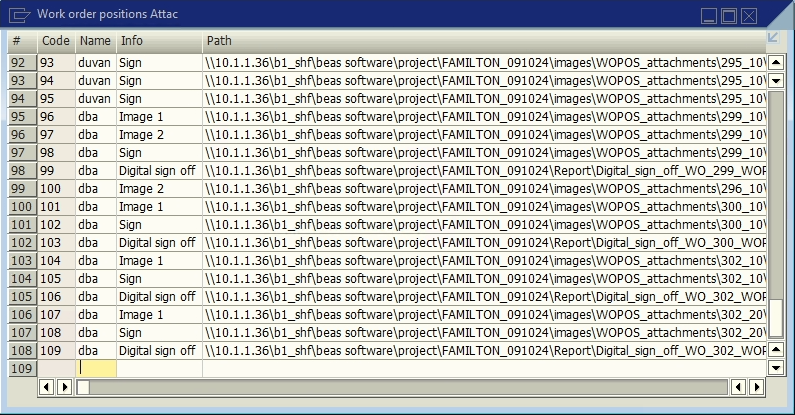

# Work order positions attach

**UDT** for storing the information for **signatures** and the **work order position documents** they belong to.

### Fields

Table **WOPOS_ATTACH**.

| Display Name | Field | Description | Type |
| --- | --- | --- | --- |
| Info | U_info | Description | Text |
| Path | U_path | Directory path | Text |
| Date | U_date | Date | Date |
| Work Order | U_wo | Work order id | Number |
| Work Order Position | U_wopos | Work order position | Number |
| Status | U_basetype | Status | Text |
| Log | U_log | Log | Text |
| Type | U_type | Document type | Text |
| Text | U_img | Image URI | Text |
